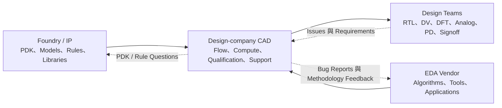
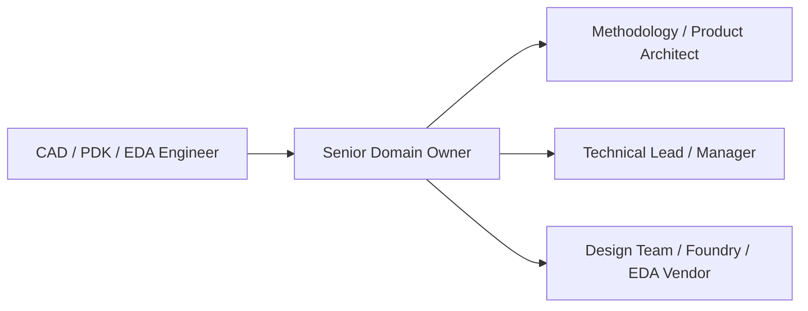

# EDA / CAD / PDK 工程師

EDA、CAD 與 PDK 都在建立「別的工程師用來設計晶片的系統」，但不是同一職務：設計公司的 CAD/Methodology team 維護內部 flow；foundry 與 IP 團隊交付 PDK/design enablement；EDA vendor 則開發與支援工具本身。

## 三個工作場域

### 設計公司端 CAD / Design Methodology

大型公司常依流程分成 frontend CAD、DV CAD、DFT CAD、PD/signoff CAD 與 custom/analog CAD：

- 評估新工具／版本，建立 benchmark、qualification、golden flow 與 regression。
- 把 PDK、IP/library、tool options、compute 與 license 串成可重現的 production flow。
- 維護 Tcl/Python/Perl/SKILL/Make automation、結果資料庫與 dashboard。
- 重現 design team 問題，區分 design、constraint、PDK、environment 或 tool bug。
- 與 EDA vendor、foundry 與內部 project owner 推動修正和 release。

CAD 不只是安裝軟體或管 license。資深角色的價值在於把個別專家的做法變成可靠、可擴展、可簽核的方法論。

### Foundry / IP 端 PDK 與 Design Enablement

PDK（Process Design Kit）是有版本、相依性與品質保證的 design-enablement package，不只是「製程說明書」。實際工作通常分工如下：

| 子角色 | 主要交付物 |
|---|---|
| Compact-model / device modeling | characterization、parameter extraction、model card、PVT/statistical/reliability model |
| Physical-verification rule deck | DRC、LVS、ERC、DFM、fill deck 與 validation cases |
| PCell / techfile | layer、connectivity、display、PCell、symbol 與 custom-design environment |
| Digital enablement | tech LEF、LEF/Liberty/RC tech、standard-cell/memory/IP collateral |
| PDK integration / QA / release | packaging、version control、regression、文件、release notes、customer support |
| EDA certification / reference flow | 驗證工具與製程 collateral 的相容性及 signoff 方法 |

原稿把上述工作都寫成同一位 PDK engineer 的日常，過度簡化。實際團隊會依製程、工具與 collateral 專業分工。

#### BSIM 模型修正

`BSIM-IMG` 不能泛稱為 N3/N2 的模型。UC Berkeley BSIM Group 的定義是：

- **BSIM-CMG**：common multi-gate 元件，例如 FinFET；FAQ 也涵蓋 all-around gate 結構。
- **BSIM-IMG**：independent multi-gate，常用於 FD-SOI/UTB-SOI 類元件。

實際 foundry PDK 使用哪個 compact model 與參數版本，必須看元件架構和官方 PDK，不能只由節點名稱推定。

### EDA Vendor：R&D、Application 與 Product/QA

- **R&D engineer**：開發演算法、compiler、database、distributed compute、UI、simulation/verification/implementation engine；語言依產品而異，不只 C++。
- **Application engineer**：協助客戶導入工具、benchmark、重現問題、改善 flow，並把需求回饋 R&D。
- **Product/QA engineer**：規劃 release quality、regression、performance/QoR validation 與跨產品整合。

這三種角色都懂 EDA domain，但 R&D 偏軟體與演算法、AE 偏客戶 problem-solving、Product/QA 偏可用性與 release quality。

## 2025–2026：AI 進入 EDA Flow

AI for EDA 已不只做單點 PPA search。Cadence 2025 的 Cerebrus AI Studio 主打 agentic、multi-block、multi-user SoC closure；Synopsys 2025 擴充 Copilot 到 RTL generation、formal assertion generation 與 EDA assistant。聯發科 2026 也公開招募用 LLM/agentic workflow 做 RTL optimization、simulation/formal testbench generation 的工程師。

這不代表 CAD/PD/DV 可以無人運作。AI 產出仍需規格、constraints、golden checks、signoff 與資料安全控制。供應商公布的倍數提升屬特定產品與案例宣稱，不能直接當成所有專案的生產率。

## 適合誰與工作型態

| 方向 | 適合誰 | 工作型態 |
|---|---|---|
| CAD / Methodology | 喜歡把零散流程變穩定系統，能同時讀 log、script、設計資料與工具文件 | 內部平台開發、project support、vendor/foundry 協作 |
| PDK / Modeling / Rules | 喜歡製程、元件、版圖規則與嚴謹 release/validation | 長週期版本開發，錯誤影響所有下游使用者 |
| EDA R&D | 喜歡演算法、資料結構、compiler、效能與大型軟體 | 產品開發、benchmark、debug 與 release |
| EDA AE | 喜歡技術深度也願意面對客戶與不完整問題 | 導入、support、training、需求回饋，可能需出差 |

## 核心技能

- 至少深入一條 IC flow：synthesis/STA、DV/formal、DFT、PD/signoff、analog/custom 或 physical verification。
- Linux、Tcl/Python/Perl/shell；custom flow 常用 SKILL，R&D 常見 C/C++ 與軟體工程能力。
- 能讀 tool log/report、建立最小重現案例、設計 regression 並管理版本相容性。
- PDK 專職另需元件／製程、compact model、layout、DRC/LVS/PEX 或 digital library collateral。
- AE/Methodology 需要把模糊需求轉成可重現問題與可驗收改善。

## 職涯發展與轉換

CAD 可轉 design implementation、signoff 或 EDA AE；foundry PDK 可轉 modeling、physical verification、design enablement 或 customer support；EDA AE 可往 product management、R&D 或客戶端 methodology。能否轉換取決於是否真的擁有 flow、code、model/rules 或 signoff 經驗，而非只會操作 GUI。

## 主要雇主

- IC 設計公司與 ASIC design service 的 CAD/DM/internal platform 團隊。
- Foundry、IDM、memory、IP/library 公司中的 PDK、modeling、PV deck 與 design enablement 團隊。
- Synopsys、Cadence、Siemens EDA 及其他 EDA/CAE 公司的 R&D、AE、product 與 QA 團隊。

## 薪資怎麼看

CAD、PDK、EDA R&D 與 AE 的公司型態、職級和獎酬結構差異太大，原頁面的三列區間沒有足夠來源，已撤下。請參考 [薪資與職涯比較](appendix-salary.md)，並先辨認職缺是 internal support、methodology owner、software R&D、customer AE 還是 foundry enablement。

## 面試準備

- 畫出自己熟悉的 design flow，說清楚每階段 input、output、quality gate 與最常見 failure。
- 準備一個 tool/flow bug：如何做 minimal reproduction、排除 environment/PDK/design/constraint 問題並驗證修正。
- Script 題重視文字處理、資料彙整、error handling、可重現性與效能，不只語法。
- PDK/PV 職缺要準備 MOS/device、layout layers、DRC/LVS/PEX、model corner 與 rule-deck validation。
- EDA R&D 要準備 C/C++、algorithm/data structure、debug/profiling 與 domain problem。
- 反問職缺的主要使用者、on-call/support 比重、release ownership、是否寫 production code，以及 signoff 責任。

## 資料來源

- [TSMC：Open Innovation Platform](https://www.tsmc.com/english/dedicatedFoundry/oip)（官方 design-enablement 頁；查證：2026-08-31）
- [TSMC 2025 Annual Report：PDK、EDA 與 3DFabric Ecosystem](https://investor.tsmc.com/static/annualReports/2025/english/pdf/2025_tsmc_ar_e_ch5.pdf)（發布：2026；查證：2026-08-31）
- [UC Berkeley BSIM Group：Models](https://www.bsim.berkeley.edu/models/) 與 [BSIM-MG FAQ](https://bsim.berkeley.edu/bsim-mg-faq/)（查證：2026-08-31）
- [Synopsys：Physical Verification Runset Development](https://careers.synopsys.com/job/hyderabad/application-engineering-staff-engineer-physical-verification-runset-development/44408/92446615856)（發布：2026-03-04；查證：2026-08-31）
- [Cadence：Cerebrus AI Studio](https://www.cadence.com/en_US/home/tools/digital-design-and-signoff/soc-implementation-and-floorplanning/cadence-cerebrus-ai-studio.html)（2025 推出；查證：2026-08-31）
- [Synopsys：Expanding AI Capabilities for EDA](https://news.synopsys.com/2025-09-03-Synopsys-Announces-Expanding-AI-Capabilities-for-its-Leading-EDA-Solutions)（發布：2025-09-03；查證：2026-08-31）

相關職務：[IC 設計工程師](01-ic-design.md)｜[類比版圖與數位實體設計](02-layout.md)｜[AI / 軟體工程師](19-ai-software.md)
