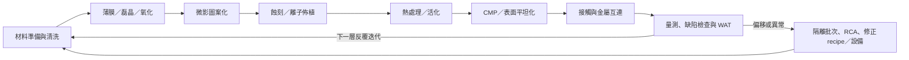

# 製程工程師總覽

製程工程師（Process Engineer, PE）負責讓某一組製程步驟在量產中持續符合規格：建立與調整 recipe、監控製程能力、處理異常、降低缺陷，並把新技術從開發帶進穩定量產。這不是「操作機台」而已；設備狀態、材料、量測結果與上下游製程都會影響判斷。

## 真實流程不是一條直線

一片晶圓會反覆經過清洗、薄膜、微影、蝕刻、熱處理與量測。離子佈植、磊晶、CMP、金屬化等步驟依元件與互連層插入流程；inline inspection、WAT 與電性測試則持續把結果回饋給製程。

## 製程專長地圖

| 專長 | 主要問題 | 常見合作對象 |
|---|---|---|
| 微影 | CD、overlay、focus、dose、光阻與缺陷 | 光罩、計算微影、量測、設備商 |
| 蝕刻 | profile、selectivity、loading、plasma damage | 微影、薄膜、整合、設備 |
| 薄膜／磊晶 | 膜厚、成分、應力、共形性、界面 | 材料、整合、可靠度、設備 |
| 清洗／濕製程 | 殘留物、表面狀態、金屬與粒子污染 | 薄膜、缺陷、廠務、EHS |
| 佈植／熱製程 | dose、能量、活化、擴散、熱預算 | 元件、整合、量測 |
| CMP | removal rate、uniformity、dishing、erosion、scratch | 薄膜、金屬、缺陷、設備 |
| 量測／缺陷 | CD、膜厚、overlay、材料、缺陷分類 | 所有製程模組、良率、FA |
| 先進封裝製程 | RDL、電鍍、薄化、鍵合、翹曲 | 封裝整合、量測、測試、可靠度 |

N2 奈米片電晶體已在 2025 年進入量產；A16 進一步加入背面供電。對製程工程師而言，先進節點不只是尺寸變小，還代表三維形貌、原子級材料控制、背面製程與跨模組耦合增加。

## 日常工作與異常處理

- 看 SPC、FDC、inline metrology 與 defect map，判斷是正常波動、量測問題或真實 excursion。
- 對受影響 lot 執行 hold、界定風險範圍，與設備、整合、良率工程師做 root-cause analysis。
- 用 DOE 驗證參數視窗，完成 change qualification 後才更新 recipe 或 control plan。
- 做 tool matching、chamber matching 與 PM 後 qualification，避免同型機台產出不同。
- 支援新產品／新節點 ramp，追蹤良率、cycle time、成本與可靠度間的取捨。

## 適合誰／工作型態

適合喜歡用數據理解物理現象、能在不完整資訊下排除原因，也願意和設備、整合、良率及製造團隊密切協作的人。材料、化工、物理、電機、化學、機械等背景都可能切入，不同模組偏好的知識不同。

量產 PE 可能需要輪班、值班或 on-call，但不是所有製程職缺一律 12 小時輪班；研發、技術開發與不同廠區的安排也不同，應以實際職缺與面談確認。

## 核心技能

- 半導體製程與材料／元件基礎，能說明上下游因果。
- SPC、process capability、DOE、迴歸與假設檢定。
- defect map、wafer map、equipment trace 與 lot history 的交叉分析。
- 清楚的異常通報、風險界定、實驗紀錄與變更管理。
- SQL 或 Python 有助大量資料處理，但不能取代製程物理判斷。

## 職涯與轉換

PE 可往資深模組技術、製程整合、良率／缺陷、設備應用、產品工程、先進封裝或技術管理發展。整合工程師也可由校園招募直接進入，並非一定要先做數年 PE；實際路徑依公司與職缺而異。

## 面試準備

準備一個完整案例：規格偏移後如何確認量測、切 lot／tool／time window、提出假設、設計最小實驗並防止再發。技術題常從薄膜、電漿、光學、熱傳或元件物理出發；比背誦設備型號更重要的是能畫出因果鏈，說清楚「先查什麼、為什麼」。

薪資受公司、廠區、班別、分紅與景氣影響，請見[薪資比較附錄](appendix-salary.md)。

## 資料來源

- [TSMC 2025 Annual Report](https://investor.tsmc.com/static/annualReports/2025/english/index.html)，2026（N2、A16 與製造技術進展；查證：2026-08-31）
- [Tokyo Electron and imec extend beyond-2nm partnership](https://www.tel.com/news/topics/2025/20250616_001.html)，2025-06-16（patterning、wet processing、etch、deposition 與 3D integration；查證：2026-08-31）
- [KLA 2025 Annual Report](https://ir.kla.com/sec-filings/all-sec-filings/content/0001193125-25-213412/0001193125-25-213412.pdf)，2025（inspection、metrology 與 process control；查證：2026-08-31）

相關：[微影工程師](07-photo.md)｜[蝕刻／薄膜／CMP](08-etch-dep-cmp.md)｜[整合工程師](09-integration.md)｜[良率與產品工程](10-yield-product.md)
