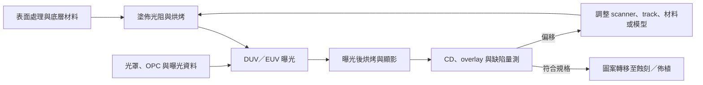

# 微影工程師

微影工程師（Lithography / Photo Process Engineer）把光罩圖案穩定地轉移到晶圓上，核心任務是控制 critical dimension（CD）、overlay、focus、dose 與缺陷。工作橫跨 scanner、coat/develop track、光阻材料、光罩、量測與計算微影，不是只操作曝光機。

## 微影模組如何運作

## EUV、High-NA 與 DUV 的正確關係

EUV 使用 13.5 nm 波長，0.33 NA EUV 已用於部分先進節點 critical layers；0.55 NA High-NA EUV 正在導入更細圖案。DUV 並未因此消失：先進晶片仍有大量層使用 193 nm immersion 或其他 DUV 工具，成熟與特殊製程也持續依賴 DUV。

因此不應把技術簡化成「7 nm 以下全用 EUV、28 nm 以上才用 DUV」。工程師會按 layer 的解析度、overlay、defectivity、throughput、製程複雜度與成本共同選擇方案。

| 面向 | DUV | EUV／High-NA EUV |
|---|---|---|
| 光學 | 透射式光學與光罩 | 真空中的反射式光學與光罩 |
| 量產角色 | 成熟、特殊及先進節點的廣泛層次 | 先進節點的部分關鍵層 |
| 主要難題 | 多重圖案化、overlay、成本與週期 | 光源、反射鏡／光罩、隨機缺陷、resist、pellicle |
| 共通工作 | focus/dose、CD、overlay、track、缺陷與模型校正 | 同左，且更依賴 scanner-track-material-mask 協同最佳化 |

## 日常工作

- 維護 focus-exposure process window，追蹤 CD uniformity、overlay 與 defectivity。
- 分析 scanner、track、resist lot、reticle、wafer history 與 metrology 的關聯。
- 與 OPC／computational lithography、mask、etch 與 integration 團隊修正 patterning hotspot。
- 處理 stochastic defect、resist collapse、scum、bridge、missing contact、overlay excursion 等問題。
- 新材料、新光罩或設備升級後做 qualification、matching 與量產 release。

## 適合誰／工作型態

適合對光學、材料化學、精密控制與統計都感興趣，且能接受問題常跨越多個系統的人。光電、物理、化學、材料、化工、電機與機械背景都有切入點。

量產支援可能值班或 on-call；技術開發、計算微影、光罩與設備商應用工作的型態不同。設備商的 application/process engineer 與 field service/customer support 也不是同一角色，求職時要看清 ownership。

## 核心技能

- Fourier optics、成像、resist chemistry 與 pattern transfer 基礎。
- CD/overlay metrology、process window、SPC、DOE 與 defect classification。
- 能把 wafer map 與 scanner field、reticle、track module、時間序列對齊。
- 基本資料分析與自動化；先進職缺可能需要 OPC、source-mask optimization 或模型經驗。

## 職涯與轉換

可往資深 lithography module、patterning integration、computational lithography、mask technology、metrology、yield/defect 或設備商 application/customer support 發展。跨到先進封裝圖案化時，需重新理解 RDL、翹曲、厚光阻與封裝基材，不能把前段 EUV 經驗原封不動套用。

## 面試準備

要能解釋 resolution、depth of focus、NA、dose 與 resist 的取捨，並用一個 overlay 或 CD excursion 案例展示分層排查。若題目只給 wafer map，先問量測可信度，再區分 reticle/field、wafer radial、track module、tool/chamber 與 lot/material signature。

薪資請見[薪資比較附錄](appendix-salary.md)。

## 資料來源

- [ASML 2025 Annual Report — Strategy & Stories](https://www.asml.com/en/investors/annual-report/2025/strategy-and-stories)，2026（DUV、0.33 NA EUV、0.55 NA EUV 與 holistic lithography；查證：2026-08-31）
- [Tokyo Electron and imec extend beyond-2nm partnership](https://www.tel.com/news/topics/2025/20250616_001.html)，2025-06-16（High-NA patterning、材料與 defectivity control；查證：2026-08-31）
- [TSMC 2025 Annual Report](https://investor.tsmc.com/static/annualReports/2025/english/index.html)，2026（N2、A16 與先進製程量產時程；查證：2026-08-31）

相關：[製程工程師總覽](06-process-overview.md)｜[設備工程師](10-equipment.md)
