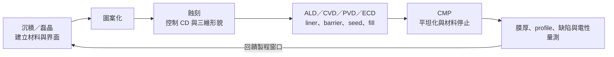

# 蝕刻、薄膜與 CMP 工程師

蝕刻負責移除材料，薄膜負責形成材料，CMP 負責把表面磨回可繼續堆疊的平坦度。三者各有獨立製程窗口，卻必須一起看：一層薄膜的組成與應力會改變後續蝕刻，蝕刻 profile 會影響填孔，而填孔與圖案密度又會反映在 CMP dishing、erosion 與缺陷上。

## 三個模組如何銜接

## 蝕刻工程師

蝕刻不是單純把孔挖深，而是同時控制 anisotropy、selectivity、CD bias、sidewall、microloading、notching、殘留物與 plasma damage。recipe 會調整 gas chemistry、pressure、RF/bias、temperature 與 endpoint。

先進邏輯的挑戰包括 GAA nanosheet 的形貌與 release、angstrom-level profile control；記憶體則常面對高深寬比結構；先進封裝也有 TSV、RDL 與 bonding surface 的相關製程。Atomic Layer Etch 是工具之一，不代表所有先進蝕刻都採同一方法。

## 薄膜與表面工程師

| 方法 | 擅長之處 | 常見工程問題 |
|---|---|---|
| CVD／PECVD | 量產速率、介電層與 gap fill | step coverage、應力、組成、particle |
| ALD | 原子級厚度與高共形性 | nucleation、cycle time、雜質與界面 |
| PVD | 金屬與 seed/barrier | sidewall coverage、方向性、應力 |
| Epitaxy | 選擇性晶體成長 | defect、selectivity、摻雜與 strain |
| Electrochemical deposition | Cu 與封裝互連填充 | void、seam、uniformity、additive control |
| Clean／surface treatment | 去除污染並設定表面狀態 | material loss、roughness、recontamination |

N2/A16 等技術使薄膜工作延伸到奈米片、背面供電與新接觸材料。混合鍵合則要求清洗、表面活化、薄膜性質、CMP 與 overlay 共同達標，前段與封裝製程的界線正在變得模糊。

## CMP 工程師

CMP 用 pad、slurry、pressure、rotation 與 conditioning 同時作用，目標不是「越平越好」，而是在 removal rate、selectivity、within-wafer uniformity、dishing、erosion、scratch、residue 與 defectivity 間取得可量產的窗口。

除了 STI、contact 與 Cu interconnect，CMP 也直接影響 hybrid bonding surface：極小的 topography、particle 或 queue-time variation 都可能降低接合品質與良率。

## 適合誰／工作型態

蝕刻偏 plasma、vacuum 與反應工程；薄膜偏材料、表面、化學與熱力學；CMP 偏 tribology、化學、流體與缺陷。共同點是需要大量實驗、量測與設備協作。量產職位可能值班或 on-call，研發與設備商 application 工作則依專案節奏運作。

## 核心技能

- transport、surface reaction、plasma／vacuum、材料分析或 tribology 的相應基礎。
- DOE、SPC、tool/chamber matching、equipment trace 與 wafer map 分析。
- SEM/TEM、ellipsometry、profilometry、XPS/EDS 等結果的正確解讀。
- 能分辨 recipe、hardware、incoming material、upstream pattern 與 metrology 的影響。

## 職涯與轉換

可往模組專家、process integration、yield/defect、equipment/application、materials supplier、先進封裝製程或 reliability/FA 發展。跨模組的關鍵不是多背設備，而是能說明材料與形貌如何一路影響電性、良率及可靠度。

## 面試準備

準備回答「uniformity 變差」「particle 突增」「etch profile 傾斜」「膜應力漂移」或「CMP scratch」時，如何先確認量測，再切 tool/chamber/time/material/pattern。若提出調 recipe，也要交代副作用與 qualification 指標。

薪資請見[薪資比較附錄](appendix-salary.md)。

## 資料來源

- [Applied Materials：2nm 以下電晶體與互連設備](https://ir.appliedmaterials.com/news-releases/news-release-details/applied-materials-unveils-transistor-and-wiring-innovations)，2026-02-10（GAA、angstrom-level etch、ALD 與新接觸材料；查證：2026-08-31）
- [Applied Materials：Kinex hybrid bonding system](https://ir.appliedmaterials.com/news-releases/news-release-details/applied-materials-unveils-next-gen-chipmaking-products/)，2025-10-07（清洗、鍵合、inline metrology 與 drift detection；查證：2026-08-31）
- [Tokyo Electron：3DI manufacturing equipment](https://www.tel.com/blog/all/20250930_001.html)，2025-09-30（CMP、clean、surface activation 與 bonding；查證：2026-08-31）

相關：[製程工程師總覽](06-process-overview.md)｜[整合工程師](09-integration.md)
