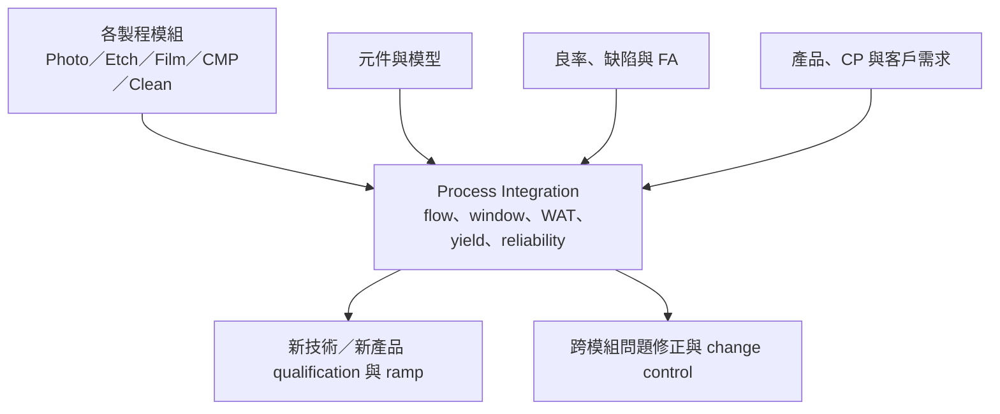

# 製程整合工程師

製程整合工程師（Process Integration Engineer, PIE）對一段完整 process flow、元件與產品結果負責。他們不只看單一 recipe，而是追蹤不同模組如何共同影響 WAT、元件電性、良率、可靠度、成本與客戶規格。

PIE 可以由校園招募直接進入，也可由製程、元件、良率或產品工程轉入；「一定先做多年 PE」「只有博士適合」都不是通則。

## PIE 在流程中的位置

## 核心工作

- 建立、維護與變更 process flow，確保各 module 的窗口能一起工作。
- 監控 WAT 與元件參數，如 Vt、leakage、drive current、contact/interconnect resistance。
- 把良率、inline defect、wafer map、CP bin 與製程歷史連起來，找出跨模組根因。
- 規劃 split、short-loop 或 integration DOE，驗證改善是否真的作用在目標機制。
- 支援 NPI 與 technology transfer，協調 module、equipment、yield、product、reliability 與客戶。
- 管理 change qualification：一項改善不能用新的可靠度、成本或製造風險交換而不自知。

## 量產 PIE、研發整合與封裝整合

| 類型 | 主要焦點 |
|---|---|
| 量產 PIE | flow control、WAT/yield、客戶產品、異常與持續改善 |
| 技術研發整合 | 新元件架構、新材料、process window、design-technology co-optimization |
| 先進封裝／系統整合 | chiplet、RDL/interposer、bonding、thermal/PI/SI、test 與 package yield |

先進節點的 N2 奈米片與 A16 背面供電，使 frontside、backside、元件與互連間的耦合更強；CoWoS、SoIC 與 hybrid bonding 則讓 integration 延伸到 chip-package-system。只熟 TCAD 並不足以描述所有 PIE 工作。

## 適合誰／工作型態

適合喜歡看全局、能在不同專業間翻譯問題，也願意為模糊的跨模組結果負責的人。電機、物理、材料、化工等碩士可直接應徵量產或研發 PIE；博士在前瞻元件與技術研發有優勢，但不是全職類的必要條件。

PIE 以跨團隊分析與會議為多，仍會進實驗室或無塵室。量產單位可能有值班／on-call；研發與 pathfinding 則較受實驗與里程碑驅動。

## 核心技能

- CMOS 元件、製程 flow、WAT 與基本 circuit/layout 知識。
- multivariate analysis、DOE、SPC、wafer map 與 yield correlation。
- 能讀懂 module data、electrical data、FA evidence 並建立可驗證假設。
- 專案推進、change control、風險溝通與跨團隊決策紀錄。
- TCAD 是部分職缺的加分工具，不是 PIE 的通用定義。

## 職涯與轉換

可往技術平台／pathfinding、產品工程、良率、元件、先進封裝整合、客戶技術服務或技術管理發展。PIE 也常成為跨部門 program owner，因為它最接近「技術是否能穩定變成產品」的交界。

## 面試準備

練習把一個 WAT 或 yield shift 拆成 measurement、design/product、process module、equipment 與 material 五類假設，並說明最便宜、最快且能區分假設的實驗。面試官通常更在意推理順序與協作方式，而不是猜中唯一 recipe。

薪資請見[薪資比較附錄](appendix-salary.md)。

## 資料來源

- [UMC 製程整合工程師職缺](https://careers.umc.com/jobin.php?mid=67)，更新：2026-07-23（process flow、WAT、良率、客戶與新製程；查證：2026-08-31）
- [TSMC 2025 Campus Recruitment](https://www.tsmc.com/static/english/careers/campus_recruitment_2025/index.html)，2025（PIE、system integration 與 advanced packaging 職務；查證：2026-08-31）
- [TSMC 2025 Annual Report](https://investor.tsmc.com/static/annualReports/2025/english/index.html)，2026（N2、A16、CoWoS、SoIC 與 COUPE；查證：2026-08-31）

相關：[製程工程師總覽](06-process-overview.md)｜[良率與產品工程](10-yield-product.md)
