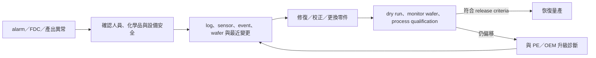

# 設備工程師

設備工程師（Equipment Engineer, EE）讓製程機台安全、穩定且可預測地生產。除了 PM 與故障維修，工作還包括 tool installation/qualification、hardware improvement、FDC、備品策略、供應商管理，以及用設備資料預防下一次停機。

## 從故障到量產恢復

## 設備專長

| 類型 | 常見工程重點 |
|---|---|
| 微影／量測 | 光機電、stage、vacuum、thermal control、calibration |
| 蝕刻／薄膜 | RF、plasma、gas delivery、vacuum、chamber matching |
| CMP／濕製程 | motion、pressure、slurry/chemical、filter、leak 與 particle |
| 熱製程／佈植／磊晶 | temperature、beam、gas、contamination、uniformity |
| 先進封裝 | thinning、bond/debond、TCB/hybrid bonding、plating、warpage |
| AMHS／robotics | carrier transport、stockers、interlock、routing、system availability |

AMHS 與 robotics 在大型晶圓廠常是獨立專業，不宜全歸入一般 process equipment。設備商端也要區分 field service/customer support、installation/upgrade 與 application/process engineer；職稱相近，ownership 很不同。

## 現代設備工程：資料加上現場

ASML 2025 年報已描述 predictive maintenance、reactive diagnostics、知識搜尋與 root-cause AI agent；SEMI 也把 PM automation 視為 autonomous fab 的基礎。但 AI 輸出仍需由工程師依物理、維修紀錄與現場狀況驗證。

典型工作包括：

- 分析 alarm、sensor trace、event log、SPC/FDC 與 downtime Pareto。
- 規劃 PM interval、parts lifetime、consumable 與 critical spare。
- PM 或 repair 後與 PE 執行 calibration、matching 與 process qualification。
- 管理新機 install、hook-up、acceptance、software/firmware upgrade 與量產 release。
- 對 chronic failure 做 hardware improvement，而不是反覆 reset。
- 和 OEM escalation team、廠務、EHS、製造與採購協調。

## 適合誰／工作型態

適合喜歡拆解實體系統、能讀圖與 log、重視安全，也願意在時間壓力下有紀律地排障的人。機械、電機、機電、化工、材料與物理背景都常見。

量產設備職缺較可能輪班、值班、無塵室作業或 on-call；不同 tool、廠區與公司差異很大。維修可能涉及高壓、真空、雷射、RF、機械運動與危害性化學品，lockout/tagout、interlock 與 EHS 程序不能為了 uptime 省略。

## 核心技能

- 機械、電氣、控制、vacuum、fluid/gas 或 RF/plasma 的相應基礎。
- 讀 P&ID、schematic、sequence、alarm history 與 maintenance manual。
- FMEA、RCA、MTBF/MTTR、OEE、FDC 與基本統計。
- qualification、change management、vendor escalation 與技術文件能力。
- SQL/Python 有助 condition monitoring，但現場診斷與安全判斷仍是核心。

## 職涯與轉換

可往 equipment owner／module lead、設備改善與自動化、OEM field service、application engineering、install/upgrade、AMHS、廠務 hook-up 或技術管理發展。熟悉製程結果的 EE 也可轉 PE；熟悉平台與客戶問題者可轉設備商 application。

## 面試準備

用一個真實排障案例說明：如何先確保安全、重現症狀、讀 log、隔離 subsystem、驗證修復、完成 qualification，最後防止再發。若只說「換零件後好了」，面試官看不到你的診斷能力。

薪資請見[薪資比較附錄](appendix-salary.md)。

## 資料來源

- [ASML 2025 Annual Report — Strategy & Stories](https://www.asml.com/en/investors/annual-report/2025/strategy-and-stories)，2026（predictive maintenance、diagnostics 與 human validation；查證：2026-08-31）
- [SEMI Smart Manufacturing](https://www.semi.org/cn/industry-groups/smart-manufacturing)，內容含 2025 industry survey（PM automation 與 autonomous fab；查證：2026-08-31）
- [TSMC Fall 2026 Engineering Opportunities](https://ro.careers.tsmc.com/job/Phoenix-Fall-2026-TSMC-Arizona-Engineering-Full-Time-Opportunities-%28Phoenix%2C-AZ%29-AZ-85001/1366233566/)，2026-08（equipment、AMHS 與 robotics 職責；查證：2026-08-31）

相關：[製程工程師總覽](06-process-overview.md)｜[廠務工程師](11-facilities.md)
