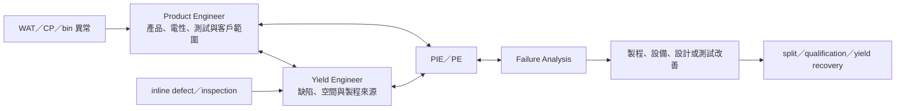

# 良率工程師與產品工程師

良率工程師（Yield Enhancement / Yield Excellence Engineer）與產品工程師（Product Engineer）都會看 wafer map、WAT 與測試資料，但 ownership 不同：良率工程師追「哪一類缺陷或製程機制正在限制整條技術／產線」，產品工程師追「某個產品能否順利導入、達到電性與良率目標並交付客戶」。

## 先把兩個角色分清楚

| 面向 | 良率工程師 | 產品工程師 |
|---|---|---|
| 核心對象 | defect mechanism、製程／設備來源、technology yield | product/device、WAT/CP bin、規格與客戶 ramp |
| 常用資料 | inline inspection、defect review、spatial/slot signature、process trace | WAT、wafer sort/CP、bin split、PCM、product layout/circuit |
| 主要合作 | PE、PIE、equipment、metrology、FA | 客戶、PIE、design、test、yield、fab operations |
| 典型成果 | defect reduction roadmap、excursion prevention、inspection methodology | NPI/ramp、product yield、process window、issue closure |

兩者可能在同一問題相遇。例如某產品 CP yield 下跌：產品工程師先確認產品、測試與電性 signature；良率工程師把 signature 與 inline defect、設備與製程資料關聯；PIE/PE/FA 再共同驗證根因。

## 良率工程師在做什麼

- 建立 defect reduction roadmap，定義關鍵缺陷、monitor 與 control limit。
- 使用 brightfield、darkfield、e-beam inspection 與 review/metrology 建立 inline detection。
- 看 wafer、field、die、lot、slot、tool、chamber 與時間 signature，縮小來源。
- 把缺陷與 electrical/yield loss 關聯，避免只降低「看得到但不影響產品」的 defect count。
- 與 PE/PIE/equipment 做 DOE、tool qualification 與 excursion prevention。
- 與 FA 建立 physical evidence，確認 correlation 不只是巧合。

## 產品工程師在做什麼

- 主導新產品導入與 ramp，連接客戶、設計、fab、測試及支援團隊。
- 分析 WAT、CP、yield、bin、device、layout/design rule 與製程歷史。
- 找出能改善產品效能、process window 與 die cost 的製程或測試方案。
- 處理產品特有 issue，判斷是 design、test、process、equipment 還是 interaction。
- 管理 qualification、release、客戶溝通與量產追蹤。

Product Engineer 不等於 Test Engineer。測試工程師主要擁有 test method、program、interface、coverage、throughput 與 cost-of-test；產品工程師使用測試結果理解並推進產品。

## 適合誰／工作型態

良率適合喜歡從大量圖形與異常中找規律、願意追 physical root cause 的人；產品工程適合能理解元件／電路／製程，又善於跨客戶與 fab 推動事情的人。電機、材料、物理、光電及相關背景常見。

兩者多為日班分析與專案工作，但量產 excursion、NPI ramp 或客戶 issue 可能需要 on-call、跨時區會議或短期高強度支援；以職缺為準。

## 核心技能

- 半導體製程、元件、WAT、wafer sort 與基本測試概念。
- SQL/Python、統計、wafer map、spatial pattern、multivariate analysis。
- 良率方向：inspection/metrology、defect classification、FA 與 defect-to-yield correlation。
- 產品方向：device/circuit/layout、bin/yield analysis、NPI、qualification 與客戶溝通。
- 對資料相關性保持懷疑，能設計實驗或用 physical evidence 證明因果。

## 職涯與轉換

良率可往 defect/metrology、PIE、FA、data/AI manufacturing 或 yield management；產品工程可往 PIE、test、customer engineering、program/product management 或技術管理。兩者互轉並不少見，但需要補足 inspection/FA 或 circuit/test 的另一側知識。

## 面試準備

練習從一張 wafer/bin map 開始：先驗證測試與量測，再判斷 radial、edge、field、reticle、slot、tool/chamber 或 product-layout signature。回答時要明確區分 correlation、hypothesis、experiment 與 proof；也要說明如何圈定受影響 lot 與客戶風險。

薪資請見[薪資比較附錄](appendix-salary.md)。

## 資料來源

- [TSMC Arizona Yield Excellence Engineer](https://ro.careers.tsmc.com/job/Phoenix-Yield-Excellence-Engineer-AZ-85001/1063086966/)，發布：2026-08-30（defect reduction、inspection methodology、SPC 與跨模組改善；查證：2026-08-31）
- [TSMC 2025 Campus Recruitment — Product Engineer](https://careers.tsmc.com/de_DE/careers/JobDetail/2025-Campus-Recruitment-Product-Engineer-PE/15386)，發布：2025-02-10（產品導入、yield/WAT、design rule、CP 與客戶協作；查證：2026-08-31）
- [SEMI ASMC 2026 Topics](https://www.semi.org/sites/semi.org/files/2025-08/ASMC26_CFA_Topics.pdf)，發布：2025-08（defect-to-yield、spatial/slot signature、volume diagnostics 與 ML/AI；查證：2026-08-31）

相關：[製程工程師總覽](06-process-overview.md)｜[整合工程師](09-integration.md)｜[測試工程師](16-test.md)｜[失效分析工程師](14-failure-analysis.md)
