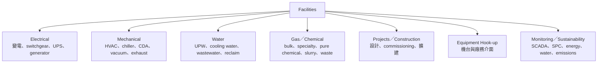

# 廠務工程師

廠務工程師（Facilities Engineer, FAC）負責讓晶圓廠的建築、無塵室、公用系統與材料供應持續符合生產需求。工作從 design、construction、commissioning、operation 到 maintenance 與 improvement，並非只有設備壞了才修水電。

## 廠務專業線

不同公司還會把消防、生命安全、環境保護、職業安全與 process safety 設為獨立 EHS 團隊。氣體與化學品也應分開描述；例如 HF 常見於化學品／濕製程供應，不能不分型態地把所有危害物都叫「特殊氣體」。

## 日常工作

- 監控 SCADA/BMS、alarm、SPC 與供應品質，處理 power、temperature、humidity、pressure、flow、resistivity 或 contamination 異常。
- 做 preventive/predictive maintenance、系統 walkdown、risk analysis 與備援切換演練。
- 對 outage、leak、water-quality excursion 等事件執行緊急應變、RCA 與防止再發。
- 參與新廠／擴建的 design review、施工管理、commissioning、start-up 與文件移交。
- 與設備工程師管理 tool hook-up，確認 utilities、exhaust、chemical/gas 與 interlock 符合規格。
- 改善 energy efficiency、用水、回收、廢水／廢氣與資源循環，同時維持供應可靠度。

## 廠務與設備工程的邊界

| 問題 | 廠務工程師 | 設備工程師 |
|---|---|---|
| 管理範圍 | 廠級 utility、建築、材料配送與環境 | 單台或同型製程／量測設備 |
| 典型異常 | 電力、UPW、氣體／化學、HVAC、exhaust | chamber、robot、RF、vacuum、calibration |
| 交界 | tool hook-up、供應品質、interlock、commissioning | 同左，從設備端完成 acceptance 與 qualification |
| 法規與安全 | 建築、消防、環保、高壓電、化學與 process safety | tool safety、LOTO、OEM procedure、製程資格 |

## 適合誰／工作型態

適合喜歡大型系統、可靠度、風險與現場工程，且能在生產、施工、承攬商與法規間協調的人。電機、機械、化工、環工、土木、能源與控制背景可對應不同系統。

晶圓廠 24/7 運轉，operations 類職缺通常有值班或 on-call；project/design/construction 的節奏則跟建廠與 commissioning 里程碑走。緊急應變壓力高，但程序、permit、LOTO 與人員疏散優先於產出。

## 核心技能

- 依專業線掌握 power distribution、HVAC/thermodynamics、fluid、water chemistry、gas/chemical delivery 或 environmental control。
- 讀 P&ID、single-line diagram、layout、sequence 與 control logic。
- SCADA/BMS、SPC、alarm management、reliability、RCA 與 risk assessment。
- commissioning、MOC、承攬商管理、法規與 EHS 溝通。
- 能把 utility quality 與產品／設備需求連起來，而不只看「有沒有供應」。

## 職涯與轉換

可往系統 owner、project/construction、hook-up、能源與永續、EHS/process safety、可靠度、廠務管理或工程顧問發展。熟悉特定 utility 與設備介面者，也可轉 equipment install 或供應商 technical service。

## 面試準備

選一個停電、壓力下降、水質異常或 chemical leak 情境，說明 alarm 到來後如何保人、保設備、保產品，如何啟動備援、界定影響、溝通停機與完成 RCA。也要能說明單點失效、N+1、預防保養與變更管理。

薪資請見[薪資比較附錄](appendix-salary.md)。

## 資料來源

- [TSMC/JASM Facility Water Engineer](https://ro.careers.tsmc.com/job/kumamoto-jasm-facility-facility-water-engineer-%286147%29-43/1057244766/)，2026（廠務專業線、SPC、風險、RCA 與能源效率；查證：2026-08-31）
- [TSMC Engineering Career Opportunities](https://ro.careers.tsmc.com/job/Phoenix-Fall-2025-TSMC-Career-Opportunities-%28Arizona-California-Texas-Washington-Canada%29-AZ-85001/1213554866/)，2026（electrical、water、gas/chemical、construction 職責；查證：2026-08-31）
- [TSMC 2025 Annual Report](https://investor.tsmc.com/sites/ir/annual-report/2025/2025%20Annual%20Report_E.pdf)，2026（energy、water 與營運永續；查證：2026-08-31）

相關：[設備工程師](10-equipment.md)｜[工業工程師](18-ie.md)
