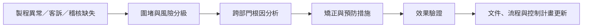

# QA／品質工程師

品質工程師管理的不是「最後抽驗」而已，而是產品從設計、供應商、製造、變更到客訴的品質系統。半導體 QA 常見分工包括產品品質、客戶品質、供應商品質與品質系統；職稱相同，實際工作可能很不一樣。

## 四種常見分工

| 分工 | 主要交付物 | 最常合作的對象 |
|---|---|---|
| 產品品質（Product Quality） | qualification 計畫、量產品質指標、變更評估 | Product、Test、可靠度、製程 |
| 客戶品質（Customer Quality） | 客訴分流、8D、改善追蹤、客戶稽核 | FAE、FA、業務、客戶 |
| 供應商品質（Supplier Quality） | 供應商稽核、來料風險、SCAR、變更管理 | 採購、封裝基板／材料／OSAT 供應商 |
| 品質系統（QMS） | 稽核、文件、訓練、認證與持續改善 | 全公司、認證機構、客戶 |

## 車用品質要先分清三件事

- **IATF 16949** 是汽車產業品質管理系統要求，還要搭配 Rules、sanctioned interpretations 與各車廠的 customer-specific requirements。
- **AEC-Q100** 是積體電路的 failure-mechanism-based stress-test qualification 要求，不是 AEC 發給單顆晶片的「產品認證」。離散元件另有 AEC-Q101 等文件。
- **PPAP、APQP、FMEA、Control Plan** 是產品與製程品質規劃工具；實際提交內容依客戶與供應鏈角色而異。

溫度 grade 只是 qualification matrix 的一部分。追溯性、變更通知、樣本與零失效準則、量產監控、功能安全及客戶特殊要求，同樣會影響工作內容。不能用「比消費電子嚴格幾倍」概括。

## 日常工作與判斷

- 收到客訴時先確認症狀、批次、影響範圍與暫時圍堵，不急著把問題直接送 FA。
- 協調 Product、Test、製程、可靠度與 FA 建立 root-cause tree，避免把相關性當成根因。
- 維護 8D、CAPA、FMEA、Control Plan、變更通知與稽核證據。
- 監看 defect、DPPM、退貨、test escape、供應商異常等指標，但不把單一 KPI 當品質全貌。
- 對客戶說明風險與證據；QA 通常負責閉環，不一定親自操作分析儀器。

## 適合誰與工作型態

適合願意追證據、能寫清楚報告、也能在客戶與內部團隊間推進行動的人。客戶品質可能有時差與緊急應變；QMS／供應商品質則常有稽核與出差。是否輪班取決於量產支援範圍，不是 QA 的固定條件。

## 核心技能

- 8D、5 Why、魚骨圖、fault tree 等問題分析工具
- SPC、MSA、FMEA、Control Plan、APQP／PPAP 基礎
- IATF 16949、ISO 9001 與 AEC-Q 文件閱讀能力
- 風險溝通、技術寫作、跨部門追蹤與英文客戶會議
- 半導體製造、測試、可靠度與失效分析的流程概念

## 職涯與轉換

可由產品／製程／測試／可靠度工程轉入，也可從品質系統或供應商品質起步。後續常見方向是 Customer Quality Lead、Supplier Quality Manager、QMS／Audit Lead 或 Quality Manager。技術深度與客戶協調是兩條不同的成長軸。

## 面試準備

- 用一個真實案例說明如何從症狀、圍堵、根因到效果驗證；不要只背 8D 八個欄位。
- 分清 correction、corrective action、preventive action，以及「暫時相關」與「已證實根因」。
- 準備回答 AEC-Q100、IATF 16949、PPAP 各自管什麼，避免統稱「車用認證」。
- 反問職缺主要 owner 是客戶、產品、供應商還是 QMS，以及是否需要 on-call／出差。

薪資不在本頁列精準區間；公開資料難以把不同 QA 分工與職級正確切開。比較方式見[薪資資料怎麼看](appendix-salary.md)。

## 資料來源

- [Automotive Electronics Council：AEC Documents](https://www.aecouncil.com/AECDocuments.html)（含 AEC-Q100 Rev. J；查證：2026-08-31）
- [IATF Publications](https://www.iatfglobaloversight.org/iatf-publications/)（Rules 與官方出版品；查證：2026-08-31）
- [IATF Customer-Specific Requirements](https://www.iatfglobaloversight.org/oem-requirements/customer-specific-requirements/)（查證：2026-08-31）

相關：[可靠度工程師](13-reliability.md)｜[失效分析工程師](14-failure-analysis.md)｜[良率與產品工程師](10-yield-product.md)
