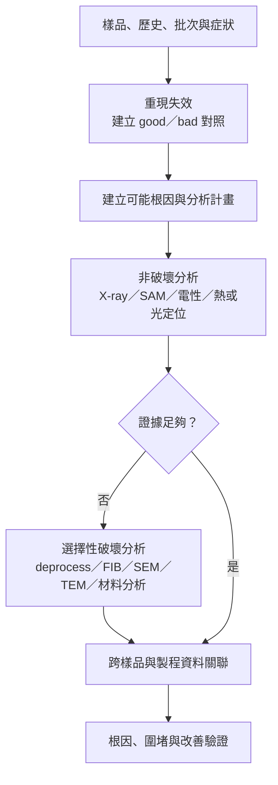

# 失效分析工程師

失效分析工程師（Failure Analysis, FA）從「可重現的症狀」建立假設，再用電性、影像、材料與截面證據定位失效機制。高價儀器只是工具；真正的交付物是能讓設計、製程、封裝或供應商採取行動的根因證據鏈。

## FA 不是固定流水線

不同失效可能只需電性分析，也可能要做到 FIB／TEM。破壞樣品前必須保存證據，因此較可靠的決策流程是：

「先 decap、再 EMMI、再 FIB」並不是通用順序。封裝分層、開路、漏電、時序弱點、污染與製程缺陷需要不同的 sample preparation 與工具組合。

## 工具回答什麼問題

| 工具族 | 典型用途 | 限制意識 |
|---|---|---|
| Electrical characterization | 重現規格失效、縮小條件與節點 | 相關性不等於物理根因 |
| X-ray／SAM | 封裝內部、空洞、分層與組裝異常 | 解析度與材料對比有限 |
| EMMI／OBIRCH／熱成像 | 定位漏電、發熱或高阻區域 | 需要偏壓條件與 good/bad 對照 |
| SEM／FIB | 表面／截面觀察、局部切割與 circuit edit | 會破壞樣品，也可能引入 artifact |
| TEM／EDS／SIMS／XPS | 奈米結構、元素或化學資訊 | 樣品製備與結果解讀門檻高 |

## 與良率和品質的閉環

FA 不只處理客訴退貨。量產中也會把 wafer map、inspection defect、CP／FT bin、設備與製程 history 串起來：

`異常 signature → 定位 defect／failure mechanism → 製程或設計假設 → 改善批驗證 → 監控 recurrence`

QA 負責客戶與改善閉環，可靠度負責 stress plan 與風險外推，良率／Product 負責量產 signature 與批次關聯；FA 提供物理與電性證據。四者不能互相替代。

## 適合誰與工作型態

適合有耐心保留證據、能在資訊不完整時管理假設、也願意操作實驗與寫報告的人。實驗室工作比例高；緊急程度取決於量產停線、重大客訴或 qualification failure。儀器訓練時間沒有通用年限，取決於工具與案件複雜度。

## 核心技能

- 半導體製程、元件、封裝與基本電路量測
- hypothesis-driven debugging、DOE 與 good/bad correlation
- 一至數種 localization／sample-prep／microscopy 專長
- chain of custody、artifact 判讀與實驗室安全
- 技術報告：清楚分開觀察、推論、根因與建議行動

## 職涯與面試準備

常見方向包括 electrical FA、physical／materials FA、package FA、yield diagnostics、lab／methodology lead。面試可準備一個「第一個假設錯了」的除錯案例，說明如何保存樣品、選下一個工具、排除 artifact，最後如何證明改善有效。

薪資比較見[薪資資料怎麼看](appendix-salary.md)；儀器專長不等於可直接推導固定薪資溢價。

## 資料來源

- [SEMI ASMC 2026 topics](https://www.semi.org/sites/semi.org/files/2025-08/ASMC26_CFA_Topics.pdf)（defect-to-yield correlation、volume diagnostics 與 yield enhancement；查證：2026-08-31）
- [KLA 2025 Annual Report](https://ir.kla.com/sec-filings/all-sec-filings/content/0001193125-25-213412/0001193125-25-213412.pdf)（process control、inspection 與 metrology；查證：2026-08-31）

相關：[良率與產品工程師](10-yield-product.md)｜[可靠度工程師](13-reliability.md)｜[QA／品質工程師](12-qa.md)
