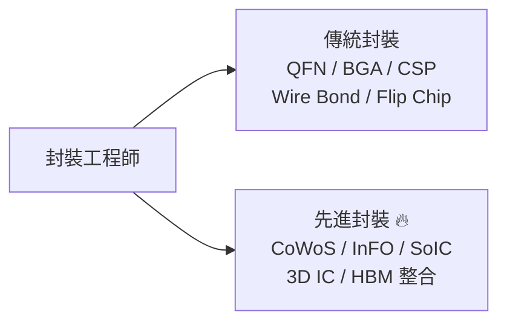
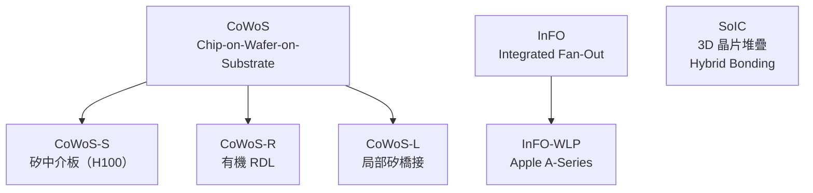

# 封裝工程師

封裝工程師（Package Engineer）在 2024–2025 年是半導體業最熱門的職務之一。NVIDIA H100 使用 CoWoS 先進封裝整合 HBM，導致台積電先進封裝產能嚴重不足，封裝工程師需求爆增。

## 傳統封裝 vs 先進封裝

**先進封裝為何熱門：**
- NVIDIA H100/H200/B100 全部採用 TSMC CoWoS 封裝
- Apple M 系列晶片採用 InFO / SoIC 封裝
- Moore's Law 放緩後，先進封裝成為下一代效能提升的主戰場

## 核心工作

**每天在做什麼：**
- **設計**：選擇封裝類型、基板材料、打線佈局 / Flip Chip Bump 設計
- **模擬**：
  - 熱模擬（ANSYS Icepak）：確保晶片不過熱
  - 機械應力模擬（ANSYS Mechanical）：防止焊點疲勞斷裂
  - 訊號完整性（Sigrity）：高速介面的寄生效應
- **先進封裝**：協同設計矽中介板 RDL 佈局、TSV 設計規範、Micro Bump 規格
- 與晶圓廠（TSMC）和基板供應商協作；監督試產；分析可靠度測試結果

## 先進封裝技術樹

## 核心技能

- MSEE / 機械工程 / 材料碩士
- ANSYS 系列（熱 / 機械模擬）；Sigrity / APD（訊號完整性）
- TSV、RDL、Flip Chip、Wire Bond 製程知識
- 基板設計：Buildup Layer、Via 種類、表面處理（ENIG / ENEPIG）
- 失效模式：焊點疲勞、介金屬化合物（IMC）成長、分層

## 薪資（2024 估計）

| 雇主 | 職級 | 年總酬勞（TWD）|
|------|------|-------------|
| ASE 日月光（新鮮人） | Junior | NT$700K – NT$1.1M |
| ASE 日月光（資深） | Senior | NT$1.5M – NT$2.5M |
| **TSMC 先進封裝**（新鮮人） | Junior | NT$1.0M – NT$1.5M |
| **TSMC 先進封裝**（資深） | Senior | NT$2.0M – NT$4.5M |
| TSMC 先進封裝（Staff / Lead） | Staff | NT$4.0M – NT$8M |

> TSMC 先進封裝（CoWoS / InFO）薪資顯著高於 OSAT 封測廠，差距達 2–3 倍

相關：[CoWoS 技術詳解](../../cowos/html/index.html) 另有專書
