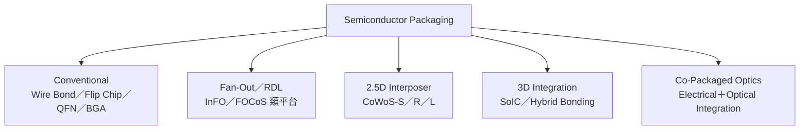

# 封裝工程師

封裝工程師（Package Engineer）把一顆或多顆 die、記憶體、基板、散熱與外部連接整合成可製造、可測試且可靠的產品。先進封裝已從「保護晶片」演變成系統效能的一部分：互連、power delivery、thermal、signal integrity、mechanical stress 與 test strategy 必須一起設計。

## 封裝技術地圖

```mermaid
flowchart TD
    PKG["Semiconductor Packaging"] --> CON["Conventional<br/>Wire Bond／Flip Chip／QFN／BGA"]
    PKG --> FAN["Fan-Out／RDL<br/>InFO／FOCoS 類平台"]
    PKG --> INT["2.5D Interposer<br/>CoWoS-S／R／L"]
    PKG --> D3["3D Integration<br/>SoIC／Hybrid Bonding"]
    PKG --> CPO["Co-Packaged Optics<br/>Electrical＋Optical Integration"]
```

平台名稱不是單純的新舊排名。矽中介板、RDL interposer、local silicon bridge、fan-out 與 3D stacking 各自在 routing density、die size、成本、翹曲、熱與供應鏈上有不同取捨。

## 核心工作

- 定義 package architecture、die placement、bump map、substrate/RDL routing 與 assembly flow。
- 做 chip-package interaction、signal integrity、power integrity、thermal 與 mechanical/warpage 分析。
- 和 foundry、OSAT、HBM／chiplet 供應商、substrate、EDA、test 與系統團隊協同設計。
- 開發或整合 wafer thinning、temporary bond/debond、RDL、plating、microbump/TCB、hybrid bonding、molding、underfill 與 singulation。
- 建立 inline metrology、inspection、package yield、rework 與 reliability qualification。
- 支援 NPI/ramp，處理材料批次、翹曲、void、delamination、open/short、熱與組裝公差問題。

## 2025–2026 的技術焦點

TSMC 的 2025 年報把 CoWoS-S、CoWoS-R、CoWoS-L、SoIC 與 COUPE 分成不同路線；CoWoS-L 正往更大 interposer 與更多 HBM 整合推進。ASE 則以 FOCoS/bridge、TSV、fan-out、2.5D/3D 與 integrated optics 發展異質整合。兩者共同指向幾個職能需求：

- **Chip-package-system co-design**：不再只做基板 layout，還要連動 design、manufacturing data 與 multi-physics risk。
- **Hybrid bonding**：clean、surface activation、CMP、alignment、die traceability 與 queue-time control 一起決定良率。
- **Thermal 與 power delivery**：HBM 與高功率 accelerator 使散熱、PDN、embedded passive/IVR 與冷卻策略提前進入架構階段。
- **CPO 與 optical packaging**：加入光學耦合、fiber attach、photonic/electrical die 與新測試方法。

## 適合誰／工作型態

適合願意同時處理電、熱、力、材料與製造公差，並喜歡跨公司供應鏈協作的人。電機、機械、材料、化工、物理與封裝相關背景都能切入；不同職缺可能偏 design/simulation、process integration、assembly、materials 或 customer technology service。

工作多為日班專案與實驗，但 NPI/ramp、客戶 issue 與量產 excursion 可能需要跨時區會議、短期出差或 on-call。封裝廠的製程／設備職缺與辦公室型 package design 工作不可混為一談。

## 核心技能

- RDL、bump、TSV、substrate、assembly、bonding 與材料界面基礎。
- SI/PI、thermal、mechanical/warpage 或 process integration 中至少一項深度。
- DOE、SPC、FA、reliability、yield 與 qualification/change control。
- 讀懂 package drawing、stack-up、design rule、test vehicle 與 cross-section。
- 能在 performance、yield、reliability、cost、capacity 與 schedule 間做明確取捨。

## 職涯與轉換

可往 package architect、3DIC/system integration、SI/PI/thermal、先進封裝製程、reliability/FA、test、customer engineering 或技術管理發展。製程背景轉封裝時需補系統與 assembly；設計背景轉量產則需補 process window、yield 與供應鏈。

## 面試準備

選一個 warpage、delamination、bump open、thermal hotspot 或 SI/PI 問題，說明如何從 architecture、material、process、assembly、test 與 use condition 建立假設。若題目要求選平台，先釐清 bandwidth、power、die/HBM 數、尺寸、良率、成本與供應能力，不要只回答「用最新技術」。

薪資請見[薪資比較附錄](appendix-salary.md)。

## 資料來源

- [TSMC 2025 Annual Report](https://investor.tsmc.com/static/annualReports/2025/english/index.html)，2026（CoWoS-S/R/L、SoIC 與 COUPE；查證：2026-08-31）
- [ASE IDE 2.0](https://ase.aseglobal.com/press-room/ide2/)，2025-11-04（mechanical/electrical/thermal co-design 與 manufacturing data；查證：2026-08-31）
- [Applied Materials：Kinex hybrid bonding system](https://ir.appliedmaterials.com/news-releases/news-release-details/applied-materials-unveils-next-gen-chipmaking-products/)，2025-10-07（die-to-wafer bonding、clean、metrology 與 die tracing；查證：2026-08-31）

相關：[CoWoS 跨職務合作](21-cowos-collaboration.md)｜[測試工程師](16-test.md)｜[可靠度工程師](13-reliability.md)
