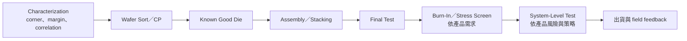

# 測試工程師

測試工程師（Test Engineer）把設計規格轉成可在量產中執行的測試方法，目標是在 coverage、quality、test time、throughput 與 cost-of-test 間取得平衡。工作不只寫程式，也包含 ATE instrument、probe card／load board／socket、handler/prober、thermal control、資料分析與量產導入。

## 測試流程不只 CP 與 FT

不同產品不一定經過所有階段。HBM 更有 base-die wafer test、memory-core test、pre-singulated known-good-stack-die、Chip-on-Wafer、post-singulated stack 與 burn-in；logic base die 與 DRAM dies 也需要不同測試內容。

## 核心工作

- 開發與維護 test flow、pattern、timing、level、measurement 與 limit。
- 做 characterization、guardband、correlation、Gage R&R 與量產 release。
- 設計或規格化 probe card、DUT/load board、socket、handler/prober 與 thermal solution。
- 降低 test time、提高 multisite/parallel efficiency，同時守住 coverage 與逃逸風險。
- 分析 bin/yield、site、touchdown、temperature、tester/interface 與 lot signature。
- 與 DFT、design validation、product、yield、OSAT 與設備商合作處理量產問題。

## Test、Product、DFT 與 Validation 的邊界

| 角色 | 主要 ownership |
|---|---|
| Test Engineer | ATE method/program、interface、coverage、throughput、cost |
| Product Engineer | NPI/ramp、產品 WAT/CP/yield、process window、客戶協作 |
| DFT Engineer | scan、BIST、boundary scan、test access 與 design-for-test architecture |
| Silicon/System Validation | bring-up、功能／情境驗證、margin 與 system behavior |

這些角色高度合作，但不能互相當同義詞。測試工程師會使用 C/C++、Java、Python、pattern language 或平台工具；實際語言依 ATE 與公司環境而定。以 V93000 為例，現行 SmarTEST 8 官方說明為 Java-based interface；IJTAG 是 IEEE 1687 的 embedded-instrument access 標準，不是 ATE 程式語言。

## AI/HPC 與先進封裝的新難題

- scan data 與 pin count 增加，interface bandwidth 和 vector memory 成為瓶頸。
- 高功率與低電壓要求更高的供電動態、針卡保護、散熱與量測準確度。
- HBM 需要 memory＋logic、KGD/KGSD、high parallelism 與多階段 correlation。
- chiplet/package 使 die-level、package-level 與 SLT coverage 必須共同規劃。
- 測試資料要更快回饋 product/yield/fab，不能等到 final test 才發現系統性問題。

## 適合誰／工作型態

適合喜歡硬體、軟體、量測與統計交界，且願意追查「是真的壞、接觸不好、測試程式錯，還是 guardband 不合理」的人。電機、電子、資工、物理與相關背景常見。

研發／NPI 多為日班專案，量產支援可能輪班或 on-call；OSAT、fabless、foundry 與 ATE vendor 的工作內容不同。設備商 application/test engineer 可能常駐客戶端或出差。

## 核心技能

- digital/analog/mixed-signal/RF 或 memory test 中至少一項基礎。
- ATE architecture、timing/level、measurement uncertainty 與 contact/interface。
- DFT/scan/BIST 概念、CP/FT/SLT 流程與基本 device knowledge。
- C/C++、Java 或 Python 中至少一種，以及資料分析／debug 能力。
- test coverage、escape、overkill、guardband、throughput 與成本的取捨。

## 職涯與轉換

可往 senior test methodology、product engineering、DFT、silicon validation、SLT、probe/interface、ATE application 或 test management 發展。轉 Product Engineer 要補製程、WAT 與客戶 ramp；轉 DFT 則要補 RTL、scan architecture 與 ATPG。

## 面試準備

準備一個 yield drop 或 test escape 案例：如何確認 tester correlation、contact、site、temperature、program revision 與真正 device failure。也要能解釋為何縮短 test time 可能犧牲 coverage，以及會用什麼實驗量化風險。

薪資請見[薪資比較附錄](appendix-salary.md)。

## 資料來源

- [Advantest V93000 EXA Scale](https://www.advantest.com/en/products/semiconductor-test-system/soc/v93000/)，現行產品頁（HPC/AI、high power、scan volume、multisite 與 SmarTEST 8；查證：2026-08-31）
- [Teradyne Magnum 7H](https://investors.teradyne.com/news-events/press-releases/detail/419/teradyne-unveils-magnum-7h---the-next-generation-memory-tester-for-high-bandwidth-memory-devices)，2025-08-04（HBM 多階段測試與 KGSD；查證：2026-08-31）
- [ASE 高階封裝與測試新廠](https://ase.aseglobal.com/press-room/ase-breaks-ground-on-new-high-tech-facility-in-kaohsiung/)，2026-03-11（高頻、高功率、高平行度與 system validation；查證：2026-08-31）
- [TSMC Product Engineer](https://careers.tsmc.com/de_DE/careers/JobDetail/2025-Campus-Recruitment-Product-Engineer-PE/15386)，2025-02-10（Product 與 Test 的職務邊界；查證：2026-08-31）

相關：[良率與產品工程](10-yield-product.md)｜[DFT 工程師](04-dft.md)｜[封裝工程師](15-packaging.md)
