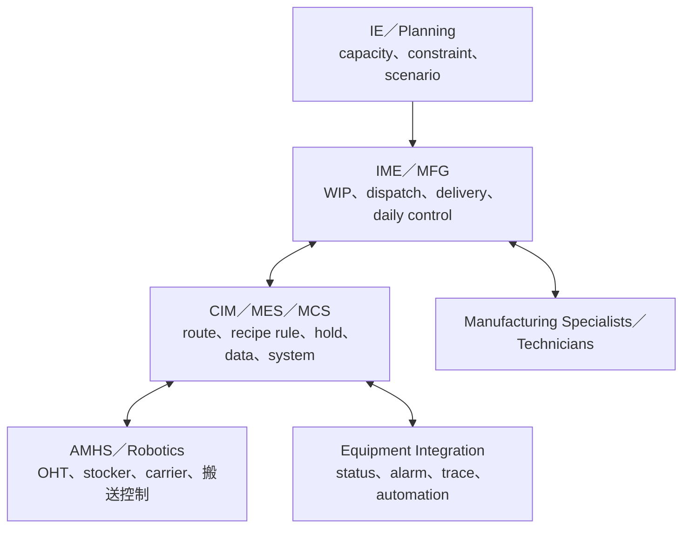

# 智慧製造、MFG、CIM 與 AMHS

智慧晶圓廠不是一個職稱，而是一組共同維持 daily operation 的角色。Intelligent Manufacturing Engineer（IME/MFG）擁有生產節奏與 dispatch；CIM/MES 工程師擁有生產執行軟體與資料流；AMHS/Robotics 工程師擁有晶圓載具的實體搬運與自動化系統。三者和 IE 密切合作，但工作不能互相代換。

## 四層工廠控制

## IME／MFG：讓今天的 fab 跑起來

- 監控 WIP、moves、cycle time、queue、bottleneck 與 delivery commitment。
- 維護 smart scheduling／precise dispatch 邏輯，處理 priority、hold、qualification 與突發 tool down。
- 協調 PE/PIE/EE、manufacturing specialists、planning 與客戶需求。
- 改善 productivity、quality defense 與 daily operation，並管理 shift/direct labor。
- 用數據與 ML/optimization 改善決策，但要保留 override、audit trail 與風險界線。

## CIM／MES／MCS：讓規則可執行且可追溯

- 維護 route、step、equipment state、recipe selection、hold/release 與 lot genealogy。
- 串接 equipment integration、dispatch、WIP、quality、material 與 reporting 系統。
- 處理 production incident、data integrity、latency、deployment、rollback 與 disaster recovery。
- 建立 API、event/data pipeline、monitoring、access control 與 change management。
- 和使用者確認流程語意；錯誤的自動化會比人工錯誤更快擴散。

## AMHS／Robotics：搬送是工廠的神經網路

- 管理 OHT、stocker、buffer、carrier、port、routing 與 material control system。
- 支援 install、commissioning、interlock、recovery、preventive maintenance 與 vendor management。
- 分析 congestion、deadlock、transport time、availability 與 tool starvation/blocking。
- 串接 MES/MCS 與 equipment，確保正確 lot 在正確時間到正確機台。
- 新廠 ramp 時同步處理實體 layout、控制軟體與 operation procedure。

## AI 與 autonomous fab 的現實

SEMI 2025 調查把 PM automation 視為 autonomous fab 的基礎，也持續推動 digital twin、data integrity、sensing、predictive analytics 與 factory-level optimization。AI 可以做 anomaly detection、maintenance prediction、dispatch 建議與 knowledge retrieval，但仍需要資料治理、物理限制、human approval、fallback 與事後追溯。

## 適合誰／工作型態

IME/MFG 適合能快速判斷優先序、溝通現場並帶領團隊的人；CIM/MES 適合懂軟體系統又願意理解製造語意的人；AMHS 適合機電、控制、自動化與系統可靠度背景。

MFG 可能有 normal 與輪班 assignment；CIM/MES 常有 production on-call；AMHS 在 install/ramp 或重大停機時需要現場支援。不同廠區安排不同，應直接確認班別、值班頻率與 incident ownership。

## 核心技能

- IME/MFG：dispatch、WIP/cycle time、constraint、SQL/Python、operation leadership。
- CIM/MES：software engineering、database、distributed system、observability、deployment/rollback。
- AMHS：automation/control、network、mechanical/electrical、routing、safety/interlock。
- 共通：incident command、RCA、change management、資料品質與跨 PE/PIE/EE 協作。

## 職涯與轉換

IME/MFG 可往 fab operations、planning/IE、manufacturing management 或 smart-factory program；CIM 可往 solution architecture、data platform、factory automation 或 IT/OT security；AMHS 可往 automation architect、equipment integration、new-fab ramp 或 vendor engineering。

## 面試準備

IME/MFG 準備「瓶頸 tool down 且 hot lot 堆積」的 dispatch 決策；CIM 準備 production deployment 失敗時的 detection、rollback、data reconciliation；AMHS 準備 congestion/deadlock 或 carrier misroute 的安全恢復。每種回答都要說明如何避免單點決策造成全廠擴散。

薪資請見[薪資比較附錄](appendix-salary.md)。

## 資料來源

- [TSMC Intelligent Manufacturing Engineer](https://careers.tsmc.com/en_US/careers/JobDetail?jobId=17663&source=External+Career+Site)，2025-09-12（daily operation、scheduling、ML、DL 與跨部門協作；查證：2026-08-31）
- [TSMC/JASM Intelligent Manufacturing Engineer](https://ro.careers.tsmc.com/job/Kumamoto-JASM-MFG-Intelligent-manufacturing-engineer-%283783%29-43/780587910/)，2026-07-18（MES Siview、MCS、equipment integration 與 shift assignment；查證：2026-08-31）
- [TSMC Fall 2026 Engineering Opportunities](https://ro.careers.tsmc.com/job/Phoenix-Fall-2026-TSMC-Arizona-Engineering-Full-Time-Opportunities-%28Phoenix%2C-AZ%29-AZ-85001/1366233566/)，2026-08（smart scheduling、precise dispatch、AMHS 與 robotics；查證：2026-08-31）
- [SEMI Smart Manufacturing](https://www.semi.org/cn/industry-groups/smart-manufacturing)，內容含 2025 industry survey（PM automation、digital twin 與 autonomous fab；查證：2026-08-31）

相關：[工業工程師](18-ie.md)｜[設備工程師](10-equipment.md)
