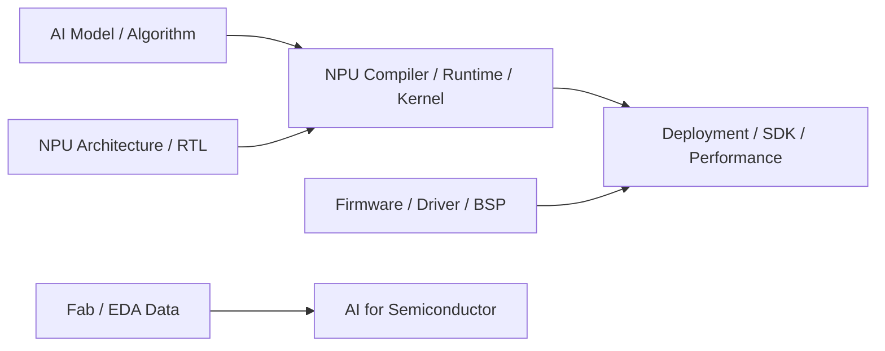
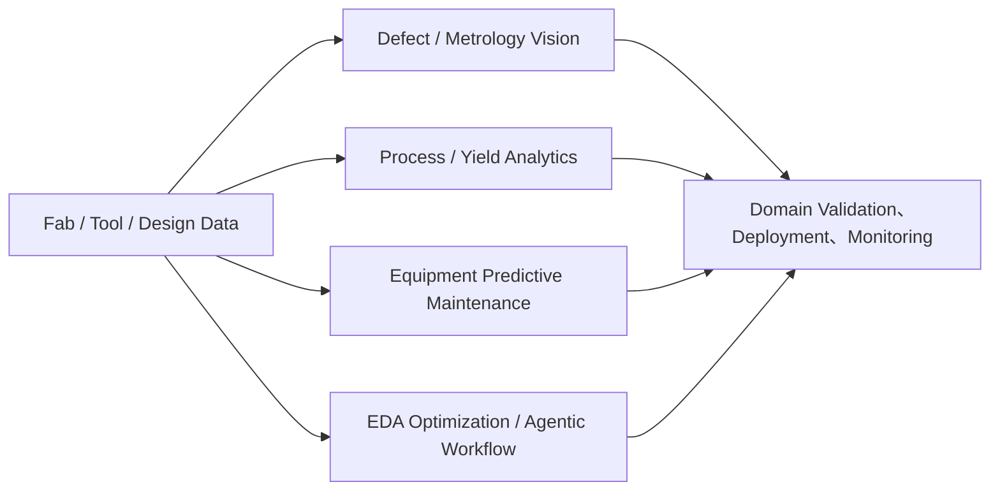
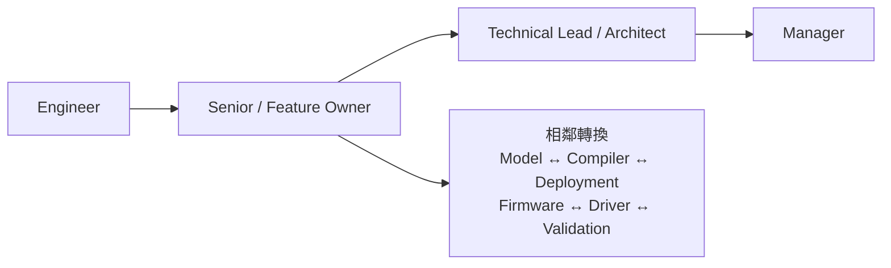

# AI / 軟體工程師

半導體公司的 AI 與軟體不是單一職涯。有人設計模型，有人設計 NPU，有人寫 compiler/runtime/kernel，也有人負責晶片內韌體、Linux driver、BMC 或晶圓廠 AI。共同點是軟體必須面對真實硬體、效能、功耗、可靠度與量產限制。

## 職務地圖

## AI 晶片：不要把四種人混成一職

| 角色 | 核心工作 | 常見交付物 |
|---|---|---|
| AI model / algorithm engineer | 模型架構、訓練、量化、剪枝、蒸餾與 accuracy/quality evaluation | model、training recipe、quantization/calibration data |
| NPU architect / RTL designer | dataflow、memory hierarchy、NoC、numeric format、PPA 與硬體實作 | architecture spec、performance model、RTL |
| AI compiler / runtime / kernel engineer | graph lowering、operator fusion、scheduling、code generation、kernel/runtime optimization | compiler pass、backend、runtime、optimized kernels |
| Deployment / performance engineer | model conversion、operator support、profiling、accuracy/performance correlation、SDK | deployable model、benchmark、SDK/tooling |

聯發科現行 NPU compiler 職缺把 LLVM 或 MLIR 列為必要，並把 TVM、RISC-V、Halide、TFLite 列為相關能力。這條路和 PyTorch model research 相鄰，但不是同一工作。

效能指標也要按 workload 選：LLM 可能看 time-to-first-token 與 tokens/sec；影像、語音或推薦系統可能看 latency、fps、throughput、accuracy/quality、memory footprint、bandwidth 與 energy/inference。`TOPS` 或 `TOPS/W` 不能脫離資料型別與實際 workload 單獨比較。

## AI for Semiconductor

真正落地不只訓練模型，還要處理資料管線、label quality、權限、drift、explainability、production monitoring 與 domain validation。模型提供決策依據，但製程、設備或 signoff 結論仍需對應領域 owner 負責。

2025–2026 的 EDA AI 已從單點 PPA search 擴展到 generative/agentic workflow。Cadence Cerebrus AI Studio 主打多 block SoC closure；Synopsys 擴充 RTL/assertion generation 與 autonomous verification；聯發科也公開招募把 LLM、RAG、agent skills 與 MCP 用於 RTL 與 verification flow 的人才。官方公布的倍數改善是特定工具／案例結果，不應泛化成所有工程師都能等比例縮時。

## 韌體、Driver 與 System Software

| 類別 | 典型內容 | 代表技能 |
|---|---|---|
| On-chip firmware | MCU/RISC-V controller、boot、power/security、calibration | C、assembly、RTOS、register/protocol、JTAG/debugger |
| Platform firmware | UEFI/BIOS、BMC/OpenBMC、secure update、telemetry/manageability | C/C++、Linux、MCTP/PLDM/SMBus、root of trust |
| Kernel / driver | Linux/Windows driver、device tree、DMA、interrupt、IOMMU | C、kernel internals、PCIe/I2C/SPI、concurrency |
| BSP / bring-up | bootloader、board/chip bring-up、硬體／軟體整合 | schematic、lab tools、U-Boot、Linux/RTOS、system debug |
| Protocol / system software | 4G/5G/Wi-Fi、multimedia、storage/network stack | C/C++、real-time/performance、domain specification |
| Customer / factory firmware | production validation、compatibility、field debug、release | automation、system triage、跨公司溝通 |

現行台灣職缺已涵蓋 RISC-V、AUTOSAR/FreeRTOS/OSEK、Linux kernel、bootloader、OpenBMC/UEFI、secure update、telemetry 與 chip/factory bring-up。把韌體只寫成「用 C/Assembly 寫 USB 或 Ethernet MCU」會漏掉大部分工作場景。

## 適合誰與工作型態

| 方向 | 適合誰 | 工作型態 |
|---|---|---|
| AI model | 喜歡數學、實驗設計、資料與模型品質 | 訓練、evaluation、與 deployment/hardware team 迭代 |
| Compiler/runtime | 喜歡 compiler、systems、效能與硬體架構 | code review、benchmark、profiling、跨 framework/target debug |
| AI for Semiconductor | 能把 ML 和製程／設備／EDA domain 接起來 | data pipeline、model、domain validation、production monitoring |
| Firmware/driver | 喜歡低階系統、時序、register、lab 與跨層 debug | code、emulator/FPGA/real silicon、bring-up 與 release |

這些職務通常不是晶圓廠產線輪班，但不能保證固定日班。晶片 bring-up、量產 build、客戶問題、資料中心故障或 release deadline 可能需要跨時區協作、出差或非上班時間支援；應直接問 team 的 support model。

## 核心技能

- **AI model**：PyTorch/JAX/TensorFlow、量化、evaluation、資料與實驗管理。
- **Compiler/runtime**：C/C++、Python、LLVM/MLIR/TVM、compiler、computer architecture、profiling。
- **AI for Semiconductor**：Python/ML、data engineering/MLOps，加上一個可信的製程、設備、良率或 EDA domain。
- **Firmware**：C/C++、RTOS/embedded Linux、ARM/RISC-V、boot、memory/concurrency、硬體介面與 lab debug。
- **Driver/system**：OS/kernel、device tree、DMA/interrupt、PCIe/I2C/SPI/USB/network/multimedia 等產品協定。
- **共同**：版本控制、test/CI、效能量測、技術文件、root-cause debug 與軟硬體協作。

## 職涯發展與轉換

模型、compiler、deployment 之間能靠 workload 與 performance 經驗相互轉換；firmware、driver、BSP、validation 之間則共享 bring-up 與 hardware interface。從一般 web/backend 軟體轉入，最常缺的是 computer architecture、C/C++、效能分析與硬體 debug；從硬體轉入 AI 軟體，則常需補軟體工程、compiler/runtime 或 ML evaluation。

## 主要雇主

- IC 設計、AI accelerator、CPU/GPU、network/storage、memory 與 automotive semiconductor 公司。
- Foundry、設備商與 EDA 公司中的製造 AI、data platform、EDA AI 與 engineering software 團隊。
- Server、ODM/OEM 與 system company 的 BIOS/BMC、driver、platform enablement 與 factory/customer support 團隊。

## 薪資怎麼看

原頁面把 AI model、firmware、driver 與 seniority 混在同一薪資表，也沒有雙來源與股票口徑，已撤下。請參考 [薪資與職涯比較](appendix-salary.md)；比較時至少分清 model research、compiler/runtime、product software、on-chip firmware、platform firmware 與 customer application。

## 面試準備

- AI model：準備一個模型從 baseline、量化／壓縮到部署的完整實驗，清楚說明 accuracy、latency、memory 與能耗取捨。
- Compiler/runtime：複習 compiler pipeline、graph/IR、memory hierarchy、operator fusion、scheduling、profiling 與 C/C++ coding。
- AI for Semiconductor：說明資料如何產生、label 是否可信、domain metric、offline/online validation、drift 與失敗時如何 fallback。
- Firmware/driver：準備 boot flow、interrupt/DMA、memory ordering、concurrency、RTOS/Linux、常見 bus 與一個 lab/root-cause debug 案例。
- 所有方向都要能區分 emulator、FPGA、real silicon 的限制，並說明如何量測而不是只宣稱「效能變快」。
- 反問職缺 owner 的 layer、目標硬體、是否負責 bring-up/量產/客戶 support，以及 on-call、出差與跨時區需求。

## 資料來源

- [MediaTek：NPU Compiler Engineer](https://careers.mediatek.com/zh-tw/jobs/MTK120250324001)（2025 職缺；查證：2026-08-31）
- [MediaTek：AI Engineer for Digital Design](https://careers.mediatek.com/zh-tw/jobs/MTK120260414004)（2026 職缺；查證：2026-08-31）
- [MediaTek：MCU/MPU Embedded Firmware Engineer](https://careers.mediatek.com/zh-tw/jobs/MTK120250529008)（2025 職缺；查證：2026-08-31）
- [NVIDIA：Senior Firmware Engineer – GPU](https://nvidia.wd5.myworkdayjobs.com/nvidiaexternalcareersite/job/Senior-Firmware-Engineer---GPU_JR2019828)（查證：2026-08-31）
- [NVIDIA：Senior Factory Support Firmware Engineer](https://nvidia.wd5.myworkdayjobs.com/en-US/NVIDIAExternalCareerSite/job/Taiwan-Taipei/Senior-Factory-Support-Firmware-Engineer_JR2013228)（查證：2026-08-31）
- [Cadence：Cerebrus AI Studio](https://www.cadence.com/en_US/home/tools/digital-design-and-signoff/soc-implementation-and-floorplanning/cadence-cerebrus-ai-studio.html)（2025 推出；查證：2026-08-31）
- [Synopsys：Expanding AI Capabilities for EDA](https://news.synopsys.com/2025-09-03-Synopsys-Announces-Expanding-AI-Capabilities-for-its-Leading-EDA-Solutions)（發布：2025-09-03；查證：2026-08-31）

相關職務：[IC 設計工程師](01-ic-design.md)｜[驗證工程師](03-verification.md)｜[EDA / CAD / PDK 工程師](05-eda-cad.md)｜[FAE / AE](17-fae.md)
