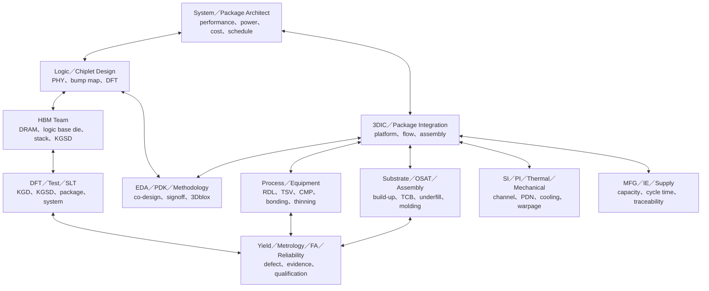
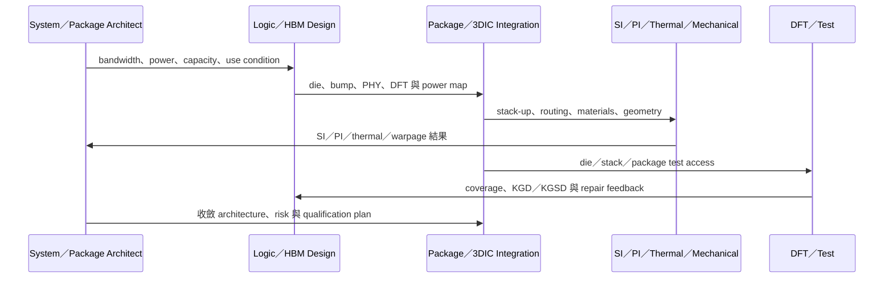
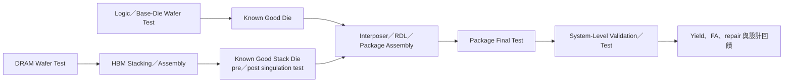

# CoWoS、HBM 與 3DIC 的跨職務合作

先進 AI/HPC 封裝不是把一顆邏輯 die 和幾顆 HBM「放上中介板」就完成。從 architecture、base die、interposer/RDL、bonding、substrate、power/thermal、test、yield 到量產供應，每個決策都會改變其他團隊的窗口。

本頁用匿名的「accelerator＋多顆 HBM」說明合作，不綁定特定產品 SKU。線寬、pitch、interposer 尺寸、overlay 與可靠度條件都應以該世代平台 PDK、產品規格與 qualification plan 為準，不自行填入網路流傳數字。

## 先辨認不同平台

| 平台方向 | 核心結構 | 工程取捨 |
|---|---|---|
| CoWoS-S | silicon interposer | 高 routing density、TSV／interposer 製造、面積與成本 |
| CoWoS-R | RDL interposer | 大面積 routing、polymer/RDL、翹曲與製造性 |
| CoWoS-L | RDL interposer＋local silicon interconnect | local high-density link、embedded device、整合與良率 |
| SoIC | wafer/die-level 3D stacking、hybrid bonding | 極細互連、bonding surface、KGD、熱與測試 |
| CPO／COUPE | photonic＋electrical integration | optical coupling、fiber attach、thermal、test 與 system architecture |

TSMC 2025 年報顯示 CoWoS-L 正往更大 interposer 發展；2025 技術論壇規劃 2027 年量產 9.5-reticle-size CoWoS、整合 12 顆以上 HBM。這是 roadmap，不代表所有產品採相同尺寸或組合。

## 完整合作地圖

## 1. 架構與協同設計

System/package architect 先定義 bandwidth、latency、power、memory capacity、form factor、cooling、reliability 與成本目標。Logic、HBM、package、substrate 與 EDA 團隊再共同收斂 die placement、bump map、PHY、RDL/interposer routing、PDN 與 test access。

這是一個反覆迭代的 loop：

ASE 2025 IDE 2.0 把 electrical、thermal、mechanical、manufacturing data 與 AI risk prediction 放入同一協同設計 loop，反映封裝工程已不能只在設計完成後被動接圖。

## 2. HBM 不只是外部零件

HBM stack 包含多層 DRAM、TSV/interconnect 與 logic base die。HBM4 世代增加 I/O、bandwidth 與客製 base-die 協作，也加重 power、thermal、yield、test 與供應協調。

HBM 相關角色至少包括：

- DRAM process/design/yield、logic base-die design/foundry interface。
- thinning、TSV、microbump/TCB 或未來 hybrid bonding 的 process/equipment。
- memory test、logic test、repair、burn-in、KGSD 與 package-level correlation。
- thermal/mechanical、stack warpage、material、reliability 與 FA。
- capacity、known-good inventory、traceability 與 supplier quality。

## 3. Process、設備與量測共同決定 bonding yield

RDL、TSV、Cu plating、CMP、temporary bond/debond、wafer/die thinning、TCB/hybrid bonding 與 molding 都有獨立窗口。Hybrid bonding 特別要求 surface clean/activation、planarity、alignment、controlled queue time、die tracing 與 inline metrology；不能只畫成「兩片晶圓壓在一起」。

先進封裝圖案化也不應直接等同 EUV。工具與設計規則依平台而異；沒有官方依據時，不應宣稱 CoWoS RDL 必須使用 ArF immersion/EUV、固定線寬或固定 stitching overlay。

## 4. Power、thermal 與 mechanical 是架構問題

高功率 accelerator、多顆 HBM、大型 interposer/substrate 與不同材料 CTE 會共同造成 PDN、hotspot、warpage、bump stress、delamination 與 cooling 挑戰。

imec 2025 的 3D HBM-on-GPU 研究顯示，直接垂直堆疊會產生嚴重熱瓶頸，必須同時調整 stack/material、雙面冷卻與 system operating point。這說明 thermal engineer、package architect、reliability 與 system team 必須在早期共同設計，而不是等 TC/HAST 失敗後才處理。

## 5. KGD、KGSD 與多階段測試

2025 Teradyne HBM 平台把 base-die wafer、memory core、burn-in、pre-singulated KGSD/Chip-on-Wafer 與 post-singulated HBM 都列入 coverage。測試策略必須在 package architecture 前期參與，否則 bonding 後才發現不可測或 coverage 缺口，代價很高。

## 6. Reliability、FA 與 quality 的閉環

qualification 條件應依產品 use condition、材料、package、客戶與適用標準制定，不能把固定的溫度循環範圍、次數或 drop test 套給所有 CoWoS。

失效後先保存證據並從 electrical、X-ray/SAM、thermal/optical localization 到 cross-section 逐步縮小；再把 bump/TSV/RDL/substrate/thermal failure 對回 lot、tool、material、assembly 與 design。Quality team 負責 change control、traceability、supplier/customer communication 與 corrective-action closure。

## 7. 從開發到量產：IE、MFG 與供應鏈

大型先進封裝的 bottleneck 可能在 interposer、HBM、substrate、bonding、test、inspection 或特定材料。IE/capacity team 建模，MFG/dispatch 控制 WIP 與交期，CIM/MES 維護 genealogy 與 route，供應鏈管理 known-good inventory 與跨廠運輸。設備產能增加不代表整體 package output 等比例增加。

## 適合誰／工作型態

這類專案適合能在單一專業保持深度，又願意理解相鄰團隊限制的人。工作多為跨公司、跨國與長週期協作；NPI/ramp、qualification failure 或 supply issue 可能帶來短期高強度與跨時區會議。製程／設備／MFG 可能輪班或 on-call，設計與整合職則多為專案節奏。

## 核心技能

- 至少一項深度：package/3DIC、HBM、RDL/TSV/bonding、SI/PI/thermal、test、yield/FA 或 manufacturing。
- 能讀 stack-up、bump map、power map、test flow、cross-section、wafer/package map 與 qualification result。
- 系統化 trade-off、interface specification、change control、risk register 與 evidence-based RCA。
- 能分清 roadmap、qualified platform、production-ready 與特定產品採用，不把傳聞當事實。

## 職涯與轉換

可往 package/system architect、3DIC integration、HBM interface、SI/PI/thermal、advanced packaging process/equipment、test/SLT、yield/reliability、customer technology service 或 program management 發展。跨域轉換時，先補相鄰 interface，而不是試圖一次學完整條供應鏈。

## 面試準備

拿一個「package yield 下跌」題目，先問發生階段、產品／lot 範圍、electrical signature、inspection/FA evidence 與最近變更，再分 design、die quality、RDL/interposer、bonding、substrate、test、thermal/mechanical 與 material 假設。能提出最小可辨識實驗，比背誦 CoWoS 世代名稱更有價值。

薪資請見[薪資比較附錄](appendix-salary.md)。

## 資料來源

- [TSMC 2025 Annual Report](https://investor.tsmc.com/static/annualReports/2025/english/index.html)，2026（CoWoS-S/R/L、SoIC、COUPE 與量產進展；查證：2026-08-31）
- [TSMC 2025 North America Technology Symposium](https://pr.tsmc.com/chinese/news/3228)，2025-04-23（9.5-reticle-size CoWoS、12+ HBM、base die、IVR 與 CPO roadmap；查證：2026-08-31）
- [ASE IDE 2.0](https://ase.aseglobal.com/press-room/ide2/)，2025-11-04（chip-package interaction 與 multi-physics co-design；查證：2026-08-31）
- [ASE FOCoS-Bridge with TSV](https://ase.aseglobal.com/press-room/ase-announces-focos-bridge-with-tsv/)，2025-05-28（HBM、TSV、power、thermal 與 bridge integration；查證：2026-08-31）
- [Applied Materials：Kinex hybrid bonding system](https://ir.appliedmaterials.com/news-releases/news-release-details/applied-materials-unveils-next-gen-chipmaking-products/)，2025-10-07（bonding、clean、die tracing 與 inline metrology；查證：2026-08-31）
- [Teradyne Magnum 7H](https://investors.teradyne.com/news-events/press-releases/detail/419/teradyne-unveils-magnum-7h---the-next-generation-memory-tester-for-high-bandwidth-memory-devices)，2025-08-04（HBM 多階段測試與 KGSD；查證：2026-08-31）
- [imec：3D HBM-on-GPU thermal STCO](https://www.imec-int.com/en/press/imec-mitigates-thermal-bottleneck-3d-hbm-gpu-architectures-using-system-technology-co)，2025-12-08（3D thermal bottleneck 與 system-technology co-optimization；查證：2026-08-31）

相關：[封裝工程師](15-packaging.md)｜[測試工程師](16-test.md)｜[可靠度工程師](13-reliability.md)｜[智慧製造](18-smart-manufacturing.md)
