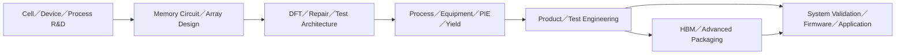

# 記憶體產業職務：DRAM、Flash 與 HBM

記憶體不是「另一種邏輯晶片」。DRAM、NOR／NAND Flash 與 HBM 在 cell、製程、測試、產品週期和客戶需求上都不同，因而形成一套自己的設計、製造與產品工程職務。台灣的重要雇主包括 Micron Taiwan、美光的 HBM 團隊、南亞科、華邦電子與旺宏。

## 先分清產品

| 產品 | 核心需求 | 常見工作重點 |
|---|---|---|
| DRAM | 高密度、速度、refresh、良率與成本 | cell／array、sense amplifier、製程整合、repair、測試 |
| NOR Flash | 快速隨機讀取、可靠度、長生命週期 | embedded／code storage、產品驗證、應用支援 |
| NAND Flash | 高密度儲存、controller／firmware、耐久度 | 3D 結構、error management、產品／測試／系統驗證 |
| HBM | 多顆 DRAM die 堆疊、logic base die、高頻寬與熱管理 | TSV／bonding、KGD/KGSD、多階段測試、封裝與系統協同 |

## 一條產品線會有哪些工程師

### 設計與元件

- Memory cell、array、sense amplifier、timing／power、I/O 與 peripheral circuit。
- ECC、redundancy、BIST／BISR 與 repair strategy；大容量記憶體需要把 coverage、test time、repair yield 一起考慮。
- Device／integration 團隊則處理 cell transistor、capacitor／charge storage、3D 結構、材料與 process window。

### 製程、良率與產品

- 製程模組與設備角色和邏輯廠相似，但 KPI 會更貼近 memory cell、array defect、retention、program／erase、refresh 或 endurance。
- 良率工程師分析 wafer／array／bit-map pattern、設備與製程 signature。
- Product Engineer 串接電性、WAT、wafer sort、repair、speed bin、可靠度與客戶 qualification；這不是單純寫 ATE 程式。

### HBM 特有工作

HBM 把 DRAM dies、logic base die、TSV／interconnect、封裝與散熱放在同一系統，測試也分成 base-die wafer test、memory-core test、pre-singulated stack／Chip-on-Wafer、burn-in 與 post-singulated test。相關角色會跨越 memory design、DFT、product/test、bonding／thinning、thermal／mechanical、package yield 與 system validation。

## 2026 年台灣職缺透露的訊號

官方職缺不能代表完整市場，但能驗證職務確實存在。2026 年華邦職缺同時出現 DRAM／Flash 產品與測試、DRAM 製程良率、元件、製程整合、量測分析、先進封裝與 NOR／NAND Product Engineering；Micron 台灣則有 HBM Product and Systems Engineering 與后里 HBM engineering／manufacturing talent pool。這說明「記憶體工程師」不是單一職稱，也不只等於晶圓廠 PE。

## 適合誰與工作型態

- 喜歡電路：memory circuit／array／I/O／DFT。
- 喜歡元件與材料：cell device、process integration、module R&D。
- 喜歡從大量 pattern 找根因：yield、product、test、reliability。
- 喜歡跨 die／封裝／系統：HBM package、test、thermal、system validation。

設計與研發多為專案制；量產製程、設備、量測或製造職可能輪班／值班；Product／HBM ramp 可能有跨國與緊急支援。應逐一確認職缺，而不是用公司名稱推定班別。

## 核心技能與面試準備

- 先理解目標產品的 cell、讀寫路徑、失效模式與測試流程，不要只背「DRAM 揮發、Flash 非揮發」。
- 準備解釋 redundancy／repair、ECC、retention／endurance、wafer／bit-map pattern；依職缺選其中一到兩項深入。
- HBM 職缺要再補 TSV／stack、KGD/KGSD、base die、熱與多階段測試。
- 面試時反問角色 owner 的交付物：cell／circuit、process module、technology yield、product ramp、ATE program，還是 customer／system validation。

薪資比較見[薪資資料怎麼看](appendix-salary.md)。記憶體景氣循環明顯，單一年份或單一公司的匿名總酬勞不宜推成整個職類行情。

## 資料來源

- [Micron Taiwan：HBM Talent Pool — Engineering, Manufacturing](https://careers.micron.com/careers/job/41526622?domain=micron.com)（查證：2026-09-01）
- [Micron Taiwan：HBM Product and Systems Engineering internship](https://careers.micron.com/careers/job/40457071?domain=micron.com)（查證：2026-09-01）
- [華邦電子 Process Development 職缺](https://careers.winbond.com/go/Process-Development/4672710/)（DRAM 良率、元件、整合、量測與先進封裝；查證：2026-09-01）
- [華邦電子 Product Engineering 職缺](https://careers.winbond.com/go/Product-Engineering/4561710/)（DRAM／NOR／NAND 產品與測試；查證：2026-09-01）
- [南亞科技 Jobs Overview](https://www.nanya.com/tw/Jobs/119/Jobs%20Overview)（DRAM design／layout；查證：2026-09-01）
- [Teradyne Magnum 7H](https://investors.teradyne.com/news-events/press-releases/detail/419/teradyne-unveils-magnum-7h---the-next-generation-memory-tester-for-high-bandwidth-memory-devices)（HBM 多階段測試；2025-08-04；查證：2026-08-31）

相關：[良率與產品工程師](10-yield-product.md)｜[封裝工程師](15-packaging.md)｜[測試工程師](16-test.md)｜[DFT 工程師](04-dft.md)
