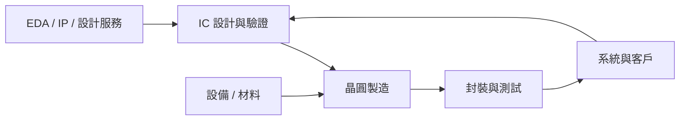

# 導讀：用可驗證的資訊規劃半導體職涯

半導體不是一種工作，而是一條由晶片規格、設計、驗證、製造、封裝、測試到客戶支援組成的價值鏈。同一個「工程師」職稱，在不同公司、產品與廠區可能有完全不同的交付物、班別與職涯出口。

這本書用三個問題介紹每個職務：

1. 這個角色負責什麼交付物，和哪些團隊協作？
2. 入職需要哪些可證明的知識、作品或現場能力？
3. 薪酬、工時與市場需求的數字，母體和日期是什麼？

## 產業範圍

官方統計的產業分類不總是等於「半導體」。例如主計總處的「電子零組件製造業」包含半導體以外的業者，因此本書不把該分類的人數直接稱為半導體就業人口。數字口徑與主要來源集中在[資料來源](references.md)。

## 怎麼讀

- 還不知道方向：先看[產業全貌地圖](00-map.md)，再依交付物選章節。
- 正在選校系或準備轉職：看[入職門檻與學歷規劃](appendix-entry.md)。
- 正在比較 offer：看[薪酬資料與比較方法](appendix-salary.md)，不要只比單一「年薪」數字。
- 正在了解記憶體產業：看[記憶體產業與職務](22-memory-industry.md)。
- 想了解市場變化：看[2025–2026 趨勢](appendix-trends.md)，注意實績與預測的差別。
- 遇到縮寫：查[術語表](glossary.md)。

## 數字怎麼用

本書把資料分成三層：政府／標準組織與公司揭露、求職平台快照、匿名社群個案。前兩者仍須保留年份與母體；論壇只用來提示「面試時該問什麼」，不拿來證明全產業薪資或工時。

> 本次市場資料查證日為 2026-08-31。職缺與薪酬會變動，實際應徵前請回到公司招募頁與原始來源重查。
