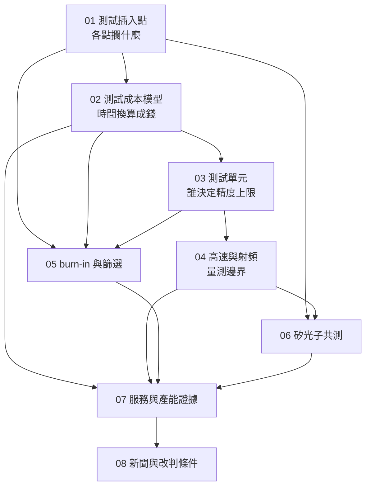

# 全書地圖

## 概念依賴

箭頭表示「先讀誰」。技術章由左至右層層疊加，公司章建立在全部技術章之上。

## 每章在整本書裡做什麼

| 章 | 它建立的東西 | 後面誰用它 |
|---|---|---|
| [01](01-test-in-the-flow.md) | 四個插入點的分工與攔截對象；「burn-in 不產生判定」這個區分 | 02 拿它算成本、05 展開篩選、06 加上光的維度 |
| [02](02-test-cost-model.md) | 一條可重算的成本算式：機台小時 ÷ UPH | 03–06 每一章談的難題，最後都回到這條算式的某一項 |
| [03](03-test-cell.md) | 訊號路徑的實體組成；「先證明治具，再判定晶片」 | 04 把它推到高速情境、05 用它談 burn-in board |
| [04](04-high-speed-rf-test.md) | 量測系統本身成為極限；相關性研究的必要性 | 06 的光耦合是同一個問題的另一種形式 |
| [05](05-burn-in-and-screening.md) | 篩選強度與過殺的取捨 | 07 對應公司的 burn-in／SLT 服務 |
| [06](06-silicon-photonics-test.md) | 光電共測比純電測多出來的對位維度 | 07 對應公司的矽光子分工主張 |
| [07](07-sigurd-product-evidence.md) | 證據等級的分級與衝突數字的並列 | 08 用它讀新聞 |
| [08](08-reading-news.md) | 五則真實事件的事實／推論／未知／改判條件拆法 | — |

## 兩條路線

**完整路線**：01 → 02 → 03 → 04 → 05 → 06 → 07 → 08。技術理解逐層累積。

**快速路線**：01 → 02 → 07 → 08。先拿到「測試是門什麼生意」與「怎麼讀公司消息」，遇到 03–06 的名詞再回頭補。

## 這本書不處理什麼

| 主題 | 去哪裡讀 |
|---|---|
| Chiplet 良率乘法、KGD 的動機 | [CoWoS 第 13 章](../../cowos/html/13-test-and-kgd.html) |
| 產能、稼動率、資本支出通則 | [GPM 第 14 章](../../gpm/html/14-yield-capacity-capex.html) |
| 測試工程師、DFT 工程師的職涯 | [半導體職缺地圖](../../semi-jobs/html/16-test.html) |
| 封裝製程本身 | [GPM](../../gpm/html/index.html)、[CoWoS](../../cowos/html/index.html) |
| 個股投資判斷 | 本書不提供。07、08 只示範證據分級，不做估值 |
