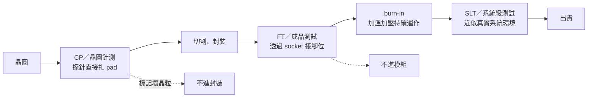

# 01　測試插在哪幾個點，各自攔得住什麼？

## 開場問題：既然最後要測，為什麼不只測一次？

一片晶圓從產出到出貨，會被測好幾次：晶圓還沒切就測一次，封裝完再測一次，有些產品還要烤幾小時再測，最貴的甚至要裝進接近真實系統的環境裡再跑一次。

直覺會問：既然最後那次最接近真實使用，為什麼不省掉前面幾次？

答案是**成本的不對稱**。一顆壞晶粒如果在切割前就被標記，它後面不會消耗封裝材料與封裝工時；如果它混進一顆 CoWoS 模組，它會連累同一模組上的其他好晶粒。**越晚發現，一次失敗毀掉的價值越多。** 所以測試不是一道關卡，是一串攔截網，每一層攔它最擅長攔的東西。

Chiplet 時代良率如何相乘、KGD 為什麼變成硬需求，見[既有書](../../cowos/html/13-test-and-kgd.html)。本章不重推那條算式，只回答一個更前面的問題：**這些插入點各自攔得住什麼、攔不住什麼。**

## 先看結構：四個插入點，四種工件狀態

關鍵在於**每個插入點面對的工件狀態不同**，能接觸到的訊號也不同。

| 插入點 | 工件狀態 | 怎麼接觸 | 主要攔什麼 | 攔不住什麼 |
|---|---|---|---|---|
| CP（晶圓針測） | 未切割的晶圓 | 探針卡直接接觸 pad | 製程缺陷、明顯功能失效、晶圓內分布問題 | 切割與封裝造成的損傷；封裝後才出現的熱與電源行為 |
| FT（成品測試） | 已封裝的成品 | socket 接封裝接腳 | 封裝造成的斷路短路、腳位問題、規格邊界 | 需要長時間才顯現的早夭；真實系統的互動 |
| burn-in | 已封裝成品 | burn-in board，長時間加溫加壓 | 早夭品（infant mortality） | 不會被加速模型涵蓋的失效機制 |
| SLT（系統級測試） | 已封裝成品 | 近似真實系統的板卡與軟體 | ATE 測不到的系統互動、韌體、時序邊界 | 成本極高，只能抽測或用於高價值產品 |

**CP 的特殊價值**：它是唯一能在「還沒花封裝錢」之前攔截的點。對先進封裝來說，CP 的品質直接決定 KGD 的可信度，而 KGD 的可信度決定整個模組的良率風險。

## 輸入／操作／輸出：一顆壞晶粒在各點的命運

| 插入點 | 輸入 | 操作／判定 | 輸出與目的 |
|---|---|---|---|
| CP | 晶圓、探針卡、測試程式 | 逐晶粒接觸、施加激勵、比對規格 | 晶圓圖（wafer map）標記良／不良，決定哪些進封裝 |
| 封裝後 FT | 封裝成品、handler、socket | 逐顆放入 socket、跑完整程式 | 良品分級（binning）、不良品隔離 |
| burn-in | 成品、burn-in board、烤箱 | 加溫加電壓持續數小時 | 篩掉早夭品；本身不產生分級資訊 |
| SLT | 成品、近似系統的測試平台 | 跑近似真實負載的軟體 | 攔截 ATE 涵蓋不到的失效 |

**關鍵推導**：注意 burn-in 和其他三者的性質不同。CP、FT、SLT 是**量測**——施加已知激勵、比對已知規格；burn-in 是**加速老化**——它不量測什麼新規格，它讓會壞的東西提早壞，再由後面的測試抓出來。所以 burn-in 永遠要搭配一次測試才有意義，單獨的 burn-in 不產生任何判定。

## 失敗會長什麼樣子：漏檢會往下游流

| 現象 | 機制 | 需要的證據 |
|---|---|---|
| CP 判良、FT 判不良 | 切割或封裝造成的損傷；或 CP 覆蓋不足 | 同一晶粒的 CP 與 FT 結果對應（需要晶粒級追溯） |
| CP 判不良、重測判良 | 探針接觸不良、針痕偏移、接觸電阻過高 | 針痕檢查、接觸電阻趨勢、重測率統計 |
| FT 全過、客戶端早夭 | 早夭品未被篩選；或 burn-in 條件不足 | 客戶端失效分析、失效時間分布 |
| FT 全過、系統整合時失效 | ATE 環境與真實系統的差異（電源雜訊、時序、韌體互動） | SLT 或客戶端重現條件 |
| 各站良率都正常但總良率掉 | 累積效應，或某站的判定準則漂移 | 逐站良率趨勢與判定門檻的變更紀錄 |

**倒數第二列是 SLT 存在的理由**：ATE 提供的是乾淨、可控、可重複的環境，而這正是它的盲點——真實系統是髒的。有些失效只在真實電源雜訊、真實韌體、真實溫度梯度下出現。

Teradyne 在其 SLT 產品頁把這個缺口講得很直接：即使 ATE 的故障涵蓋率達 99.5%，仍有大量電晶體未被測到。[T5](appendix-sources.md#T5) 這是設備商對自家產品的論述，但它指出的問題是真的——**高涵蓋率不等於全涵蓋**，而剩下那一小部分正是 SLT 要處理的。異質整合讓這件事更嚴重：chiplet 的報廢成本隨整合度呈幾何級數上升，愈晚攔截愈貴。[T6](appendix-sources.md#T6)

## 如何檢查與控制：攔截率要能被計算

要判斷一個插入點值不值得，必須能回答**它攔到了多少、漏掉了多少**。這需要下游的回饋：

| 指標 | 定義 | 沒有它會怎樣 |
|---|---|---|
| 各站良率 | 該站判良數 ÷ 進站數 | 只知道掉了多少，不知道掉的是什麼 |
| 攔截率 | 該站攔到的真不良 ÷ 總真不良 | 無法判斷這站值不值得 |
| 過殺率（overkill） | 被判不良但其實是良品的比例 | 良率損失被誤當成製程問題 |
| 客戶端 DPPM | 流到客戶的不良數（每百萬） | 漏檢成本完全看不見 |
| 重測率 | 重測後翻判的比例 | 接觸問題被誤當成真不良 |

**過殺率是最容易被忽略的一項**。測試門檻收緊會同時提高攔截率與過殺率，兩者的最佳點由「漏檢成本」與「良品被丟掉的成本」的比值決定，不是「越嚴越好」。

一份能判定的測試策略，至少要寫出：**每個插入點測什麼、預期攔什麼、實際攔到什麼、漏檢流到哪裡、這個配置適用哪些產品**。換產品、換封裝形式、換客戶要求，這個配置就要重算。

## 理解檢查

??? question "為什麼 burn-in 和 CP／FT／SLT 性質不同？"
    CP、FT、SLT 都是量測——施加已知激勵、比對已知規格，會產生判定。burn-in 是加速老化，它不產生判定，只讓潛在的早夭品提早失效，必須搭配後續測試才能抓出來。單獨做 burn-in 不會篩掉任何東西。

??? question "CP 已經判良的晶粒，為什麼 FT 還會判不良？"
    兩個可能：一是切割、封裝過程造成新的損傷；二是 CP 的覆蓋本來就不完整——探針接觸的 pad 數有限，封裝後才有完整腳位，某些測試項在 CP 階段根本做不到。要區分這兩者，需要晶粒級的追溯把同一顆的 CP 與 FT 結果對起來。

??? question "為什麼不把所有產品都加做 SLT？"
    SLT 每顆的時間遠長於 ATE 測試，成本高出一個量級。只有高價值產品（漏檢代價極大）或 ATE 確實涵蓋不到的失效模式，才划得來。代價的算法見 [02](02-test-cost-model.md)。

??? question "測試門檻收緊一定比較安全嗎？"
    不一定。收緊會同時提高攔截率與過殺率——本來是良品的也被丟掉。最佳門檻由漏檢成本與良品損失成本的比值決定。只講「從嚴」而不講過殺率，等於把良率損失藏起來。

## 來源與待查

本章來源為 [T4](appendix-sources.md#T4)、[T5](appendix-sources.md#T5)、[T6](appendix-sources.md#T6)。插入點分工與失效機制為工程通則整理；各站的攔截率、過殺率與 DPPM 因產品與客戶而異，本書不提供「業界通用數字」。

接續 [02 測試時間為什麼就是錢](02-test-cost-model.md)，把本章的「值不值得」寫成可重算的算式。
