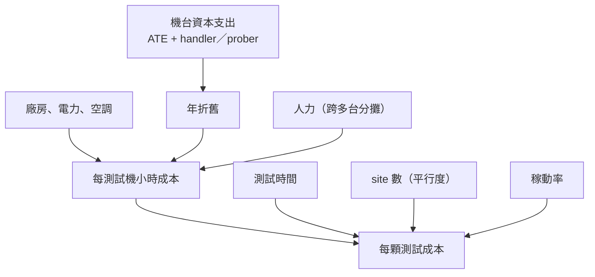
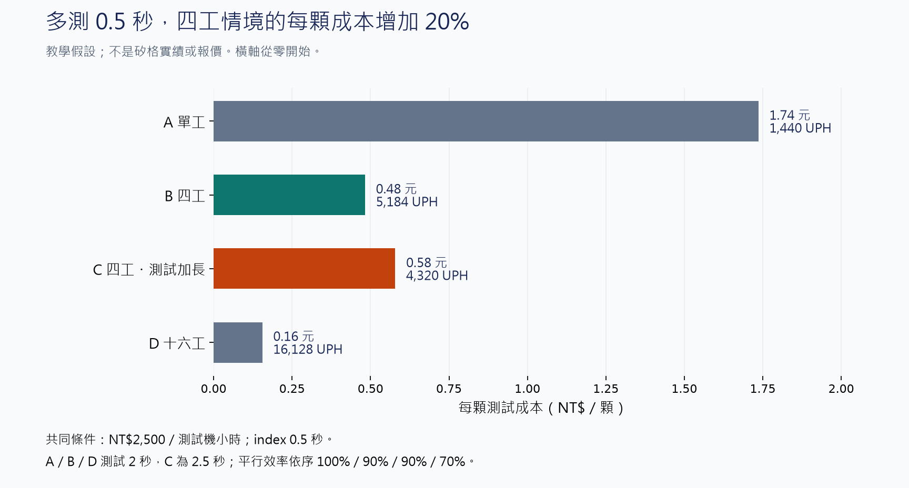

# 02　測試時間為什麼就是錢？

## 開場問題：多測 0.5 秒，一年差多少？

一顆晶片的測試程式跑 2 秒和跑 2.5 秒，聽起來差 0.5 秒。但測試廠賣的不是「測試」這個動作，而是**測試機的可用小時**。一台機器一年能賣的小時數是固定的，測試時間每長一點，同樣的機台一年就少出幾百萬顆。

於是測試工程出現一個外行常誤解的張力：**測得越徹底不一定越好**。多測的每一項都要有人付錢，而付錢的方式是佔用機台小時、或是買更多機台。本章把這件事寫成一條可重算的算式，之後幾章談的「為什麼這個訊號難測」「為什麼要 burn-in」，最後都會回到這條算式上。

先備是 [01 測試插入點](01-test-in-the-flow.md)：知道 CP、FT、SLT、burn-in 各攔什麼。產能與資本支出的通則見[既有書](../../gpm/html/14-yield-capacity-capex.html)，本章只加測試廠特有的部分。

## 先看結構：成本的分母是機台小時，不是人

測試廠的成本結構和組裝廠不同。組裝廠的變動成本裡有材料（基板、錫球、模封料）；**測試幾乎沒有材料**，測試消耗的是機台折舊、廠務（電、空調、氮氣）與少量耗材（探針卡、socket 的壽命）。

這張圖說明一件事：**降低每顆成本只有三條路**——縮短測試時間、提高平行度、把稼動率拉滿。三條路各有物理上限，後面幾章談的難題就是這些上限。

## 輸入／操作／輸出：把算式寫出來

以下全部是**教學假設值**，不是矽格或任何公司的實際數字。目的是讓讀者能自己換數字重算。

先算「每測試機小時成本」：

| 項目 | 假設值 | 說明 |
|---|---|---|
| 一套測試單元（ATE + handler） | NT$60,000,000 | 含介面治具初期投入 |
| 折舊年限 | 5 年 | 直線折舊、無殘值。矽格合併財報揭露其機器設備折舊年限為 **1–9 年**，本例取中間值。[F1](appendix-sources.md#F1) |
| 年折舊 | NT$12,000,000 | 60,000,000 ÷ 5 |
| 年可用小時 | 7,446 小時 | 365 × 24 × 85% 稼動 |
| 每小時折舊 | NT$1,612 | 12,000,000 ÷ 7,446 |
| 廠務＋人力＋耗材分攤 | NT$888 | 教學假設，實務隨廠區差異大 |
| **每測試機小時成本** | **NT$2,500** | 以下算例都用這個數字 |

再算吞吐。一次「插入」（insertion）包含測試本身與 handler 換料的時間：

**每小時產出（UPH）＝ 3,600 ÷（測試時間 ＋ index 時間）× site 數 × 平行效率**

| 情境 | 測試時間 | index | site 數 | 平行效率 | UPH | 每顆成本 |
|---|---|---|---|---|---|---|
| A 單工 | 2.0 秒 | 0.5 秒 | 1 | 100% | 1,440 | NT$1.74 |
| B 四工 | 2.0 秒 | 0.5 秒 | 4 | 90% | 5,184 | NT$0.48 |
| C 四工、測試加長 | 2.5 秒 | 0.5 秒 | 4 | 90% | 4,320 | NT$0.58 |
| D 十六工 | 2.0 秒 | 0.5 秒 | 16 | 70% | 16,128 | NT$0.16 |

<figure class="external-image">
  
  <figcaption>圖 02-1｜B 與 C 只改測試時間，多測 0.5 秒讓每顆成本增加 20%。A、B、D 同時改了 site 數與平行效率，不能把差距全歸給 site 數。全部為教學假設，未另計高工數治具加價與換線成本；數值四捨五入，20% 由未取整數值計算。<a href="99-image-credits.html#img-02-1">圖表來源</a>。</figcaption>
</figure>

驗算 B：3,600 ÷ 2.5 = 1,440；1,440 × 4 × 0.9 = 5,184；2,500 ÷ 5,184 = NT$0.48。

**開場問題的答案**：情境 B 到 C，測試時間從 2.0 加到 2.5 秒，每顆成本從 0.48 漲到 0.58，**貴了 20%（5,184 ÷ 4,320 = 1.2）**。一年一億顆就是近 960 萬台幣。這 0.5 秒必須攔下足夠多的不良品，才值得。

## 失敗會長什麼樣子：帳面便宜，實際不便宜

| 現象 | 機制 | 需要的證據 |
|---|---|---|
| site 數加倍，UPH 沒加倍 | 平行效率下降：測試機通道不足、電源供應受限、site 間串擾、部分項目只能輪流測 | 各 site 的實測時間分解，不是只看總 UPH |
| UPH 達標但交期仍延 | 稼動率被換線（changeover）、換探針卡、校正吃掉 | 機台日誌的稼動分解：測試／換線／待料／維修 |
| 測試成本低但客戶退貨 | 測試涵蓋不足，漏檢成本轉嫁到下游或客戶端 | 各插入點的攔截率與客戶端 DPPM |
| 多測的項目沒有降低退貨 | 加測的項目與實際失效模式不對應 | 失效分析回饋，證明加測項攔到的是真的會壞的 |
| 高工數機台稼動率低 | 高 site 數治具貴、換線久，小批量產品攤不平 | 依產品批量分別計算的單顆成本 |

這個遞減效應有公開數據可對照。ITRS 在 2009 年的測試章節估計：即使多工效率高達 98%，32-site 的測試時間仍會由 10 秒拉長到 16.4 秒。[T4](appendix-sources.md#T4) Advantest 的多工效率文件則給出經驗分界：8 至 16 site 仍有效益，**32 site 以上必須評估投資報酬**。[T3](appendix-sources.md#T3)

Qorvo 在 CS MANTECH 發表的案例更直接：測試時間縮短了 8 倍，實際 UPH 卻因為 OEE 與 index time 只提升不到 5 倍。[T8](appendix-sources.md#T8) **這正是本章算式裡 index 項與稼動率項存在的理由——只算測試時間會系統性高估效益。**

**關鍵推導**：高 site 數不是免費的。治具（load board、probe card、socket）的成本隨 site 數上升，換線時間也變長。小批量產品用高工數治具，換線的損失可能超過平行測試省下的時間。所以**平行度的最佳值由批量決定，不是越高越好**。

## 如何檢查與控制：每個「便宜」都要寫出條件

一份能判定的測試成本評估，至少要回答：

- **測什麼產品、哪個批量**——單顆成本在 10 萬顆和 1,000 萬顆是不同的數字
- **用哪一台機、哪一版程式**——測試時間隨程式版本變動
- **site 數與實測平行效率**——不是治具標稱的 site 數
- **稼動率怎麼算的**——分母是日曆時間、排程時間還是可用時間，差距很大
- **漏檢成本算進去了沒**——只算機台成本會系統性低估

| 控制項 | 怎麼量 | 常見的誤用 |
|---|---|---|
| 測試時間 | 程式各段實測耗時分解 | 只報總時間，看不出哪段可縮 |
| 平行效率 | 實測 UPH ÷ 理論 UPH | 直接用 site 數當平行度 |
| 稼動率 | 分母定義明寫 | 換分母美化數字 |
| 攔截率 | 各插入點抓到的不良 ÷ 總不良 | 沒有下游回饋就無法計算 |

縮短測試時間的手段（減少測試項、降低覆蓋、放寬 guard band）**每一項都在拿良率風險換成本**。這個交換必須是明示的決策，不能是工程師私下改程式的結果。

## 理解檢查

??? question "為什麼測試廠的變動成本裡幾乎沒有材料？"
    測試不改變工件本身，消耗的是機台時間與治具壽命。這使測試廠的成本結構高度依賴折舊與稼動率，接近重資產的租賃生意，而不是加工生意。

??? question "16 site 的每顆成本比 4 site 便宜三倍，為什麼不是所有產品都用 16 site？"
    因為平行效率會掉（表中從 90% 掉到 70%），且治具更貴、換線更久。批量小的時候，換線損失與治具攤提會吃掉平行測試省下的錢。最佳 site 數由批量、治具成本與換線時間共同決定。

??? question "客戶說「測試成本要降三成」，工程上有哪些做法，各自的代價是什麼？"
    縮短測試時間（風險：覆蓋下降）、提高 site 數（代價：治具投資與換線）、提高稼動率（代價：排程彈性）、把部分項目移到更便宜的插入點（風險：該點攔不住）。沒有一項是免費的，都要說出被換掉的是什麼。

??? question "為什麼只看「每測試機小時成本」會低估真實成本？"
    它沒有包含漏檢成本。一顆流到客戶端的不良品，代價可能是它測試成本的幾百倍到幾千倍。完整的評估必須把攔截率與下游失效成本一起算。

## 來源與待查

本章引用的多工遞減數據來自 [T3](appendix-sources.md#T3)、[T4](appendix-sources.md#T4)、[T8](appendix-sources.md#T8)；折舊年限來自 [F1](appendix-sources.md#F1)。

除上述具名來源外，本章的成本算式與全部數值為**教學假設**，可自行代入重算；不代表矽格或任何測試廠的實際機台成本、測試時間或 UPH。
