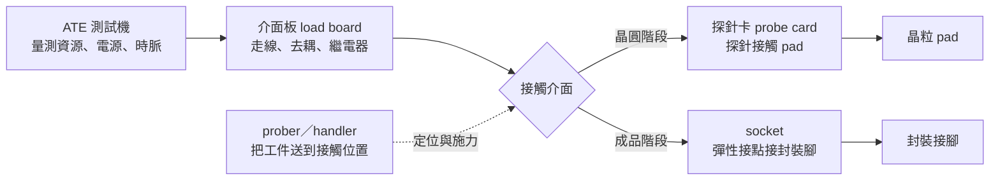
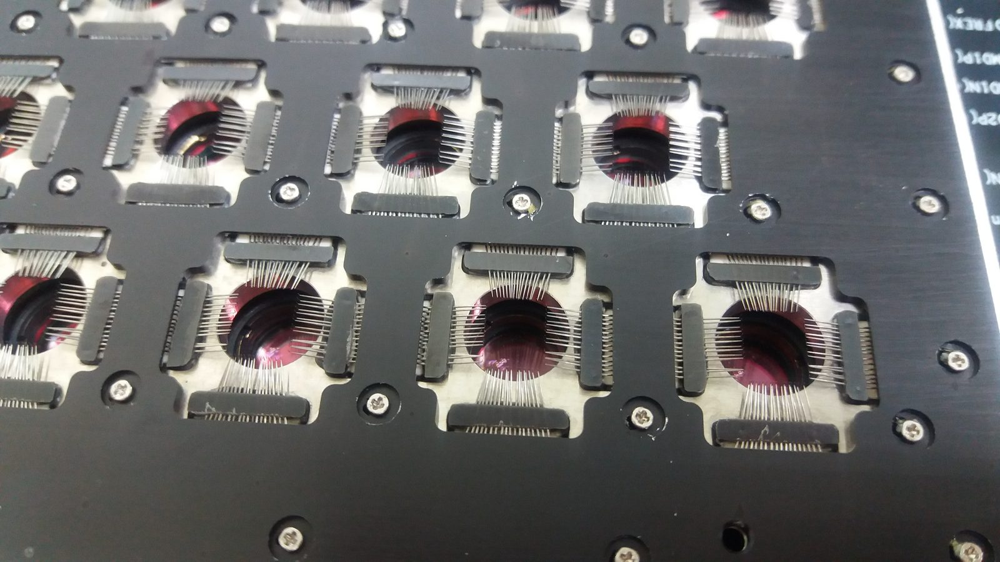
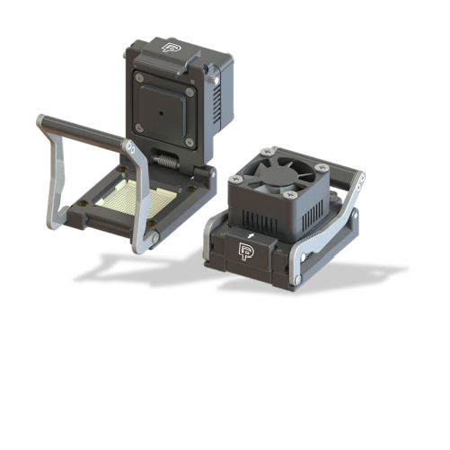

# 03　一個測試單元由什麼組成，誰決定精度上限？

## 開場問題：測試機再好，為什麼還是測不準？

買一台規格頂級的 ATE，量測精度標得很漂亮。裝上線之後卻發現：同一顆晶片重測兩次結果不同、換一片探針卡整批良率就掉、機台放在角落那台的數字跟別台差一截。

問題通常不在測試機本身。**訊號從測試機的量測資源走到晶片的 pad，中間要經過一長串實體介面**，每一段都會衰減、反射、引入雜訊與接觸電阻。測試機的規格是它自己端點的規格，不是晶片端點的規格。

本章拆開這條路徑，回答：誰真正決定了一個測試單元的精度上限。成本面見 [02](02-test-cost-model.md)。

## 先看結構：訊號要走過幾道關

| 元件 | 做什麼 | 它引入的限制 |
|---|---|---|
| ATE 測試機 | 產生激勵、量測回應、供電、對時 | 通道數、量測解析度、電源供應能力 |
| 介面板（load board） | 把測試機資源接到接觸介面 | 走線長度造成的衰減與反射；去耦不足導致電源雜訊 |
| 探針卡（probe card） | 晶圓階段的接觸 | 接觸電阻、平面度、針痕、針的磨耗與壽命 |
| socket | 成品階段的接觸 | 接觸電阻、插拔壽命、熱阻 |
| prober／handler | 把工件送到定位並施力 | 定位精度、施力一致性、溫度控制、index 時間 |

<figure class="external-image">
  
  <figcaption>圖 03-1｜CIS（CMOS 影像感測器）探針卡實物。看各模組中央集中的細探針，將它對回上圖的「探針卡 → 晶粒 pad」接觸介面；照片沒有呈現整套 ATE 或晶圓定位機構，也不代表矽格使用此設備。攝影：Jasycheng，<a href="https://creativecommons.org/licenses/by-sa/4.0/">CC BY-SA 4.0</a>，原圖未修改。<a href="99-image-credits.html#img-03-1">原始檔案與出處</a>。</figcaption>
</figure>

<figure class="external-image">
  
  <figcaption>圖 03-2｜夾殼式測試 socket 的外觀例子。相較於直接接觸晶圓焊墊的探針卡，socket 以定位與夾持機構讓待測物接上測試介面。原始頁將此型號描述為 IC 操作壽命測試用模組 socket；不能據此推定所有 FT 的治具形狀，也不代表矽格使用此設備。作者：DPJessie，<a href="https://creativecommons.org/licenses/by-sa/4.0/">CC BY-SA 4.0</a>，原圖未修改。<a href="99-image-credits.html#img-03-2">原始檔案與出處</a>。</figcaption>
</figure>

**核心認知**：ATE 的規格是「測試機端點」的規格。實際落在晶片 pad 上的激勵，已經被後面每一段修改過。高速訊號尤其如此——這是 [04](04-high-speed-rf-test.md) 的主題。

## 輸入／操作／輸出：一次接觸發生什麼

| 步驟 | 輸入 | 操作／判定 | 輸出 |
|---|---|---|---|
| 對位 | 工件、視覺系統、座標 | prober 對準 pad 或 handler 對準 socket | 接觸位置確定 |
| 接觸 | 探針或彈性接點、下針量（overdrive） | 施力壓到設定行程 | 建立電氣通路；同時在 pad 留下針痕 |
| 溫度到位 | 目標測試溫度 | 加熱／冷卻並等待穩定 | 在規定溫度下量測 |
| 量測 | 測試程式 | 施加激勵、讀回應、比對規格 | 逐項通過／失敗 |
| 分選 | 判定結果 | 標記晶圓圖或分 bin | 良品分級、不良品隔離 |

這些力量累積起來不容小覷。Advantest 的直接探針文件記載：單針施力約 5–15 公克，一顆 5,000 針的晶粒總施力就超過 75 公斤；平面度要求落在 5–20 微米。[T1](appendix-sources.md#T1) 全片探針卡更極端——超過 10 萬支探針、需要 200 公斤的卡盤力道。[T8](appendix-sources.md#T8)

接觸電阻則有一個常見的數量級參考：ITRS 2009 的測試章節提到需低於 0.5 歐姆，socket 的正向力約 20–30 公克／針。[T4](appendix-sources.md#T4) 這是 2009 年的產業估值，不是現行規格，但足以說明一件事：**接觸電阻的可接受範圍是歐姆的小數點等級，很容易被污染與磨耗推出範圍。**

**關鍵推導**：接觸品質與針痕是一組取捨。下針量太小，接觸電阻高、量測不準、容易誤判為不良；下針量太大，接觸確實了，但針痕深、可能傷到 pad 下方結構，也加速探針磨耗。**這個窗口必須量出來，不能憑手感調。**

## 失敗會長什麼樣子：最難查的是「時好時壞」

| 現象 | 機制 | 需要的證據 |
|---|---|---|
| 重測就變良品 | 接觸電阻過高：針尖氧化、髒污、下針量不足 | 接觸電阻趨勢、重測翻判率、針尖清潔週期 |
| 晶圓邊緣良率特別低 | 探針卡平面度不足、晶圓翹曲、對位偏移 | 依晶圓座標分區的良率圖 |
| 換一片探針卡良率就變 | 兩片卡的針位、平面度或阻抗不一致 | 同一批工件在兩片卡上的比對測試 |
| 同機種不同台結果不同 | load board 版本、校正週期、溫控能力差異 | 標準件（golden unit）在各台的結果 |
| 測試久了數字漂移 | 探針磨耗、socket 接點疲勞、溫度累積 | 隨接觸次數的趨勢，而非單點量測 |
| 高速項目失敗、低速全過 | 訊號路徑的衰減與反射，不是晶片問題 | 治具本身的通道特性量測 |

**「重測就變良品」是測試廠最危險的訊號**。它可能代表接觸問題（過殺），也可能代表產品真的處在邊界（漏檢）。兩者的處理方式完全相反，不能用「重測通過就放行」帶過。

## 如何檢查與控制：耗材有壽命，校正有有效期

測試單元裡有兩類東西會隨使用改變：**接觸類耗材**（探針、socket 接點）與**校正狀態**。兩者都必須有明確的有效期與判定準則。

| 控制項 | 怎麼量 | 失控的後果 |
|---|---|---|
| 探針卡接觸電阻 | 定期用標準件量測，看趨勢 | 良率被接觸問題污染，誤判為製程問題 |
| 針痕位置與大小 | 針痕檢查（光學或人工抽檢） | 傷及 pad，後續打線或凸塊不良 |
| 探針接觸次數 | 累計計數，設定清潔與更換門檻 | 磨耗到失效才發現，整批重測 |
| socket 插拔次數 | 累計計數 | 接觸不良率隨使用上升 |
| 校正有效期 | 定期校正並記錄 | 過期校正下的數據無法追溯 |
| 溫度穩定性 | 量測點的實測溫度，不是設定溫度 | 規格是在溫度下定義的，溫度不對規格就不對 |

一份能判定的測試單元驗收，至少要回答：**用哪一版 load board、哪一片探針卡（幾號、已用幾次）、哪台機、校正日期、測試溫度的實測值、標準件的結果**。缺其中任何一項，這批數據的可追溯性就斷了。

## 理解檢查

??? question "ATE 標的量測精度是 1 mV，為什麼實際量到的誤差遠大於此？"
    因為 1 mV 是測試機端點的規格。訊號還要走過 load board、探針卡或 socket，經歷走線衰減、接觸電阻上的壓降、電源雜訊與溫度漂移。晶片 pad 上實際看到的，是被整條路徑修改過的訊號。要知道實際精度，必須量測整條路徑，不能只看機台型錄。

??? question "下針量（overdrive）加大能改善接觸，為什麼不一律調到最大？"
    針痕會變深，可能傷及 pad 下方結構，影響後續打線或凸塊；探針磨耗也加速，壽命縮短。這是一個要量出來的窗口：接觸電阻要夠低，針痕要夠淺，兩個條件共同框出可用範圍。

??? question "重測後通過的產品可以出貨嗎？"
    看重測翻判的原因。如果是接觸問題（可由接觸電阻、針痕證明），第一次是過殺，翻判合理；如果產品本身處在規格邊界，重測通過只是量測散布的另一次抽樣，放行等於把邊界品送出去。兩者的判斷需要證據，不能用「重測通過」當通則。

??? question "同一個測試程式在兩台機上結果不同，該先查哪裡？"
    先查兩台的治具與校正狀態，不是先懷疑程式。load board 版本、探針卡或 socket 的使用次數、校正日期、實測溫度——這些是最常見的差異來源。用標準件在兩台上跑一次，能快速定位差異是在工件還是在測試單元。

## 來源與待查

本章引用的施力、平面度與接觸電阻數字來自 [T1](appendix-sources.md#T1)、[T4](appendix-sources.md#T4)、[T8](appendix-sources.md#T8)。**設備商文件描述其自家產品能力，ITRS 為 2009 年的產業估值，兩者都不是現行通用規格。**

其餘元件分工、失效機制與控制項為工程通則整理，不對應任何特定設備商的型號規格。各項門檻（接觸電阻上限、下針量窗口、探針壽命）隨產品、pad 材質與封裝形式而異，本書不提供通用數字。

接續 [04 高速與射頻的量測邊界](04-high-speed-rf-test.md)，看訊號路徑的限制在什麼條件下會變成決定性的。
