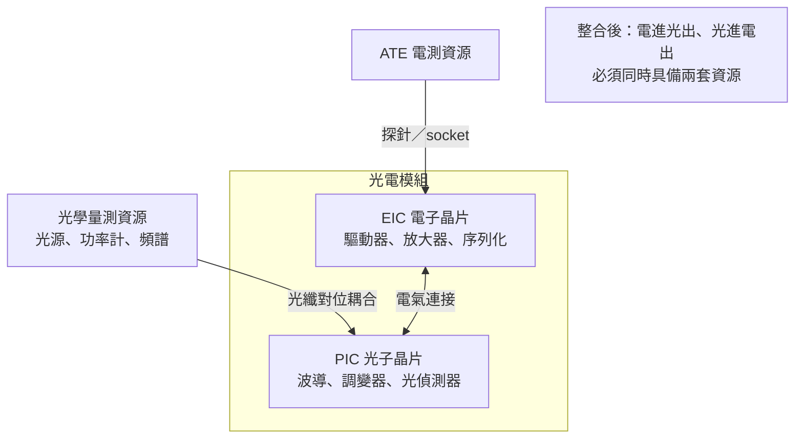
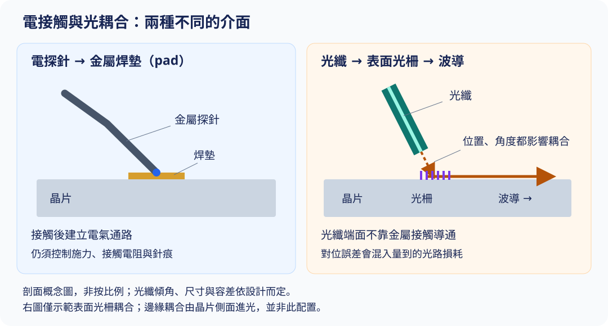

# 06　光進來之後，測試多了哪些新題目？

## 開場問題：探針可以扎 pad，那光要怎麼「接」？

前面五章的測試都建立在同一個前提上：**訊號是電的，可以用金屬接點接出來。** 探針扎 pad、socket 夾接腳，建立一條電氣通路，量測就能進行。

矽光子把這個前提打破了。晶片上有光波導、有光柵耦合器、有雷射源與光偵測器。要測它，得把光接進去、把光接出來——而光**沒有辦法用一根探針扎住**。它要對準，容差在微米等級；它會因為角度偏一點就損失大半功率；它進出晶片的那個介面本身就是一個精密光學元件。

本章談光電共測比純電測多出來的東西。先備是 [01 插入點](01-test-in-the-flow.md) 與 [04 高速量測邊界](04-high-speed-rf-test.md)。

## 先看結構：EIC 與 PIC 是兩種不同的待測物

矽光子模組通常由兩類晶片組成，它們的測試需求完全不同：

| 待測物 | 訊號型態 | 接觸方式 | 主要量什麼 |
|---|---|---|---|
| EIC（電子晶片） | 純電 | 探針或 socket | 與前面幾章相同：功能、時序、高速 |
| PIC（光子晶片） | 光 | 光纖對位耦合 | 插入損耗、波長響應、調變效率、消光比 |
| 整合模組 | 電進光出、光進電出 | **同時需要電接觸與光耦合** | 端到端的鏈路性能 |

**核心差異**：電測的接觸是「接上就通」，光的耦合是「對準才有效率」。對準的品質直接成為量測數字的一部分——**你量到的損耗，包含了你對得多準。**

<figure class="external-image">
  
  <figcaption>圖 06-1｜電探針要控制接觸品質，光纖則要控制位置與角度，耦合誤差會混入光路損耗。右側只示範表面光柵耦合，另有從晶片側面進光的邊緣耦合；本圖非按比例，也不是矽格設備配置。依 Keysight 對耦合幾何的文字說明繪製，未轉載原圖。<a href="99-image-credits.html#img-06-1">圖表來源</a>。</figcaption>
</figure>

## 輸入／操作／輸出：多了一道對位

| 步驟 | 輸入 | 操作 | 輸出 |
|---|---|---|---|
| 電接觸 | 探針卡或 socket | 與純電測相同 | 電氣通路建立 |
| **光對位** | 光纖或光學探針、對位機構 | 主動對位：邊送光邊搜尋最大耦合效率的位置 | 光路建立，並記錄對位品質 |
| 光電量測 | 電激勵、光源 | 電進光出或光進電出，量測端到端性能 | 損耗、消光比、頻寬等 |
| 溫度條件 | 目標溫度 | 波長對溫度敏感，溫控要求比純電測嚴 | 在規定溫度下的光學性能 |
| 分選 | 判定結果 | 標記或分 bin | 良品分級 |

**關鍵推導**：光對位是一道**耗時且會影響量測結果**的步驟。它拉長測試時間（直接推高 [02](02-test-cost-model.md) 的每顆成本），而且對位不準會被誤讀成產品損耗高。所以光電共測必須把「對位品質」本身當成一項要控制、要記錄的指標，不能只記錄最終損耗值。

對位精度的落差有多大？Teradyne 在其矽光子測試文章中指出：光纖對位需要**次微米**精度，而電性探針只需要**數十微米**。[T12](appendix-sources.md#T12) Keysight 則點出幾何上的根本矛盾：單模光纖的核心約 9 微米，遠大於晶片上的波導尺寸，而且偏振態會隨波長變化。[T13](appendix-sources.md#T13) **兩者相差兩到三個數量級，這就是光對位無法像電接觸那樣「接上就通」的原因。**

業界正在用整合式治具壓低這個代價。Jenoptik 的光電整合探針卡標示每片晶圓只需對位一次、插入損耗重複性 0.3 dB，並相容 Advantest V93000 與 Teradyne UltraFLEX。[T14](appendix-sources.md#T14) 耦合損耗本身則隨結構設計差距很大：一篇 2024 年的 CPO 回顧論文列出 FP 共振腔輔助對位的耦合損耗為 3.52 dB，而先進邊緣耦合器可壓到 1 dB 以下。[T15](appendix-sources.md#T15)

## 失敗會長什麼樣子：分不清是晶片還是耦合

| 現象 | 機制 | 需要的證據 |
|---|---|---|
| 插入損耗偏高 | 可能是晶片波導損耗，也可能是對位不佳或光纖端面髒污 | 重新對位後的重測；標準件在同一設定下的結果 |
| 同一顆重測損耗不同 | 對位重現性不足 | 多次對位的損耗散布，而非單次數值 |
| 波長響應偏移 | 溫度不在規格點；或製程造成的尺寸偏差 | 實測晶片溫度，不是設定溫度 |
| 電測全過、光路不過 | EIC 正常但 PIC 或兩者介面有問題 | 分別測 EIC 與 PIC，再測整合鏈路 |
| 測試時間遠超預估 | 對位搜尋耗時，且難以多工平行 | 對位時間與量測時間的分解 |
| 批次間損耗系統性偏移 | 光學治具老化、光纖端面磨耗 | 標準件的長期趨勢 |

**第一列是矽光子測試的核心困難**，也是它與純電測最大的差別：在電測裡，接觸不良通常會造成明顯的開路，容易辨認；在光測裡，對位差一點只是損耗高一點，**看起來就像產品性能比較差**。分辨兩者必須靠標準件與對位重現性數據。

## 如何檢查與控制：對位品質要被記錄

| 控制項 | 怎麼量 | 失控的後果 |
|---|---|---|
| 對位重現性 | 同一顆多次對位的損耗散布 | 產品散布與對位散布混在一起 |
| 標準件損耗 | 已知損耗的參考件定期量測 | 光學治具漂移無法察覺 |
| 光纖端面狀態 | 定期檢查與清潔 | 損耗系統性偏高，誤判為產品不良 |
| 實測溫度 | 晶片端量測 | 波長規格是溫度相依的，溫度不對規格就不對 |
| 對位時間 | 計入測試時間分解 | 成本估算低估 |
| 參考面定義 | 明寫損耗數字含不含耦合介面 | 規格無法跨廠比較 |

**最後一項與 [04](04-high-speed-rf-test.md) 的校正面是同一個道理**：一個損耗數字若不說明它從哪裡量到哪裡，就無法比較。含耦合介面的損耗與純晶片波導損耗，是兩個不同的數字。

CPO（共同封裝光學）把光學元件與運算晶片封在一起，測試的難題再加一層：**模組完成後，光路與電路已經綁在一起，任何一方不良都報廢整個模組。** 這使得「封裝前先確認每個部分都是好的」——也就是 KGD 的邏輯——在矽光子上比在純電模組上更關鍵。相關的良率乘法見[既有書](../../cowos/html/13-test-and-kgd.html)。

Teradyne 把 CPO 的測試點拆成三個階段：晶圓級、切割後、以及最終共封裝。[T12](appendix-sources.md#T12) **這和 [01](01-test-in-the-flow.md) 的插入點邏輯是同一件事**——只是每個階段都多了一套光學資源的需求，而且愈晚攔截，報廢掉的東西愈貴。

## 理解檢查

??? question "為什麼光的「接觸」比電的接觸難？"
    電接觸只要建立通路就算成功，接觸電阻可以量測並控制在容許範圍內。光耦合的效率高度依賴對位精度——容差在微米等級，角度偏一點功率就損失大半。而且對位品質會直接混進量測結果：你量到的損耗包含了你對得多準。

??? question "插入損耗量到偏高，怎麼判斷是晶片問題還是對位問題？"
    先重新對位再測一次，看數字是否收斂；再用已知損耗的標準件在同一設定下測，確認治具本身正常。如果標準件也偏高，問題在治具或光纖端面；如果標準件正常而待測件重測後仍偏高，才有理由懷疑晶片。

??? question "為什麼矽光子測試特別難提高平行度（multi-site）？"
    因為每個 site 都需要獨立的光學對位機構與光學量測資源，而對位是耗時的搜尋過程，難以像電測那樣單純複製通道。這使 [02](02-test-cost-model.md) 裡「提高 site 數降低每顆成本」這條路在矽光子上代價高得多。

??? question "CPO 為什麼讓 KGD 的要求變得更嚴格？"
    因為光學元件與運算晶片被封在同一個模組裡，封裝後任一方不良都報廢整個模組，而模組的價值遠高於單一晶片。封裝前把每個部分確認為已知良品，是控制這個風險的唯一方法，光路與電路都要。

## 來源與待查

本章引用的對位精度、耦合損耗與治具能力數字來自 [T12](appendix-sources.md#T12)、[T13](appendix-sources.md#T13)、[T14](appendix-sources.md#T14)、[T15](appendix-sources.md#T15)。

**查證限制**：未找到 EIC／PIC 測試分工協定的專門一手來源，本章對兩者分工的描述為依公開資料的合理整理。

其餘光電共測差異與控制項為工程通則整理，不提供通用的損耗、容差或波長門檻。

矽格與其子公司台星科（WinStek）在公開場合陳述過集團在矽光子上的分工：台星科負責前段封裝（含晶圓凸塊、覆晶與矽光子／CPO 光模組封裝整合），矽格負責後段的矽光子晶片測試。[I2](appendix-sources.md#I2)、[N1](appendix-sources.md#N1) 這是**公司自述的商業模式，不是交易憑證**；實際承接的產品、客戶與量產階段未公開，列為待查（[Q06](appendix-open-questions.md)）。

接續 [07 服務與產能證據矩陣](07-sigurd-product-evidence.md)，把技術能力與公開證據對起來。
