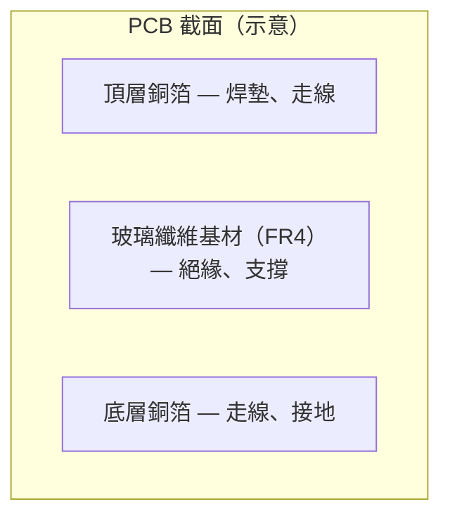
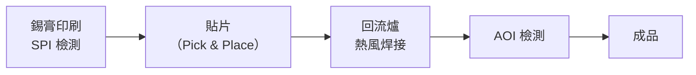
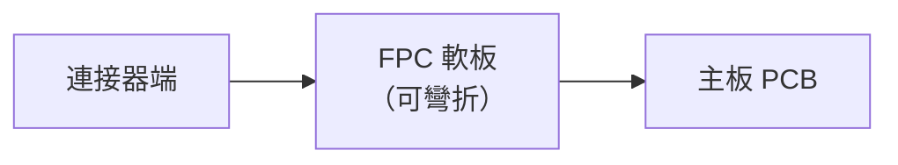

# PCB 與 SMT 基礎概念

在深入三種加熱工藝之前，先建立必要的基礎認識。

---

## 什麼是 PCB？

**PCB（Printed Circuit Board，印刷電路板）** 是電子產品的「骨架」，提供機械支撐與電氣連接。

*DVD 播放機的 PCB：可清楚看到綠色阻焊層、白色絲印、銅色焊墊與各式 SMT 元件。*

*ZX Spectrum 主機板細節：可清楚看到銅色走線、通孔（Via）及兩層之間的連結路徑。*

| 名詞 | 說明 |
|------|------|
| **焊墊（Pad）** | 銅箔暴露區域，用來焊接元件引腳 |
| **走線（Trace）** | 銅箔導電路徑，連接各焊墊 |
| **通孔（Via）** | 穿透各層的鍍銅孔，實現層間導通 |
| **阻焊層（Solder Mask）** | 綠漆（或其他顏色），保護不需焊接的銅面 |
| **絲印層（Silkscreen）** | 白色標示，印元件編號與方向 |

---

## 什麼是 SMT？

**SMT（Surface Mount Technology，表面黏著技術）** 是現代電子製造的主流組裝方式。元件不再插入鑽孔，而是直接**貼在 PCB 表面的焊墊上**，再經過回流爐焊接。

*USB 隨身碟 PCB 上的 SMT 元件——小方塊為電阻（有數字）與電容（無標示），尺寸約 0603。*

### SMT 生產線流程

*SMT 生產線：前景是料帶送料器（Tape Feeder），後方是空的 PCB 傳送帶，頭部裝有兩個吸嘴。*

*貼片機（Pick & Place Machine）——機械手臂以真空吸嘴高速吸取元件，精確貼到 PCB 焊墊上。*

### SMT vs 插件（THT）比較

| 項目 | SMT | THT（Through-Hole） |
|------|-----|---------------------|
| 元件引腳 | 貼在板面 | 插入鑽孔 |
| 元件尺寸 | 極小（0201、01005） | 較大 |
| 組裝速度 | 快（自動貼片） | 慢（人工插件為主） |
| 雙面貼裝 | 可以 | 困難 |
| 現今用途 | 量產主流 | 特殊元件（連接器、電源） |

---

## 常見 SMT 元件封裝

| 封裝 | 全名 | 外觀特徵 |
|------|------|---------|
| **0402 / 0201** | 尺寸代碼（英制） | 超小方塊，電阻電容 |
| **SOP / SOIC** | Small Outline Package | 兩側有翼型引腳 |
| **QFP** | Quad Flat Package | 四側引腳，IC 常用 |
| **QFN** | Quad Flat No-lead | 四側無外露引腳，底部焊墊 |
| **BGA** | Ball Grid Array | 底部球陣列，處理器、記憶體 |
| **CSP** | Chip Scale Package | 尺寸接近晶粒本身 |

*BGA 封裝移除後，PCB 上留下的焊球陣列——每個球對應一個 I/O 或電源接腳。*

*BGA 封裝的記憶體 IC 陣列，可清楚看到底部密集的焊球排列。*

---

## 什麼是 FPC？

**FPC（Flexible Printed Circuit，軟性電路板）** 以薄膜（Polyimide / Kapton）為基材，可彎折，用於連接可動部件或狹窄空間。

*拆開外殼的 Olympus 相機，可以看到橘黃色 FPC 軟板連接各模組。*

常見於手機螢幕、相機模組、鍵盤排線。與主板的接合方式包括：熱壓（ACF）或 ZIF 連接器。

---

## 什麼是玻璃基板？

顯示器（LCD / OLED）的核心是**玻璃基板**，上面已蒸鍍薄膜電晶體（TFT）與導電端子。驅動 IC 和 FPC 需要接合到玻璃邊緣的**端子（Pad）排**，這正是 [FOG / COG / COF](05-display-modules.md) 的接合位置。

---

## 名詞快速對照

| 縮寫 | 中文 | 一句話說明 |
|------|------|----------|
| PCB | 印刷電路板 | 電子產品的電氣骨架 |
| SMT | 表面黏著技術 | 元件貼在板面的組裝方式 |
| FPC | 軟性電路板 | 可彎折的薄膜電路板 |
| BGA | 球格陣列封裝 | 底部球狀焊點的 IC 封裝 |
| IC | 積體電路 | 晶片的通稱 |
| ACF | 異向性導電膜 | Z 向導電、X-Y 絕緣的導電膠帶 |
| AOI | 自動光學檢測 | 機器視覺掃描外觀缺陷 |
| SPI | 錫膏印刷檢測 | 檢測錫膏印刷體積與位置 |

---

繼續閱讀 → [名詞解釋速查表](00-glossary.md) 或直接進入 [熱風回流爐](01-hot-air.md)
