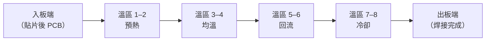

# 熱風回流爐原理

熱風回流爐（Hot Air Convection Reflow Oven）是 SMT 量產主線的核心設備。它以**強制對流**方式，讓加熱後的空氣（或氮氣）持續循環吹拂 PCB，使整片板子上的錫膏同步熔融潤濕。

*工業用熱風回流爐：PCB 從右端入板，穿過多個溫區後由左端出板，全程在傳送鏈上移動。*

---

## 爐體結構

現代爐體通常設有 **6–10 個獨立溫區**，每個溫區上下各裝一組**熱風刀（Air Knife）**，使 PCB 上下表面受熱均勻。

| 元件 | 說明 |
|------|------|
| 熱風刀 | 上下對稱噴嘴，強制熱氣均勻分布 |
| 加熱器 | 電阻絲或紅外管，為空氣加熱 |
| 傳送鏈 | 鏈爪或網帶，控制 PCB 通過速度 |
| 冷卻段 | 風扇 + 散熱器，快速降溫固化 |
| 氮氣選配 | 降低氧化，改善無鉛焊錫潤濕性 |

---

## 為什麼用對流而非傳導？

- **均勻性**：氣流可以穿入 BGA 球陣、密集元件間的縫隙，傳導無法做到。
- **非接觸**：不傷害元件或 PCB 表面。
- **可量產**：PCB 連續通過爐體，吞吐量高。

---

## 氮氣保護（N₂ Reflow）

| 比較項目 | 空氣回流 | 氮氣回流 |
|---------|---------|---------|
| 氧化程度 | 較高 | 極低 |
| 潤濕性 | 標準 | 優 |
| 錫珠風險 | 中 | 低 |
| 運營成本 | 低 | 較高 |

無鉛焊錫（SAC305）在空氣中潤濕性本已較弱，導入氮氣可顯著改善焊點成形。

---

## 下一頁

接下來學習如何設定 → [爐溫曲線](02-temp-profile.md)
