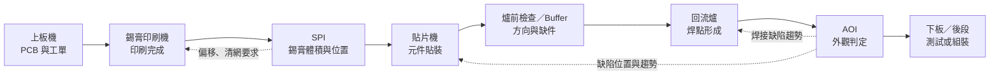
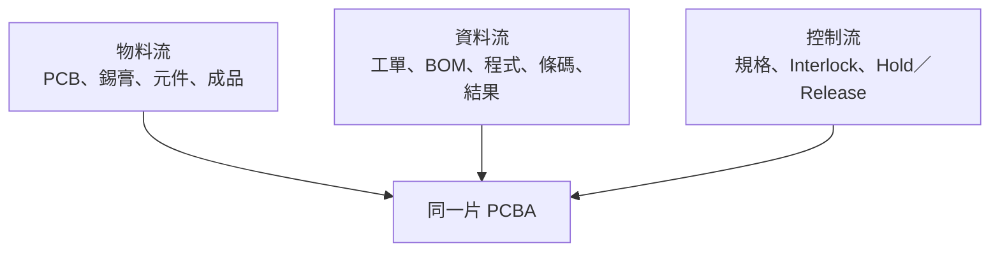

# SMT 整線：從上板到檢測

回流爐不是一座獨立孤島。量產時，它位於錫膏印刷、貼片與檢測之間；任何上游偏移都可能到爐後才變成可見缺陷。因此，理解回流焊之前，必須先看懂整條 SMT 線的物料流、資料流與品質回饋。

## 標準站點與交付物

Yamaha 的官方產品線把印刷機、SPI、貼片機、AOI 與工廠軟體視為同一套 SMT 系統；其跨機台功能可讓 SPI 回饋印刷偏移或清網要求，也可把 AOI 結果回饋貼片站。這表示「AOI 發現不良」只是起點，真正的控制閉環要回到造成偏移的站點。[來源：Yamaha SMT 產品線](https://global.yamaha-motor.com/business/smt/lineup/)、[YSUP 機台連線與回饋](https://global.yamaha-motor.com/business/smt/software/ifactory/)

| 站點 | 主要輸入 | 主要輸出 | 開線前最小確認 |
|---|---|---|---|
| 上板／追溯 | PCB、工單、條碼 | 正確板型與方向 | 工單、版次、條碼可讀性 |
| 錫膏印刷 | 錫膏、鋼網、刮刀 | 焊墊上的錫膏 | 錫膏狀態、鋼網版次、支撐與清網設定 |
| SPI | 檢測程式、允收門檻 | 高度、面積、體積、偏移 | 程式版次、Golden board／基準確認 |
| 貼片 | BOM、程式、Feeder、吸嘴 | 已貼裝但未焊接的 PCBA | 料號、站位、極性、吸嘴與首件 |
| 回流 | 爐溫 recipe、鏈速、氣氛 | 固化焊點 | Profile 核准版、鏈速、溫區、氧含量（若用氮氣） |
| AOI／X-Ray | 檢測程式、判定標準 | 缺陷分類與趨勢 | 程式版次、誤判率、人工複判規則 |

## 三條流同時在跑

- **物料流**：PCB、錫膏與元件的料號、批號、保存條件及使用期限必須正確。
- **資料流**：工單、BOM、Gerber、機台程式和檢測程式必須是同一版次。
- **控制流**：超出規格時要能停線、隔離受影響批次、保留追溯資料並由有權限者放行。

「條碼掃對、程式自動切換」只能降低選錯 recipe 的機率，不能取代首件確認。Yamaha 的自動換線案例也明確保留物料準備、Feeder 設定與品質確認，只是把部分搬運和切換動作自動化。[來源：Yamaha 全自動換線案例](https://global.yamaha-motor.com/business/smt/concept/recipe/)

## Buffer 不是多餘設備

Buffer／Conveyor 看似只搬板，實際上會影響整線：

- 隔離前後站短暫停機，避免一台 alarm 立即拖停全線。
- 保留冷卻或人工確認時間，避免熱板直接進入檢測造成影像或尺寸飄移。
- 配合 NG diverter，把待複判板與良品分流。
- 建立 upstream/downstream interlock，避免下游滿載時持續入板。

但 Buffer 只能吸收短期波動；若回流爐節拍長期低於貼片站，堆再多 Buffer 仍會塞線。瓶頸要用實際 cycle time、changeover、停機與產品組合評估。

## 自動化後，人做什麼？

高度自動化會減少搬運、換程式與例行檢查，但仍需要人員負責：

1. 物料與版次核對。
2. 首件、換線與復線確認。
3. Alarm 的分級處理與安全停機。
4. AOI/SPI 誤判複判與缺陷趨勢判讀。
5. 補料、耗材、清潔與預防保養。
6. 製程或設備變更後的資格確認。

Yamaha 把自動補料、自我診斷與自動換線定位為降低操作負擔，而非取消製程與設備責任。[來源：Yamaha 省人化方案](https://global.yamaha-motor.com/business/smt/concept/oss/line/resource/)

## 延伸閱讀

- [熱風回流爐原理](01-hot-air.md)
- [爐溫曲線設定](02-temp-profile.md)
- [量產控制：Recipe、換線與追溯](02b-production-control.md)
- [機台團隊與人力配置](12-staffing.md)

