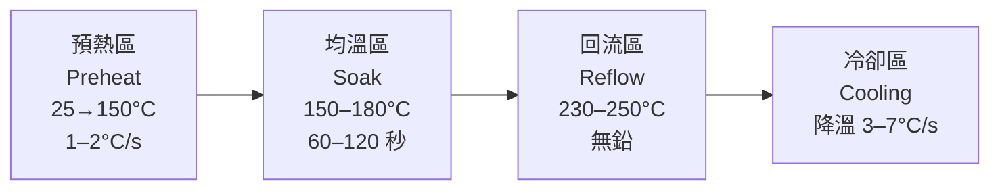

# 爐溫曲線設定

爐溫曲線（Thermal Profile）是回流焊品質的核心。設定不當是錫珠、冷焊、板彎、元件裂紋的主要原因。

---

## 四段標準曲線

*標準回流焊溫度曲線（RSS 型）：橫軸為時間，縱軸為溫度，四段清晰標示。*

*Ramp-to-Spike 曲線——跳過長均溫段，直接快速升溫至峰值，常用於對溫度敏感性要求較低的無鉛製程。*

| 區段 | 溫度 / 時間 | 目的 | 若失控 |
|------|-----------|------|--------|
| 預熱區 | 升溫 1–2°C/s | 揮發溶劑與水分，防錫珠 | 升溫過快 → 錫珠、陶瓷元件裂 |
| 均溫區 | 150–180°C，60–120 s | 活化助焊劑，均勻板溫 | 時間過短 → 助焊劑失效，冷焊 |
| 回流區 | 230–250°C（無鉛） | 錫膏熔融，潤濕焊墊 | 峰溫不足 → 冷焊；過高 → 元件損傷 |
| 冷卻區 | 降溫 3–7°C/s | 快速凝固，防晶粒粗化 | 過慢 → 焊點晶粒粗，強度差 |

---

## 無鉛 vs 有鉛比較

| 參數 | 有鉛（Sn63Pb37） | 無鉛（SAC305） |
|------|--------------|-------------|
| 熔點 | 183°C | 217°C |
| 峰溫建議 | 210–220°C | 235–250°C |
| 潤濕性 | 優 | 一般（需氮氣輔助） |
| 冷卻速率 | 寬鬆 | 需嚴格控制（防錫縮） |
| RoHS 合規 | 否 | 是 |

---

## 調機實務步驟

1. **量測基板**：在 PCB 上放置 K-type 熱電偶（至少 3 點：角落、中心、最大元件下方）。
2. **跑 Profile**：讓 PCB 通過爐體，記錄實際溫度對時間曲線。
3. **對照規格**：比對錫膏 Datasheet 中的允許視窗（Process Window）。
4. **調整參數**：修改各溫區設定溫度與傳送鏈速度。
5. **重複驗證**：通常需要 3–5 次迭代。

---

## 常見缺陷與曲線關係

| 缺陷 | 可能曲線原因 |
|------|------------|
| 錫珠（Solder Bead） | 預熱升溫過快，溶劑爆沸 |
| 冷焊（Cold Joint） | 峰溫不足或均溫時間過短 |
| 墓碑效應（Tombstone） | 兩端元件加熱不均 |
| 橋接（Bridging） | 錫膏塌陷 + 回流溫度過高 |
| 板彎（Warpage） | 冷卻速率過快或溫差過大 |

---

## 延伸閱讀

- [熱風回流爐結構](01-hot-air.md)
- [缺陷分析方法](08-defect-analysis.md)
