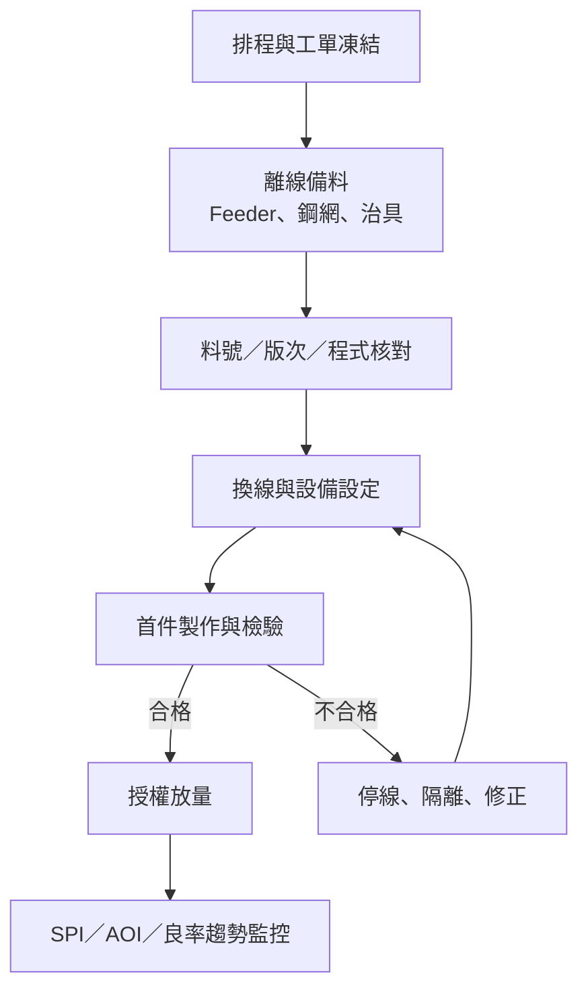
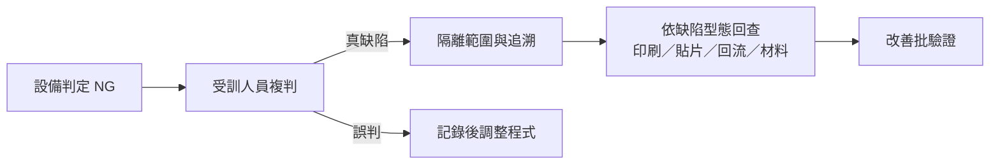

# 量產控制：Recipe、換線與追溯

一條線能做出良品，不代表它能穩定量產。量產控制的核心是把「正確物料、正確程式、正確設備狀態、正確放行」鎖在同一個工單與批次上。

## Recipe 不只是一組爐溫

| Recipe 層級 | 典型內容 | 主要負責角色 |
|---|---|---|
| 產品資料 | BOM、座標、極性、板尺寸、版次 | NPI／製造工程 |
| 印刷 | 鋼網、刮刀速度與壓力、脫模、清網頻率 | SMT 製程工程師 |
| 貼片 | Feeder 站位、吸嘴、視覺參數、貼裝順序 | 程式／製程工程師 |
| 回流 | 各溫區設定、鏈速、風量、氮氣條件 | 回流／SMT 製程工程師 |
| 檢測 | SPI/AOI 程式、門檻、Golden sample、複判規則 | AOI／品質工程師 |

這些資料必須共同版本化。只改了貼片程式卻沒更新 AOI，或換錫膏批次後沿用未確認的 Profile，都可能讓線上看似正常、實際控制基準已經分裂。

## 換線的最小閉環

操作員可以依核准文件換線與製作首件；是否能自行放量，取決於工廠定義的授權矩陣。新產品、重大參數變更、維修後復線與一般同族產品換線，不應使用完全相同的簽核強度。

## 回流 Profile 的管理邊界

爐體 HMI 上的設定值不是產品實際承受的溫度。量產基準應保存：

- 測溫板／治具識別與熱電偶位置。
- 錫膏或材料規格版本。
- Ramp、Soak、TAL、Peak、Cooling 的實測結果。
- 爐體、產品方向、載板、鏈速與氮氣條件。
- 核准人、日期、適用產品族與重測觸發條件。

建議把「何時必須重測」寫進控制計畫，例如：爐體重大維修、加熱／風扇模組更換、產品熱容量顯著改變、載具改版、材料更換或長期趨勢漂移。不要只按固定日曆重測，也不要等出現大量焊接不良才重測。

## SPI、AOI 與人工複判

AOI 程式調整必須同時管理 **漏檢** 與 **誤判**。只追求降低誤判，容易把真缺陷一起放過；只把門檻收緊，則會讓複判人力爆量。研華公開的 AOI 職缺也把程式建立、參數優化、缺陷分析、設備商協作與教育訓練列為同一角色的責任。[來源：研華 SMT AOI 工程師職務（104 工程師職涯平台）](https://www.104.com.tw/jobs/search/?area=6001000000&jobcat=2009002004&ro=0)

## 異常時先回答四個問題

1. **影響什麼？** 哪個料號、批次、時間窗、機台與線別。
2. **最後一次良品在哪裡？** 用首件、巡檢、SPI/AOI、測試與設備紀錄界定邊界。
3. **最近改了什麼？** 材料、程式、Feeder、鋼網、維修、軟體、環境或人員。
4. **誰能放行？** 操作員、線長、製程、設備與品質的權限要預先寫清楚。

Jabil 的 SMT 製造工程職務把 NPI、回流曲線、設備程式、RCA/DOE/CAPA，以及對生產人員的技術支援放在同一製程責任鏈；這與單純操機或修機不同。[來源：Jabil Manufacturing Engineer II](https://careers.jabil.com/jobs.html?jobitem=j2444754-il-united-states-of-america-manufacturing-engineer-ii--1st-shift)

## 最少要保留的紀錄

- 工單、產品與程式版次。
- 物料批號、效期、烘烤／回溫與 MSD 狀態。
- 首件與放行結果。
- SPI/AOI/測試結果及複判。
- Alarm、停機、維修、參數變更與復線資格確認。
- 不良隔離範圍、處置、RCA 與改善驗證。

保留期間與欄位應依客戶、產品風險與品質系統決定；沒有必要為所有產品保存完全相同粒度的資料。

## 延伸閱讀

- [SMT 整線：從上板到檢測](01b-smt-line.md)
- [爐溫曲線設定](02-temp-profile.md)
- [缺陷分析方法](08-defect-analysis.md)
- [設備導入、保養與復線](11-equipment-lifecycle.md)

