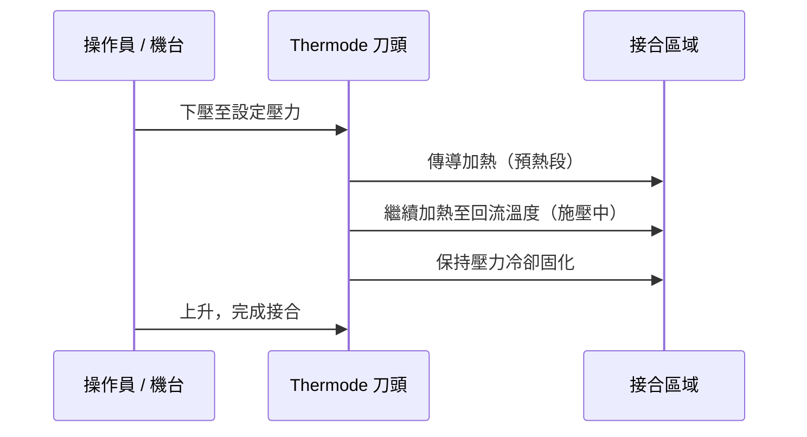
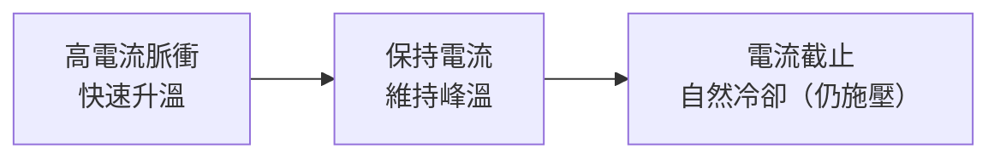

# 熱壓接合原理

熱壓接合（Hot Bar Bonding / Thermode Bonding / Pulse Heat Bonding）以金屬**刀頭（Thermode）**直接接觸接合區域，在整個加熱→回流→冷卻週期中**全程施加壓力**——這是與熱風焊接最根本的差異。

*FPC 面板去除邊框前的樣態——熱壓接合正是用來連接這類軟板與主板或玻璃端子。*

---

## 製程流程

---

## Thermode 刀頭

刀頭材質通常為鈦合金或鎢鋼，具備：

- **高熱導率**：快速傳熱到接合點
- **耐高溫**：可承受 300–500°C 反覆循環
- **精密成形**：依接合區域客製化形狀（直線、L 型、框型）

### 接觸溫度參考

| 接合對象 | 刀頭溫度範圍 |
|---------|------------|
| 直接焊錫（如 FPC to PCB） | 約 300°C |
| Kapton 軟板接合 | 約 350–400°C |
| ACF 壓著（FOG / COG） | 170–250°C（受 ACF 樹脂固化溫度限制） |
| 陶瓷基板硬焊 | 可達 500°C |

---

## 脈衝加熱（Pulse Heat）

大部分熱壓設備使用**脈衝電流加熱**（非持續通電），優點：

- 精確控制溫度上升斜率
- 降低過衝風險（Overshoot）
- 延長刀頭壽命

---

## 施壓的關鍵作用

壓力貫穿整個週期，主要作用：

1. **確保接觸熱阻低**：刀頭與工件緊密貼合，傳熱效率高。
2. **壓破 ACF 導電粒子**：建立 Z 向導通（詳見 [ACF 製程](04-acf.md)）。
3. **防止接合層分離**：冷卻固化過程中維持尺寸穩定。

*凸點（Bump）對位示意——熱壓接合中，IC 凸點必須精確對準基板端子，再施加壓力導通，原理與 Flip Chip 類似。*

---

## 與熱風的根本差異

| 項目 | 熱風回流 | 熱壓接合 |
|------|---------|---------|
| 加熱方式 | 對流（非接觸） | 傳導（直接接觸） |
| 是否施壓 | 無 | 全程施壓 |
| 加熱範圍 | 整片 PCB | 局部接合區域 |
| 製程速度 | 連續輸送（快） | 逐點停留（慢） |
| 適合材料 | 錫膏 | 錫膏、ACF、熱固膠 |

---

## 延伸閱讀

- [ACF 導電膠製程](04-acf.md)
- [顯示器模組應用](05-display-modules.md)
