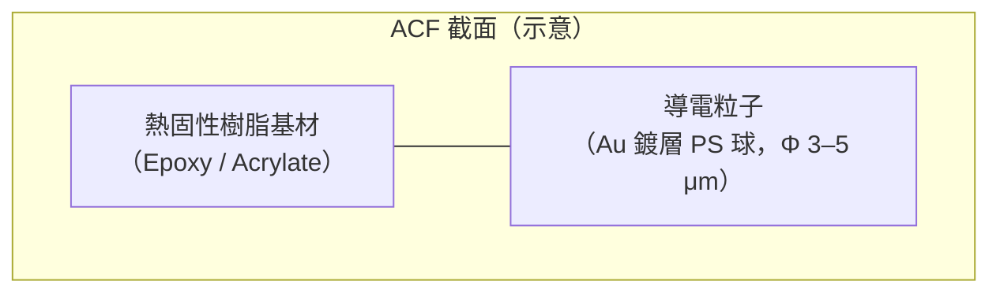
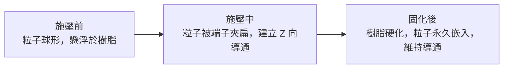
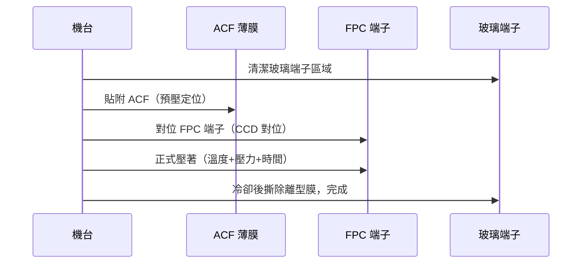

# ACF 導電膠製程

ACF（Anisotropic Conductive Film，異向性導電膜）是顯示器模組接合的核心材料。它在 Z 方向（垂直方向）導電，在 X-Y 方向絕緣，使細間距端子得以可靠連接。

*ACF 捲裝薄膜實物——通常儲存於 -10°C 冷凍，使用前才取出回溫。*

*1.2mm 寬度的 ACF 薄膜——寬度依應用端子區域訂製，顯示器模組常見 1–3mm 規格。*

---

## ACF 結構

| 組成 | 說明 |
|------|------|
| 熱固性樹脂 | 環氧樹脂或丙烯酸酯，加熱後固化，提供接合強度 |
| 導電粒子 | 以塑膠球為核心，外鍍金（Au）或鎳金（Ni/Au） |
| 隔離分散 | 粒子均勻分散於樹脂中，粒子間絕緣（X-Y 絕緣）|

---

## 導通機制：壓縮導電粒子

- 壓力不足 → 粒子未被壓扁 → **開路**
- 壓力過大 → 粒子擠入相鄰端子間 → **短路**
- 適當壓力 → 每個端子捕獲 5–20 顆粒子 → 可靠導通

---

## 三要素：溫度 × 壓力 × 時間

| 要素 | 作用 | 失控後果 |
|------|------|---------|
| **溫度** | 驅動樹脂固化反應，決定接合強度 | 過低→固化不完全；過高→樹脂碳化 |
| **壓力** | 壓破粒子建立 Z 向導通 | 過低→開路；過大→鄰端子短路 |
| **時間** | 確保樹脂達到足夠固化度（≥80%） | 過短→剝離強度弱；過長→生產效率低 |

### 典型製程條件範例

| 參數 | 典型值（依 ACF 規格書） |
|------|----------------------|
| 壓著溫度 | 170–200°C（刀頭溫度） |
| 壓力 | 2–4 MPa |
| 壓著時間 | 5–20 秒 |
| 預壓條件 | 70°C，0.5 MPa，2 秒（定位用） |

> 以上為典型範例；完整參數範圍以 ACF 規格書為準，見 [材料規格解讀](09-materials.md)。

---

## ACF 壓著製程步驟

---

## 常見缺陷

| 缺陷 | 原因 | 改善方向 |
|------|------|---------|
| 開路（High Resistance） | 壓力不足，粒子未壓扁 | 提高壓力或增加粒子密度 |
| 短路（Leakage） | 壓力過大，粒子橫向移位 | 降低壓力或選用小粒子 |
| 剝離（Delamination） | 固化不完全 | 提高溫度或延長時間 |
| 氣泡 | 界面殘留揮發物 | 優化預壓條件或清潔工序 |

---

## 延伸閱讀

- [熱壓接合原理](03-hot-bar.md)
- [顯示器模組應用 FOG/COG/COF](05-display-modules.md)
