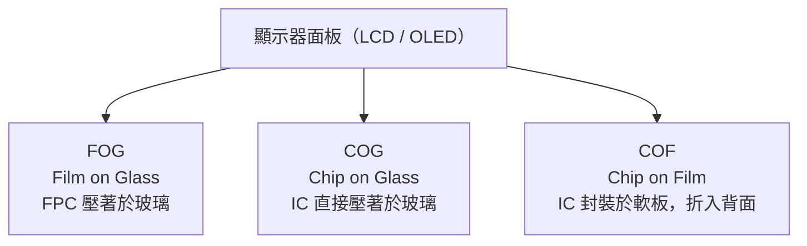
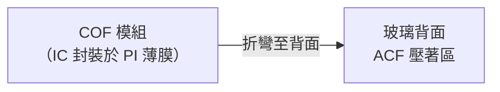

# 顯示器模組應用：FOG / COG / COF

顯示器面板的邊緣接合是熱壓技術最密集的應用場域。依驅動 IC 封裝方式不同，分為三種主流架構。

---

## 三種架構總覽

---

## FOG（Film on Glass）

**概念**：將 FPC（軟性電路板）以 ACF 接合至玻璃基板的端子區域。

*相機內部的 FPC 軟板佈線——FOG 製程中，這類橘色軟板的末端會被 ACF 壓著到顯示器玻璃端子上。*

| 項目 | 說明 |
|------|------|
| 接合材料 | ACF |
| 間距能力 | 40–100 μm |
| 優點 | 設計彈性高，FPC 可繞折 |
| 缺點 | 接合點多、可靠度風險較高 |
| 應用 | 中小尺寸面板（手機、平板） |

---

## COG（Chip on Glass）

**概念**：將裸驅動 IC 直接以 ACF 壓著於玻璃端子，省去獨立 PCB 或 FPC 的 IC 封裝。

| 項目 | 說明 |
|------|------|
| 接合材料 | ACF（更細間距規格） |
| 間距能力 | 20–50 μm |
| 優點 | 模組厚度最薄，框寬最小 |
| 缺點 | 裸 IC 壓著良率管控嚴苛 |
| 應用 | 高階手機、AR 眼鏡顯示器 |

---

## COF（Chip on Film）

**概念**：驅動 IC 先封裝於撓性薄膜（PI 基板），再將薄膜末端折至玻璃背面，以 ACF 接合。

*COF 薄膜面板示意——IC 封裝在中央區域，兩側端子區折彎後壓著於玻璃背面，實現窄邊框設計。*

| 項目 | 說明 |
|------|------|
| 接合材料 | ACF 或錫膏 |
| 間距能力 | 25–40 μm |
| 優點 | 實現窄邊框（邊框可 < 1 mm）；IC 遠離玻璃，散熱佳 |
| 缺點 | 製程多一道薄膜封裝；成本較 COG 高 |
| 應用 | AMOLED 手機（如全面屏設計） |

---

## 三種架構比較

| 項目 | FOG | COG | COF |
|------|-----|-----|-----|
| IC 位置 | FPC 上 | 玻璃上 | 薄膜上（折至背面） |
| 接合難度 | 中 | 高 | 高 |
| 邊框寬度 | 較寬 | 窄 | 最窄 |
| 模組厚度 | 中 | 薄 | 中 |
| 維修可換 | 較易 | 難 | 中 |
| 典型產品 | 平板、工業 | 高階手機 | 旗艦 AMOLED |

---

## 其他熱壓應用場景

| 應用 | 說明 |
|------|------|
| FPC to PCB | 軟硬板接合（取代 ZIF 連接器） |
| 均熱板封合 | 超薄 Vapor Chamber 銅殼以熱壓擴散接合 |
| Mini LED 背板 | 細間距 LED 陣列的 FPC 接合 |

---

## 延伸閱讀

- [ACF 導電膠製程](04-acf.md)
- [熱壓接合原理](03-hot-bar.md)
- [缺陷分析方法](08-defect-analysis.md)
