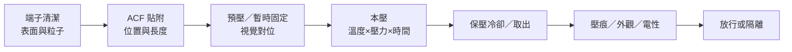
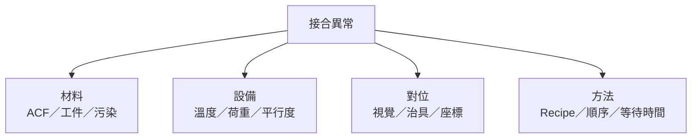

# ACF／熱壓量產線

ACF 量產並非只有「熱壓一次」。常見流程會拆成 ACF 貼附、部件預壓／對位、本壓、壓痕或電性檢查；自動化設備再以 Loader、Tray changer、視覺對位與 Unloader 串接。

## 站點流程

Panasonic 的 FOG 設備資料將流程明確拆為 ACF attachment、pre-bonding 與 final bonding；其顯示器設備另配置 ACF 壓痕檢查。Yamaha Robotics 的 ACF/FPC 設備則以視覺辨識、Loader、Tray changer 與 Unloader 完成自動化。[來源：Panasonic FOG Bonder](https://industrial.panasonic.com/content/data/FA/PDF/FPX007FG_kr_22_0808.pdf)、[Panasonic 顯示器接合設備](https://connect.panasonic.com/en/products-services_fa/products/display-related)、[Yamaha CM-F ACF/FPC Bonder](https://www.yamaha-robotics.com/en/products/process/cm-f-series)

## 每站控制重點

| 站點 | 主要控制量 | 常見失敗 |
|---|---|---|
| 清潔 | 表面污染、刮傷、靜電與等待時間 | 接觸電阻高、黏著不足、粒子污染 |
| ACF 貼附 | 批號、方向、長度、位置、氣泡、保存狀態 | 偏貼、皺褶、氣泡、樹脂失效 |
| 預壓／對位 | Mark 辨識、X/Y/θ、治具與暫壓條件 | Pad 錯位、FPC 翹起、後續滑移 |
| 本壓 | 刀頭實溫、荷重／壓力、時間、平行度 | 導通不足、短路、玻璃／IC 損傷 |
| 冷卻／取出 | 保壓、冷卻終點、取料方式 | 回彈、位移、剝離 |
| 檢查 | 壓痕、對位、外觀、開短路與抽樣可靠度 | 漏檢、誤判、隱性接觸不良 |

## 手動、半自動與全自動

| 模式 | 人的主要工作 | 適合情境 | 主要風險 |
|---|---|---|---|
| 手動／桌上型 | 上下料、對位、啟動、目視與記錄 | 打樣、維修、低量多樣 | 操作者差異、節拍與追溯不足 |
| 半自動 | 上下料、換型、複判；設備自動對位與壓著 | 中量、多品種 | 人機等待、治具與程式切換錯誤 |
| 全自動 | 補料、監控、異常處理與抽查 | 高量、穩定產品族 | 錯誤快速擴散、需更完整 Interlock |

全自動不等於無人負責。影像對位、荷重、溫度或材料狀態一旦漂移，設備仍可能穩定地連續做出不良品；因此要用首件、趨勢、設備監控與抽樣驗證共同防守。

## 換型與首件

換產品時至少核對：

1. ACF 型號、批號、保存／回溫與有效期限。
2. FPC、玻璃／PCB、IC 與治具版次。
3. 視覺 Mark、程式、壓著座標與產品方向。
4. Thermode 型號、平行度、清潔與表面狀態。
5. 溫度、荷重／壓力、時間與冷卻條件。
6. 首件壓痕、對位、導通與外觀結果。

若只換同族產品的料盤，驗證可較精簡；若變更 ACF、刀頭、治具、相機標定或本壓條件，應由製程 owner 重新界定驗證範圍。

ACF 的低溫保存、密封回溫、可用期限與累積室溫時間依料號而異；應由材料／線邊物流角色記錄 lot、保存、回溫與 out-time，製程 owner 只依該料號 datasheet 核准使用，不應全廠套用單一溫度。[來源：Dexerials ACF FAQ](https://www.dexerials.jp/en/products/faq/index.html)

## 異常定位先分四類

- 大範圍導通不足：先查實際刀頭溫度、荷重、平行度與材料狀態。
- 局部端子接觸不良：查對位、局部平坦度、粒子分布與壓痕。
- 短路：查 Pad 間距、偏移、粒子／樹脂流動與壓力。
- 剝離或氣泡：查清潔、材料保存、貼附與固化條件。

Yamaha 的高階 bonding 設備把製程監控、加熱／冷卻、荷重與對位列為穩定品質的核心功能；實際故障分析也應沿這些量測鏈回查，而不是只調高溫度或壓力。[來源：Yamaha Robotics bonding 製程監控](https://www.yamaha-robotics.com/en/products/process/fpb-1ws_neoforce)

## 延伸閱讀

- [熱壓接合原理](03-hot-bar.md)
- [ACF 導電膠製程](04-acf.md)
- [顯示器模組應用](05-display-modules.md)
- [設備導入、保養與復線](11-equipment-lifecycle.md)
- [機台團隊與人力配置](12-staffing.md)
