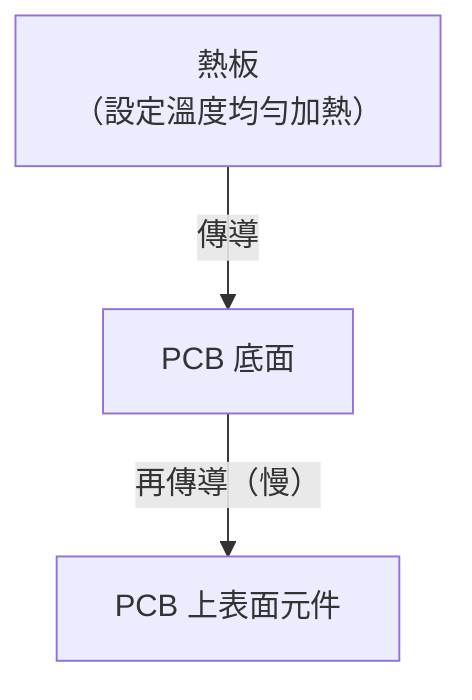

# 熱板傳導回流

熱板（Hot Plate / Conduction Reflow）是最簡單的焊接設備：一塊可加熱的金屬板，PCB 直接放置其上，靠**板面傳導**加熱底部焊點。

---

## 原理與限制

熱板僅能從底部加熱，熱量需穿過 PCB 基材（FR4 導熱差）才能到達上表面元件，因此：

- **無法精確控制四段溫度曲線**
- 上下面溫差大，元件受熱不均
- 只能大略控制「達到熔點」，無法精確控制均溫時間

---

## 適用場合

| 場合 | 原因 |
|------|------|
| 少量打樣 | 不值得設定回流爐 Profile |
| 維修 / 重工 | 局部加熱整塊板子（搭配熱風槍） |
| 教學實驗室 | 低成本設備入門 |
| 單面簡單板 | 元件少、焊點規格寬鬆 |

---

## 不建議使用熱板的情況

- BGA / QFN 等底部焊球元件（無法觀察熔融狀態）
- 有溫度敏感元件（電解電容、晶振）
- 雙面板（上面元件無法加熱）
- 無鉛製程品質要求嚴格（難以達到 SAC305 需要的精確曲線）

---

## 操作要點

1. 預熱熱板至目標溫度（通常 250–280°C，依錫膏而定）
2. 放置 PCB，觀察錫膏狀態
3. 錫膏熔融潤濕後立即移開（避免過熱）
4. 自然冷卻或以夾具固定

!!! warning "注意"
    熱板操作全程手動，溫度與時間控制依賴操作員經驗，品質一致性遠不如回流爐。

---

## 與其他工藝比較

詳見 → [三大工藝比較](07-comparison.md)
