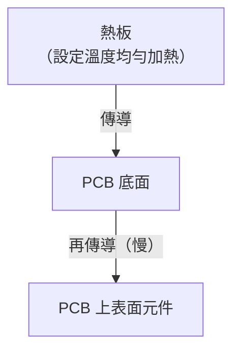

# 熱板傳導回流

熱板（Hot Plate / Conduction Reflow）是最簡單的焊接設備：一塊可加熱的金屬板，PCB 直接放置其上，靠**板面傳導**加熱底部焊點。

---

## 原理與限制

```mermaid
flowchart TB
    HP["熱板<br/>（設定溫度均勻加熱）"]
    HP -->|"傳導"| PCB["PCB 底面"]
    PCB -->|"再傳導（慢）"| Top["PCB 上表面元件"]
```

熱板僅能從底部加熱，熱量需穿過 PCB 基材（FR4 導熱差）才能到達上表面元件，因此：

- **無法精確控制四段溫度曲線**
- 上下面溫差大，元件受熱不均
- 只能大略控制「達到熔點」，無法精確控制均溫時間

---

## 適用場合

| 場合 | 原因 |
|------|------|
| 少量打樣 | 不值得設定回流爐 Profile |
| 維修 / 重工 | 局部加熱整塊板子（搭配熱風槍） |
| 教學實驗室 | 低成本設備入門 |
| 單面簡單板 | 元件少、焊點規格寬鬆 |

---

## 不建議使用熱板的情況

- BGA / QFN 等底部焊球元件（無法觀察熔融狀態）
- 有溫度敏感元件（電解電容、晶振）
- 雙面板（上面元件無法加熱）
- 無鉛製程品質要求嚴格（難以達到 SAC305 需要的精確曲線）

---

## 操作要點

1. 預熱熱板至核准條件，並以固定在 PCB 上的熱電偶確認實際板溫
2. 開啟局部排煙，放置並固定 PCB，觀察錫膏狀態
3. 錫膏熔融潤濕後立即移開（避免過熱）
4. 自然冷卻或以夾具固定

!!! warning "注意"
    熱板只能由受訓人員操作，加熱期間不可無人看守。熱表面、助焊劑煙霧與 PCB 取放都需納入工作站風險評估；維修或拆機則交由授權人員執行。[來源：PACE PH100 操作手冊](https://paceworldwide.com/sites/default/files/2021-01/PH100-Operations-Manual.pdf)

設備面板的設定溫度不等於 PCB 實際溫度。不同板厚、銅面、治具和接觸狀態都會改變升溫；沒有熱電偶驗證時，不應只用「看到錫熔」作為唯一製程紀錄。

---

## 誰負責熱板工作站？

| 責任 | 角色 |
|---|---|
| 直接操作 | 受訓返修／打樣技術員；啟用中的手動熱板不可無人看守 |
| 製程 owner | 製程或返修工程師核准板種、溫度曲線、允許返修次數與操作程序 |
| 設備／安全 | 授權維修人員負責校正與維修；EHS／廠務確認排煙、熱表面與用電 |
| 品質放行 | 依產品風險執行外觀、電性及必要的 X-Ray，不由操作員自行放寬標準 |

熱板不需每台配置一組專職工程師，但以上責任必須由共享角色明確承接。詳見 [機台團隊與人力配置](12-staffing.md)。

---

## 與其他工藝比較

詳見 → [三大工藝比較](07-comparison.md)
