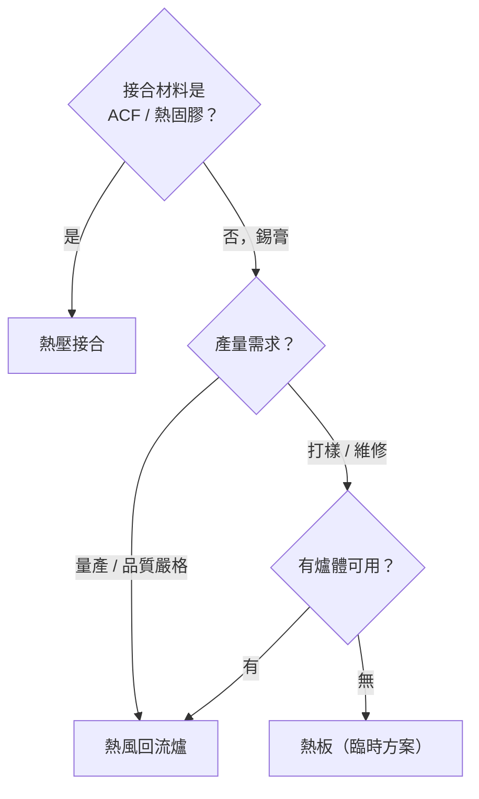

# 三大工藝比較與選型

選擇加熱工藝時，需從**接合材料、產量需求、設備成本、元件特性**四個維度評估。

---

## 全面比較矩陣

| 項目 | 熱風回流 | 熱壓接合 | 熱板傳導 |
|------|---------|---------|---------|
| 加熱方式 | 強制對流（非接觸） | 傳導（刀頭接觸） | 傳導（板面接觸） |
| 是否施壓 | 無 | 全程施壓 | 無 |
| 溫度均勻性 | ★★★★★ | ★★★ | ★★ |
| 製程可控性 | ★★★★★ | ★★★★ | ★★ |
| 產量 | 高（量產） | 中（逐點） | 低（打樣） |
| 設備成本 | 高 | 中 | 低 |
| 接合材料 | 錫膏為主 | ACF、錫膏、熱固膠 | 錫膏 |
| 典型應用 | SMT 貼片量產 | FPC / 顯示器模組 | 打樣 / 維修 |
| RoHS 合規難度 | 中（需調 Profile） | 中 | 高（難控制） |

---

## 選型決策流程

---

## 熱風回流：最適場景

- SMT 量產主線（電阻、電容、IC、BGA）
- 雙面板（可設計兩次回流）
- 對焊點外觀與強度要求高
- 年產量 > 1000 片以上

*SMT 量產線：貼片機後方緊接回流爐，全自動連線，產能極高。*

## 熱壓接合：最適場景

- FPC 軟板與 PCB 或玻璃接合
- 顯示器模組（FOG / COG / COF）
- ACF 接合（細間距端子，< 100 μm）
- 均熱板封合、Vapor Chamber

## 熱板：最適場景

- 臨時打樣（< 10 片）
- 簡單單面板維修
- 預算極度有限的教學場合

> **參考：插件（THT）時代的波峰焊**
> 在 SMT 普及之前，主流是波峰焊（Wave Soldering）——PCB 底部接觸錫液波峰完成焊接，至今仍用於連接器等大型插件元件。

*波峰焊機（Wave Soldering Machine）——PCB 經過錫液波峰，一次焊接所有插件引腳，是熱板的「大量版」。*

---

## 成本與設備概覽

| 設備 | 入門價格 | 典型廠商 |
|------|---------|---------|
| 熱風回流爐（6 溫區） | USD 15,000–50,000 | Heller, Rehm, BTU |
| 熱壓機（桌上型） | USD 5,000–30,000 | Panasonic, Toray, Shibuya |
| 熱板 | USD 200–2,000 | 各廠通用 |

---

## 延伸閱讀

- [熱風回流爐原理](01-hot-air.md)
- [熱壓接合原理](03-hot-bar.md)
- [熱板傳導回流](06-hot-plate.md)
