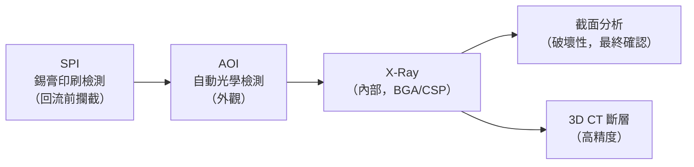
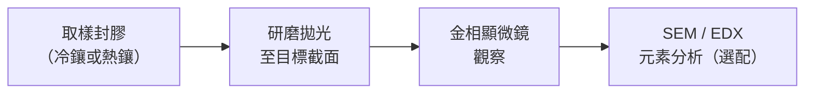

# 缺陷分析方法

焊接與接合製程的缺陷分析是品質管制的核心。本頁介紹主流的檢測工具、各自的適用場合，以及 IPC 標準的應用方式。

---

## 檢測工具總覽

---

## AOI（Automated Optical Inspection）

AOI 以可見光或雷射掃描 PCB 表面，比對標準影像，自動標記異常。

*AOI 設備工作原理：多角度光源照射 PCB，相機擷取影像後與標準比對，自動標記缺陷位置。*

| 特性 | 說明 |
|------|------|
| 檢測對象 | 外觀缺陷：橋接、墓碑、錯件、少件、偏移 |
| 速度 | 快（可串接在線） |
| 限制 | 無法看到焊點內部、BGA 球面下方 |
| 典型配置 | 回流爐後方（線上 AOI）|

### 常見 AOI 缺陷分類

| 缺陷 | AOI 可否檢出 |
|------|------------|
| 橋接（Bridging） | ✅ |
| 墓碑（Tombstone） | ✅ |
| 少錫（Insufficient Solder） | ✅（側面視角） |
| 冷焊（Cold Joint） | ⚠️ 部分（外觀正常的冷焊難以辨識） |
| BGA 空洞（Void） | ❌ |

---

## SPI（Solder Paste Inspection）

SPI 在鋼板印刷後、貼片前，量測錫膏的**體積、面積、高度**。

| 量測項目 | 不良判定 |
|---------|---------|
| 體積（Volume） | < 70% 或 > 150% 標準值 |
| 偏移（Offset） | 超出焊墊邊緣 |
| 橋接 | 相鄰墊間錫膏連通 |

SPI 是**最前端的品質守門員**，在缺陷形成之前就攔截，成本最低。

---

## X-Ray 檢測

X-Ray 穿透 PCB，顯示內部焊點結構，是 BGA、CSP 等封裝的必要手段。

*電路板的 X-Ray 透視影像——可清楚看到 BGA 焊球陣列的排列與連接狀態，亮點為焊錫，暗處為空氣或基材。*

*BGA 移除後留下的焊球陣列——X-Ray 用來確認每顆球是否完整焊接、有無橋接或空洞。*

| 類型 | 說明 |
|------|------|
| 2D X-Ray | 投影影像，快速，常規 BGA 焊球檢查 |
| 斜角 X-Ray（Oblique） | 可看到側面焊球形狀 |
| 3D CT（Computed Tomography） | 重建立體結構，空洞率精確量化 |

### X-Ray 可檢出的缺陷

| 缺陷 | 說明 |
|------|------|
| BGA 空洞（Void） | 焊球內氣泡，影響導熱與強度 |
| 橋接（Bridging） | 相鄰球連通 |
| 開路（Open） | 焊球未熔合 |
| 錫球缺失（Missing Ball） | BGA 球脫落 |

---

## 截面分析（Cross-Section Analysis）

截面分析是破壞性分析，將焊點研磨至截面，以金相顯微鏡觀察內部微結構。

*BGA 焊球截面——可清楚看到錫球形態、介金屬層（IMC）與 PCB 基材的層次關係。*

| 觀察項目 | 意義 |
|---------|------|
| 介金屬層（IMC）厚度 | 過薄→潤濕不足；過厚→脆化 |
| 晶粒大小 | 粗晶→冷卻太慢，強度差 |
| 空洞位置與比例 | 柯肯達爾效應、助焊劑殘留 |
| ACF 粒子壓扁率 | 壓力是否足夠 |

---

## IPC 標準應用

| 標準 | 內容 |
|------|------|
| **IPC-A-610** | 電子組件驗收條件（最常用，缺陷分類與等級） |
| **IPC-7711/7721** | 修復與返工程序 |
| **J-STD-001** | 焊接要求（材料、製程、檢驗） |
| **IPC-4562** | 金屬箔與 PCB 基材規範 |

### IPC-A-610 缺陷等級

| 等級 | 說明 | 適用產品 |
|------|------|---------|
| Class 1 | 一般電子產品 | 消費性電子 |
| Class 2 | 專用服務電子 | 工業、通訊 |
| Class 3 | 高性能電子 | 航太、醫療 |

---

## 缺陷分析工具選用建議

| 情境 | 建議工具 |
|------|---------|
| 線上量產品質監控 | SPI + AOI |
| BGA / CSP 焊點確認 | X-Ray 2D |
| 空洞率精確量化 | 3D CT |
| 失效根因確認 | 截面分析 + SEM/EDX |
| ACF 壓著品質 | 截面分析（觀察粒子壓扁） |

---

## 延伸閱讀

- [爐溫曲線設定](02-temp-profile.md)
- [ACF 導電膠製程](04-acf.md)
- [材料規格](09-materials.md)
