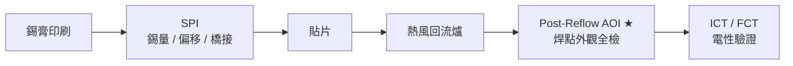
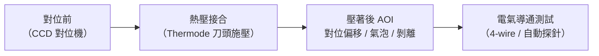
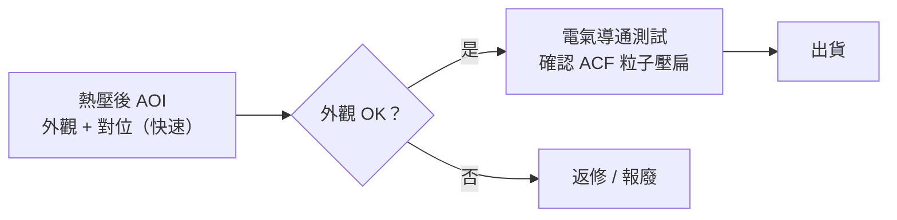
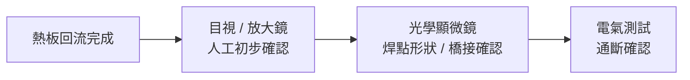

# 三大工藝的 AOI 檢測重點

熱風回流、熱壓接合、熱板傳導三種製程，因加熱方式與接合材料不同，焊後缺陷模式差異顯著——AOI 的配置位置、檢測項目與判斷邏輯也各有側重。

---

## 熱風回流焊的 AOI

熱風回流是 SMT 量產主線，AOI 通常以**線上（In-line）Post-Reflow** 配置，是品質最主要的守門關卡。

### 產線配置

### 主要缺陷與 AOI 檢測能力

| 缺陷名稱 | 成因 | AOI 能否偵測 |
|---------|------|------------|
| **橋接（Bridging）** | 錫量過多 / 間距過小 | ✅ 最容易偵測 |
| **墓碑立件（Tombstoning）** | 兩端加熱不均，表面張力不平衡 | ✅ 外觀高度明顯 |
| **元件偏移 / 旋轉（Skew）** | 貼片精度差或錫液張力拉扯 | ✅ 平面位置比對 |
| **缺件 / 錯件（Missing/Wrong Part）** | 送料或抓取失誤 | ✅ 影像特徵比對 |
| **少錫（Insufficient Solder）** | 錫膏量不足、潤濕差 | ⚠️ 3D AOI 佳，2D 僅依色差 |
| **冷焊（Cold Joint）** | 爐溫不足或升溫過快 | ⚠️ 外觀相似，難分辨 |
| **BGA 空洞（Void）** | 助焊劑氣化 | ❌ 需 X-Ray |
| **錫珠（Solder Balls）** | 錫膏飛濺 | ✅ 形狀異常 |

*密集的 0603 被動元件：橋接、墓碑、缺件是熱風回流後 AOI 最常攔截的缺陷類型。*

### AOI 配置重點

- **光源**：多角度彩色 LED，利用焊錫反光特性區分錫 / 銅 / 元件本體
- **推薦 3D AOI**：可量化焊點高度，準確判定少錫或多錫
- **冷焊補強手段**：冷焊外觀難辨，配合 SPI 數據關聯分析，或送 X-Ray 確認

---

## 熱壓接合的 AOI

熱壓接合用於 FPC 軟板、ACF 顯示器模組（FOG/COG/COF），接合區域為細間距端子而非錫點。AOI 的任務從「焊錫外觀」轉為**對位精度與 ACF 覆蓋品質**。

### 製程後 AOI 邏輯

### 熱壓 AOI 的核心檢測項目

| 檢測項目 | 說明 | 判定依據 |
|---------|------|---------|
| **端子對位偏移（Offset）** | FPC 端子相對玻璃 / PCB 端子的 XY 偏移量 | 依規格書，通常 ≤ 端子寬度的 10–20% |
| **ACF 壓著寬度** | ACF 膠帶是否完整覆蓋端子區域 | 光學觀察膠帶邊緣是否整齊、無缺口 |
| **氣泡（Bubble）** | 界面殘留氣體 | 亮點 / 暗點異常分布 |
| **剝離（Delamination）** | 接合強度不足，邊緣翹起 | 邊緣高度或反射異常 |
| **端子汙染 / 刮傷** | 壓著前清潔不足或刀頭磨損 | 表面色差或劃痕 |

### 熱壓 AOI vs 電氣測試

熱壓 AOI 以光學確認**外觀與對位**，但 ACF 粒子壓扁率（實際導通）需靠電氣測試驗證——兩者必須並用，不能互相取代。

---

## 熱板傳導的 AOI

熱板用於少量打樣與維修，通常**不配備線上 AOI**——主要原因是產量低（逐片手工操作），且設備投資無法攤銷。

### 熱板後的目視檢查替代流程

| 檢查手段 | 適用情況 | 局限 |
|---------|---------|------|
| 肉眼 / 放大鏡（10×） | 快速確認橋接、缺件 | 解析度不足，冷焊難辨 |
| 工業顯微鏡（30–100×） | 焊點潤濕形狀確認 | 費時，依賴人員經驗（IMC 需截面分析才能觀察） |
| 桌上型 AOI（離線） | 若有設備可手動放入檢測 | 非連線，無法即時回饋 |
| 截面分析 | 焊點根因確認（破壞性） | 僅限樣品確認，不做全檢 |

!!! info "熱板的品質取捨"
    熱板本質上是「犧牲可控性換取低成本」的臨時方案。若品質要求升高，應儘早升級至熱風回流爐，而非投資 AOI 來彌補不穩定製程。

---

## 三種工藝 AOI 策略比較

| 比較項目 | 熱風回流 | 熱壓接合 | 熱板 |
|---------|---------|---------|------|
| AOI 配置 | 線上 Post-Reflow AOI | 壓著後光學對位確認 | 目視 / 離線顯微鏡 |
| 主要檢測對象 | 焊錫外觀（橋接、立件、偏移） | 端子對位、ACF 覆蓋、氣泡 | 無固定規格，依人員判斷 |
| 配套電氣測試 | ICT / FCT | 4-wire 導通測試 | 簡易通斷測試 |
| AOI 盲區 | BGA 空洞、冷焊（光澤正常） | ACF 粒子壓扁率（需電測） | 幾乎全部需人工補判 |
| 品質可靠度 | ★★★★★ | ★★★★ | ★★ |

---

## 延伸閱讀

- [缺陷分析方法](08-defect-analysis.md)（AOI、X-Ray、截面分析完整比較）
- [ACF 導電膠製程](04-acf.md)（熱壓接合品質判斷依據）
- [爐溫曲線設定](02-temp-profile.md)（冷焊根因與爐溫關係）
