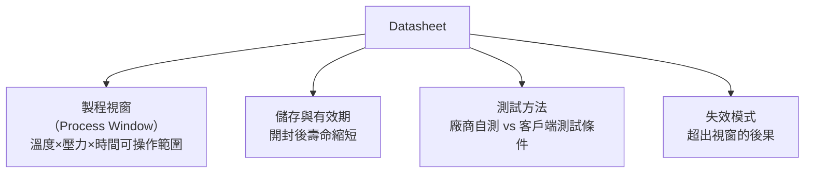

# 材料規格解讀

瞭解錫膏與 ACF 的 Datasheet，是製程調機與缺陷追蹤的基礎能力。

---

## 錫膏（Solder Paste）

錫膏由**錫粉（Metal Alloy Powder）**與**助焊劑（Flux）**混合而成。

*鋼板印刷後的 PCB：灰色的錫膏整齊印在各焊墊上，貼片後進入回流爐加熱熔融。*

*貼片後、回流前的狀態：ATtiny 微控制器放置在灰色錫膏上，錫膏的黏性暫時固定元件位置。*

*顯微鏡下的錫膏：灰色球體是錫粉（直徑 15–50 μm），均勻懸浮在透明助焊劑基質中。*

### 關鍵規格參數

| 參數 | 說明 | 典型值 |
|------|------|--------|
| 合金成分 | 錫、銀、銅比例 | SAC305：Sn96.5/Ag3.0/Cu0.5 |
| 粉末粒徑（Type） | 越細越適合小焊墊 | Type 4：20–38 μm；Type 5：15–25 μm |
| 金屬含量（Metal Loading） | 錫粉重量比 | 85–92% |
| 黏度（Viscosity） | 影響印刷性 | 800–1200 Pa·s |
| 坍塌（Slump） | 印刷後錫膏擴散量 | < 0.2 mm |
| 助焊劑類型 | 殘留物與清洗性 | ROL0（免洗）、REL0（低殘留）|
| 存放條件 | 冷藏與回溫 | 冷藏 2–10°C；使用前回溫 ≥ 4 小時 |

### SAC305 vs Sn63Pb37

| 特性 | SAC305（無鉛） | Sn63Pb37（有鉛） |
|------|-------------|--------------|
| 熔點 | 217°C | 183°C |
| 強度 | 較高 | 較低 |
| 延展性 | 較脆 | 較韌 |
| 潤濕性 | 一般 | 優 |
| RoHS | 合規 | 不合規 |

---

## 助焊劑（Flux）

助焊劑的功能：**去除金屬表面氧化層，降低表面張力，促進錫的潤濕**。

| 類型 | 代碼 | 殘留 | 清洗需求 |
|------|------|------|---------|
| 松香型（Rosin） | RO | 有（絕緣） | 可選擇清洗 |
| 水溶性（Water Soluble） | WS | 多（需清洗） | 必須清洗 |
| 免洗型（No-Clean） | NC | 極少 | 通常免清洗 |

!!! tip "IPC J-STD-004 分類"
    助焊劑活性強度分為 L（低）、M（中）、H（高），對應腐蝕性風險。免洗型常用 ROL0、REL0 等低活性規格。

---

## ACF 材料規格

ACF 規格書的關鍵參數：

*ACF 捲裝薄膜——通常以黑色不透光捲帶保護，儲存於冷凍環境，使用前須回溫至室溫。*

| 參數 | 說明 |
|------|------|
| 粒子密度 | 每平方毫米的導電粒子數，影響導通穩定性 |
| 粒子直徑 | 3–7 μm，需小於端子間距的 1/3 |
| 壓著溫度 | 150–200°C（依樹脂固化溫度） |
| 壓著壓力 | 2–5 MPa |
| 固化時間 | 5–20 秒 |
| 接觸電阻 | < 1 Ω（典型值） |
| 絕緣電阻 | > 10⁸ Ω（X-Y 方向） |
| 剝離強度 | > 500 gf/cm |
| 儲存條件 | -10°C 以下冷凍，使用前回溫 |

---

## Datasheet 閱讀要點

---

## 延伸閱讀

- [爐溫曲線設定](02-temp-profile.md)
- [ACF 導電膠製程](04-acf.md)
- [缺陷分析方法](08-defect-analysis.md)
