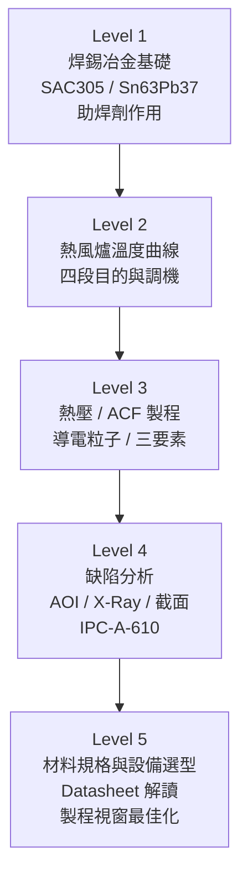

# 學習資源

本頁整理熱風 / 熱壓 / 熱板製程的標準文件、白皮書與推薦學習資源。

---

## IPC 標準

| 標準編號 | 主題 | 重要性 |
|---------|------|--------|
| **IPC-A-610** | 電子組件驗收條件（缺陷圖片+等級定義） | ⭐⭐⭐⭐⭐ |
| **J-STD-001** | 焊接要求：材料、製程、人員認證 | ⭐⭐⭐⭐⭐ |
| **IPC-7711/7721** | 電路板修復與返工程序 | ⭐⭐⭐⭐ |
| **J-STD-004** | 助焊劑分類與測試 | ⭐⭐⭐ |
| **J-STD-005** | 錫膏要求與測試方法 | ⭐⭐⭐ |
| **IPC-7095** | BGA 設計與組裝製程指南 | ⭐⭐⭐ |

---

## 設備廠商 Application Notes

| 廠商 | 主題 | 取得方式 |
|------|------|---------|
| Heller Industries | 回流爐溫度曲線設定 | 官網技術文件 |
| Panasonic / Toray | ACF 熱壓製程指南 | 詢廠商 FAE |
| Indium Corporation | 錫膏選型指南 | 官網免費下載 |
| Henkel / Alpha | 助焊劑與錫膏 Datasheet | 官網 |

---

## 推薦線上資源

| 資源 | 說明 |
|------|------|
| **ResearchMFG 部落格** | SMT 製程詳解，繁體中文，圖文豐富 |
| **RS Online 技術白皮書** | 熱壓、ACF、FPC 接合技術白皮書 |
| **IPC Apex Expo 論文** | 每年最新製程研究，免費部分可下載 |
| **YouTube: SolderKing / Pace** | 焊接技術教學影片 |

---

## 進階學習路徑

---

## IPC 認證

| 認證 | 說明 |
|------|------|
| IPC-A-610 CIS / CIT | 焊接品質檢驗員 / 訓練師 |
| J-STD-001 CIS / CIT | 焊接人員 / 訓練師 |
| IPC-7711/7721 CIS | 返工修復專員 |

---

## 回到起點

- [導讀與學習路線](README.md)
- [三大工藝比較](07-comparison.md)
