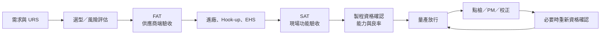
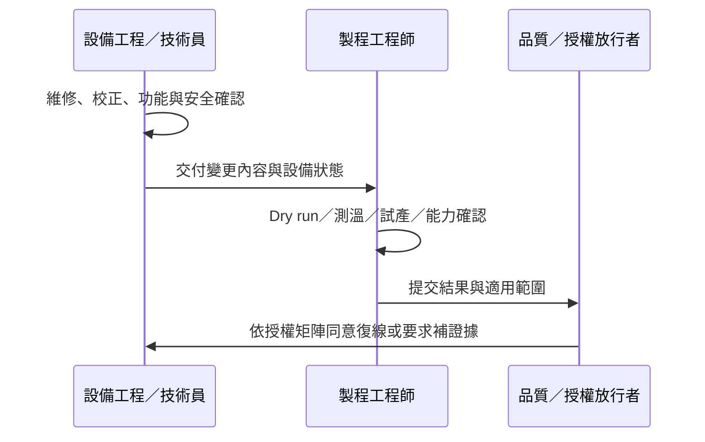

# 設備導入、保養與復線

機台管理不是「買進來、開機、故障再修」。從規格定義到退役，每一次狀態改變都可能影響產品品質；最重要的界面是：設備恢復運轉，不等於製程已可放量。

## 從需求到量產的生命週期

| 階段 | 主要問題 | 典型交付物 |
|---|---|---|
| URS／選型 | 產品、產能、精度、節拍、廠務、安全是否匹配？ | 使用者需求、風險清單、設備規格 |
| FAT | 設備出貨前是否按約定功能運作？ | 測試報告、Open item、備品與文件 |
| Install／SAT | 水電氣、排氣、網路、Interlock 與現場功能是否正常？ | Hook-up 紀錄、安全驗收、SAT |
| Process qualification | 實際產品能否在製程視窗內穩定生產？ | Profile、能力研究、首件／試產結果 |
| Release | 誰核准、適用哪些產品與限制？ | 放行紀錄、recipe 權限、控制計畫 |
| Operation／PM | 如何維持狀態並提早發現劣化？ | 點檢、PM、校正、Alarm 與備品紀錄 |
| Change／Requal | 改了什麼，需重驗到什麼程度？ | 變更風險、驗證結果、更新文件 |

設備商的支援範圍通常涵蓋安裝、試運轉、操作／維護／製程訓練與生產力改善；廠內仍需指定設備與製程 owner 承接日常責任。[來源：Yamaha Robotics 設備支援與訓練](https://www.yamaha-robotics.com/en/support/shinkawa)、[PFA 導入支援](https://www.yamaha-robotics.com/en/support/pfa)

## 設備正常與製程正常要分開

- **設備工程**證明機台功能、安全、校正與重複性回到要求。
- **製程工程**證明產品結果與製程視窗仍符合規格。
- **品質或指定放行者**依控制計畫確認證據完整；不一定每次小保養都要由 QA 親自簽核。

日本與簡中官方職缺都把故障排除、定期保養、校正、設備改善和供應商協作列為設備責任；把回流曲線、試產、缺陷改善和工藝標準列為製程責任。[來源：TCL 華瑞 SMT 設備技術員／工藝工程師](https://www.tcl-lighting.com/xwxq/b7wqkn7b)、[MinebeaMitsumi はんだ実装エンジニア](https://js01.jposting.net/minebea/u/job.phtml?job_code=950)

## 各設備的保養焦點

| 設備 | 日常／換線點檢 | 計畫保養與校正 | 維修後常見確認 |
|---|---|---|---|
| 印刷機 | 鋼網、刮刀、支撐、清網 | 軸、視覺、壓力與平行度 | 印刷偏移、體積與重複性 |
| SPI／AOI | 鏡頭、照明、程式版次 | 光源、相機、標定板、運動軸 | Golden sample、GR&R／重複性 |
| 貼片機 | Feeder、吸嘴、真空、拋料 | Head、軸、相機、Feeder 校正 | 貼裝偏移、旋轉、缺件與 Cpk |
| 回流爐 | 溫區、鏈速、風扇、排氣、氧含量 | 加熱／風扇、鏈條、冷卻、助焊劑殘留清潔 | 空爐穩定、鏈速、實板 Profile |
| ACF／熱壓機 | 刀頭、治具、壓力、對位畫面 | 溫度、荷重、平行度、相機與軸 | 壓痕、對位、導通與拉力／可靠度 |
| 熱板／重工台 | 表面、熱電偶、夾具、排煙 | 溫度均勻性、控制器與安全裝置 | 實測溫度與試片 |

實際週期只能依設備手冊、使用時數、污染負荷、故障資料與風險訂定，不能從別廠的「週／月／季保養」表直接照抄。

## 安全停機與維修權限

熱表面、移動軸、電力、壓縮空氣、真空、氮氣和排氣都可能構成危害。操作員只處理受訓且 SOP 明列的一級復歸；需要開護罩、解除能量、進入機構或繞過 Interlock 的工作，必須交給授權維修人員並依廠內能量隔離程序執行。不得為了趕產量旁路安全裝置。

## 何時找設備商？

- 新機安裝、軟硬體升級與正式訓練。
- 重複發生但廠內無法隔離的慢性故障。
- 需要原廠校正治具、權限、韌體或保固零件。
- 設備已停產、備品供應或資安更新出現風險。

廠內工程師仍要保留 Alarm、log、發生條件、已換零件與驗證結果；只回報「機台會停」會讓原廠重新做一次現場初篩。

## 延伸閱讀

- [量產控制：Recipe、換線與追溯](02b-production-control.md)
- [ACF／熱壓量產線](05b-acf-line.md)
- [機台團隊與人力配置](12-staffing.md)

