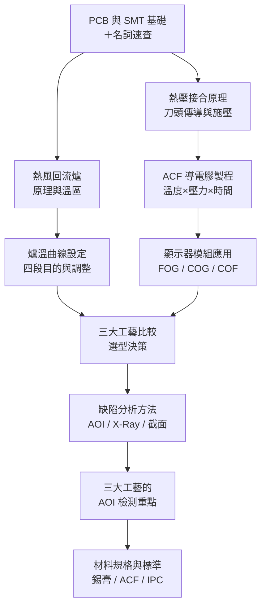

# 熱風・熱壓・熱板　電子接合完整指南

## 本書目標

電子製造中，**焊接與接合**是品質的核心。本書以三種最常見的加熱工藝為主軸：

| 工藝 | 加熱方式 | 典型應用 |
|------|---------|---------|
| 熱風回流 | 強制對流 | SMT 量產主線 |
| 熱壓接合 | 傳導（刀頭接觸） | FPC、ACF、顯示器模組 |
| 熱板傳導 | 傳導（板面接觸） | 打樣、維修 |

---

## 學習路徑

---

> 📷 **圖片來源**：本書圖片均來自 [Wikimedia Commons](https://commons.wikimedia.org/)，依各自的自由授權（CC BY / CC BY-SA / 公有領域等）使用。完整版權聲明見 [圖片來源頁](99-image-credits.md)。

1. **[熱風回流爐](01-hot-air.md)** — 爐體結構、溫區設計、熱風刀
2. **[爐溫曲線設定](02-temp-profile.md)** — 四段曲線、無鉛 vs 有鉛、調機實務
3. **[熱壓接合原理](03-hot-bar.md)** — Thermode 刀頭、脈衝加熱、壓力控制
4. **[ACF 導電膠製程](04-acf.md)** — 導電粒子結構、Z 向導通、三要素
5. **[顯示器模組應用](05-display-modules.md)** — FOG / COG / COF 詳解
6. **[熱板傳導回流](06-hot-plate.md)** — 適用場合與限制
7. **[三大工藝比較](07-comparison.md)** — 選型矩陣與決策指南
8. **[缺陷分析方法](08-defect-analysis.md)** — AOI、X-Ray、截面分析、IPC 標準
9. **[三大工藝的 AOI 檢測重點](08b-aoi.md)** — 三種製程的 AOI 配置與檢測策略
10. **[材料規格](09-materials.md)** — 錫膏、ACF、助焊劑 Datasheet 解讀
11. **[學習資源](10-resources.md)** — 標準文件、白皮書、推薦資料

---

## 先備知識

不熟悉以下名詞？先從這裡開始：

- **[PCB 與 SMT 基礎概念](00-pcb-basics.md)** — 什麼是 PCB、FPC、BGA、SMT 生產線
- **[名詞解釋速查表](00-glossary.md)** — 本書所有術語一覽，隨時查詢
