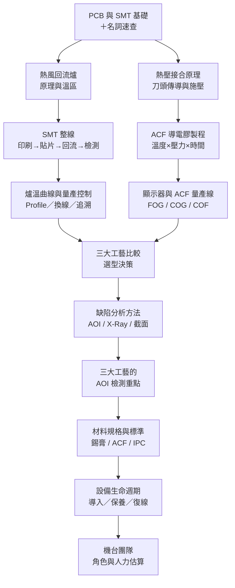

# 熱風・熱壓・熱板　電子接合完整指南

## 本書目標

電子製造中，**焊接與接合**是品質的核心。本書以三種最常見的加熱工藝為主軸：

| 工藝 | 加熱方式 | 典型應用 |
|------|---------|---------|
| 熱風回流 | 強制對流 | SMT 量產主線 |
| 熱壓接合 | 傳導（刀頭接觸） | FPC、ACF、顯示器模組 |
| 熱板傳導 | 傳導（板面接觸） | 打樣、維修 |

---

## 學習路徑

```mermaid
flowchart TD
    A["PCB 與 SMT 基礎<br/>＋名詞速查"] --> B["熱風回流爐<br/>原理與溫區"]
    B --> B2["SMT 整線<br/>印刷→貼片→回流→檢測"]
    B2 --> C["爐溫曲線與量產控制<br/>Profile／換線／追溯"]
    A --> D["熱壓接合原理<br/>刀頭傳導與施壓"]
    D --> E["ACF 導電膠製程<br/>溫度×壓力×時間"]
    E --> F["顯示器與 ACF 量產線<br/>FOG / COG / COF"]
    C --> G["三大工藝比較<br/>選型決策"]
    F --> G
    G --> H["缺陷分析方法<br/>AOI / X-Ray / 截面"]
    H --> J["三大工藝的<br/>AOI 檢測重點"]
    J --> I["材料規格與標準<br/>錫膏 / ACF / IPC"]
    I --> K["設備生命週期<br/>導入／保養／復線"]
    K --> L["機台團隊<br/>角色與人力估算"]
```

---

> 📷 **圖片來源**：本書圖片均來自 [Wikimedia Commons](https://commons.wikimedia.org/)，依各自的自由授權（CC BY / CC BY-SA / 公有領域等）使用。完整版權聲明見 [圖片來源頁](99-image-credits.md)。

1. **基礎與整線** — [熱風回流爐](01-hot-air.md)、[SMT 整線](01b-smt-line.md)、[爐溫曲線](02-temp-profile.md)、[量產控制](02b-production-control.md)
2. **熱壓與 ACF** — [熱壓接合](03-hot-bar.md)、[ACF 製程](04-acf.md)、[顯示器模組](05-display-modules.md)、[ACF 量產線](05b-acf-line.md)
3. **替代工藝與選型** — [熱板傳導](06-hot-plate.md)、[三大工藝比較](07-comparison.md)
4. **品質與材料** — [缺陷分析](08-defect-analysis.md)、[AOI 檢測重點](08b-aoi.md)、[材料規格](09-materials.md)
5. **量產營運與團隊** — [設備生命週期](11-equipment-lifecycle.md)、[機台人力配置](12-staffing.md)
6. **[學習資源](10-resources.md)** — 標準文件、設備商資料與進階路線

---

## 先備知識

不熟悉以下名詞？先從這裡開始：

- **[PCB 與 SMT 基礎概念](00-pcb-basics.md)** — 什麼是 PCB、FPC、BGA、SMT 生產線
- **[名詞解釋速查表](00-glossary.md)** — 本書所有術語一覽，隨時查詢
