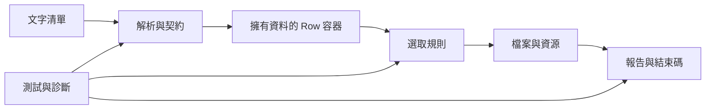

# 全書地圖：每次修改先問哪個問題

一張缺圖報告可能很短，但有一條完整因果鏈：文字輸入先被理解成 Row，再依判定規則選列，查檔案，把結果轉成使用者能採取行動的訊息。若解析錯了，後面每一步都可能「正常」地處理錯資料。

| 想回答的問題 | 原理頁 | C00 對應 |
|---|---|---|
| 我改的是正在跑的版本嗎？ | 01 產物 | G00、G01 |
| 這個值是副本還是原物件？ | 02 值／參照、03 生命週期 | G01、G02 |
| 資料量變大，代價在哪裡？ | 04 容器、05 複雜度 | G02、G03 |
| 哪些輸入可以信任？ | 06 契約 | G02、G05 |
| 失敗時誰清理、誰決定退出？ | 07 錯誤、08 模組 | G04、G06 |
| 怎麼證明改動沒破壞行為？ | 09 測試 | G05、G06 |
| 怎樣排除猜測？ | 10 除錯、11 效能 | G01、G03 |
| 怎樣留下可交付的變更？ | 12 Git、13 CI | 每階 |
| 換成 Python 還有哪些差異？ | 14 Python | 後續 ML 課程 |

讀書不必按章號走，但不要跳過當前問題需要的前提。比如學 unordered_set 之前，先理解重複「身分」是什麼；否則只學會換容器，可能把錯的 key 查得更快。

**本書的通過條件：** 選一項新需求，能指出資料、規則、資源與外部效果哪裡變動，提出最小修改、反例與驗證方式。C00 的末階提供這個任務。
