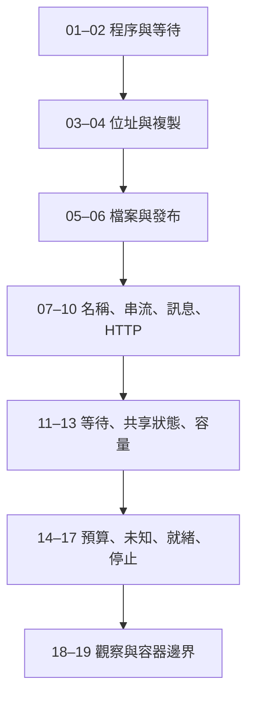

# 全書地圖

貫穿的問題是：一批合成圖片交出去之後，誰還握著它、誰在等、哪一層已經承諾完成。

| 頁 | 你要能回答的問題 | 先備 |
|---|---|---|
| [程序](01-process.md) | 兩個同名 worker，哪一個失敗了？停掉之後還在嗎？ | 函式、退出與資源歸屬 |
| [執行緒與排程](02-thread-scheduling.md) | 程序活著，為什麼沒有進度？ | 程序 |
| [位址空間](03-address-space.md) | 位址數字一樣，是同一份資料嗎？ | 程序 |
| [資料搬移](04-data-movement.md) | 一張圖讀進來之後有幾份 buffer？ | 位址空間 |
| [檔案](05-files-io.md) | 檔名存在，為什麼仍可能是半檔？ | 資料搬移 |
| [完成的層次](06-completion-durability.md) | 寫入完成，是哪一層完成？ | 檔案 |
| [名稱、位址與 port](07-address-port-dns.md) | 名稱正確，為什麼連不上？ | 程序 |
| [TCP 串流](08-tcp-stream.md) | 一次 send 可以對上一次 recv 嗎？ | 位址與 port |
| [訊息契約](09-message-contract.md) | 接收端怎麼知道一筆資料完整？ | 串流 |
| [HTTP](10-http.md) | TCP 通了，HTTP 就成功嗎？ | 串流、訊息 |
| [同步與非同步](11-sync-async.md) | 非同步讓誰不用等？ | 執行緒 |
| [共享狀態](12-shared-state.md) | 每一步都加了鎖，為什麼組合仍是錯的？ | 執行緒 |
| [佇列與背壓](13-queue-backpressure.md) | 來源比接收端快時，工作數怎麼對？ | 共享狀態 |
| [逾時與預算](14-timeout-deadline.md) | 每一步都沒逾時，整體為什麼太久？ | 等待 |
| [取消與未知](15-cancellation-unknown.md) | 客戶端不等了，對方停了嗎？ | 預算、訊息 |
| [就緒](16-readiness.md) | 程序開始、連得上、接得了工作，是同一件事嗎？ | 程序、連線 |
| [停止](17-shutdown.md) | 已接受的工作在停止時去哪了？ | 就緒、取消 |
| [觀察](18-observability.md) | 慢在計算、等待、佇列還是鎖？ | 前面各段的時間 |
| [容器](19-containers.md) | 容器裡的 localhost、檔案與 PID 指誰？ | 程序、檔案、連線、停止 |

[實驗](labs.md)依 L01 到 L11 對上這些頁。術語集中在[詞彙表](glossary.md)。來源與這次實際跑過的環境分開記在[來源](sources.md)與[驗證](verification.md)。

[回到導讀](README.md)
