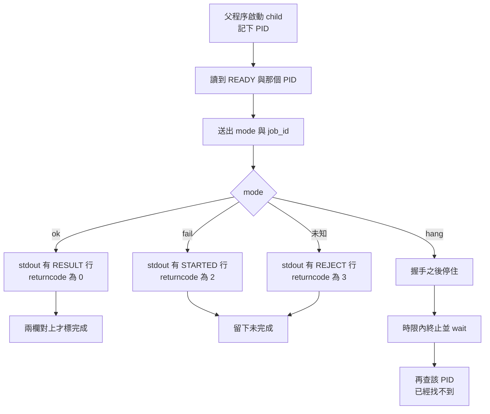

# 01｜兩個同名 worker，誰失敗了

同一支 worker 被父程序拉起兩次。產線畫面兩張合成 AOI 圖都寫著已啟動。log 裡各有一行 `STARTED`。其中一筆接著以退出碼 2 結束，另一筆停在握手之後，沒有再寫出結果。

接收端要的是這張圖的結果列。`STARTED AOI-SYN-002` 只表示 child 讀到了 `fail` 這個 mode。stdout 上的文字在一個欄位，`returncode` 在另一個欄位。

父程序若在後面某一筆丟出例外，已經啟動的 child 仍可能留在系統裡。這個程序裡的檔案物件會跟著擁有者釋放。另一個 PID 要另外等、另外收狀態。

## 先預測

child 印出 `STARTED` 之後以退出碼 2 結束。只看 log 這一行，接收端可以開始用這張圖嗎？

## 沿着這條路徑



## 原理

一次啟動產生一個程序。同一支 `l01_process.py` 可以同時有父程序和 child，各自有 PID。`READY` 行裡的數字要等於 `Popen.pid`。數字對上，只說明這個 child 已經開始跑。工作結果還沒有出現。

完成要同時滿足三件事：握手沒有失敗、`returncode` 是 0、結果行是 `RESULT <job_id> ok`。`fail` 會先印 `STARTED`，再以退出碼 2 結束。正確判準把這次留在未完成。未知 mode 印 `REJECT`，退出碼是 3，同樣留在未完成。

退出碼 0 通常表示成功，只是慣例。作業系統沒有讀這張圖，也不替業務打分。POSIX 裡，子程序交給 `exit` 的狀態只有低 8 位會進 `wait`。`WEXITSTATUS` 取出的是子程序交出去的那段狀態。實驗使用的 0、2、3 都落在這 8 位裡面。超過這 8 位的狀態不會原樣出現在 `wait` 的結果裡。

對一筆工作，父程序至少留下四項：`job_id`、child 的 PID、stdout 那一行是 `READY`、`STARTED`、`RESULT` 還是 `REJECT`，以及 `returncode`。程式路徑相同，不能代替 PID。兩次啟動的文字若寫進同一個 log，沒有 PID 就無法把某一行 `STARTED` 配回某一次 `wait`。

`Popen.returncode is None` 寫在 Python 文件裡：最後一次 `poll`、`wait` 或 `communicate` 時，程序尚未被觀察到終止。文件沒有把這句話定義成「還沒 wait，所以是 zombie」。

父程序沒有丟棄子程序狀態時，未被 `wait` 的子程序會變成 zombie，直到父程序取走狀態。父程序先結束不會自動殺掉子程序。實驗在 `finally` 裡回收，是這個父程序自己把 child 等完。

`Popen.communicate` 逾時不會殺子程序。`subprocess.run` 逾時才會自己殺並等待。這兩句要分開記。L01 卡住時用的是自己的 `wait` 時限，然後終止並 `wait`。

Linux 的 `SIGKILL` 不能被抓住、阻擋或忽略。`hang` 在時限內被終止並回收之後，實驗用 `os.kill(pid, 0)` 確認找不到該 pid。程式把 `ProcessLookupError` 當成找不到，把 `PermissionError` 當成還在。通過條件是這個 pid 已經不在。實驗沒有把某一段 Python `finally` 有沒有執行列進判準。

這支父程序把回收放在 `finally`，用來應付自己這條 Python 路徑上的例外。child 那一側若收到 `SIGKILL`，能不能被 child 的程式抓住，要回到上一句的訊號規則。父程序的 `finally` 與 child 的訊號是兩側。

同一個程序裡，區域物件的釋放綁在擁有者的生命週期上。那一段在《從讀懂程式到能修改系統》的「生命週期與 RAII」。child 的 PID、標準輸出和退出狀態在那個模型外面。容器裡停止訊號打到誰，留在《Docker 現場招式》。本頁只建立父程序如何辨認並收回自己啟動的 child。

程序還在，也不代表 CPU 正在算這張圖。見 [執行緒與等待](02-thread-scheduling.md)。兩個 PID 各自的記憶體，見 [位址空間](03-address-space.md)。父程序在停止時還有哪些 child 必須收回，後面的 [停止](17-shutdown.md) 會把這頁的 `wait` 放進整段生命週期。本頁的範圍停在：一次啟動、一次握手、兩個欄位、回收後 PID 不在。

- Python 3.13 subprocess：https://docs.python.org/3.13/library/subprocess.html
- POSIX `_Exit`：https://pubs.opengroup.org/onlinepubs/9699919799/functions/_Exit.html
- Linux signal(7)：https://man7.org/linux/man-pages/man7/signal.7.html

## 反例

`ignore_exit` 看見 `STARTED` 或 `RESULT` 就回報成功，不看退出碼。`fail` 會印 `STARTED` 再以退出碼 2 結束，錯誤版仍把工作標成完成。測試必須同時看到這個完成旗標，以及退出碼 2。少看退出碼，誤判就會被當成真的交付。本實驗也不用 log 裡幾行的先後順序來判斷誰完成。

只保存「曾經印出 `READY`」也會誤判。`READY` 對上 PID，表示 child 已啟動。`fail`、未知 mode、`hang` 都會先握手。完成仍要 `RESULT` 那一行，以及退出碼 0。把握手時間寫進交付欄，四條未完成路徑會和 `ok` 混在一起。

## 動手看

進入這本書的 `examples/` 後執行：

```bash
python3 l01_process.py
```

通過時標準輸出是 `L01 PASS`。本次 macOS 與 Linux 容器都是這個結果。

通過時程式在檢查：

- `ok`：退出碼 0，且有 `RESULT AOI-SYN-001 ok`。回收之後 `os.kill(pid, 0)` 找不到該 pid。
- `fail`：看得到 `STARTED`，退出碼是 2。正確版的完成旗標為假，child 已被回收。
- `ignore_exit`：同一條 `fail` 被錯誤版標成完成，退出碼仍是 2。測試靠這個組合抓到誤判。
- 未知 mode `nope`：退出碼 3，輸出 `REJECT AOI-SYN-003 unknown-mode`，完成旗標為假。
- `hang`：時限內結束等待，錯誤是 `child-timeout`，完成旗標為假。回收之後找不到該 pid。

沒有要求各行 log 以固定順序出現。父程序印出的只有最後的 `L01 PASS`。各次 child 的 `READY`、`STARTED`、`RESULT`、`REJECT` 留在管道裡，由檢查函式讀走，不要求讀者在終端上看到固定的交錯順序。

stdout 與 `returncode` 要同時留在同一筆 job。只归档其中一欄，下一頁的等待問題會失去「這次到底結束了沒有」的依據。

## 題目

**Q01.** child 印出 STARTED 之後以退出碼 2 結束。父程序可以把這次工作標成完成嗎？要同時看哪兩個欄位？

[返回地圖](00-map.md) · [實驗入口](labs.md) · [題目提示](hints.md) · [題目解答](answers.md)
