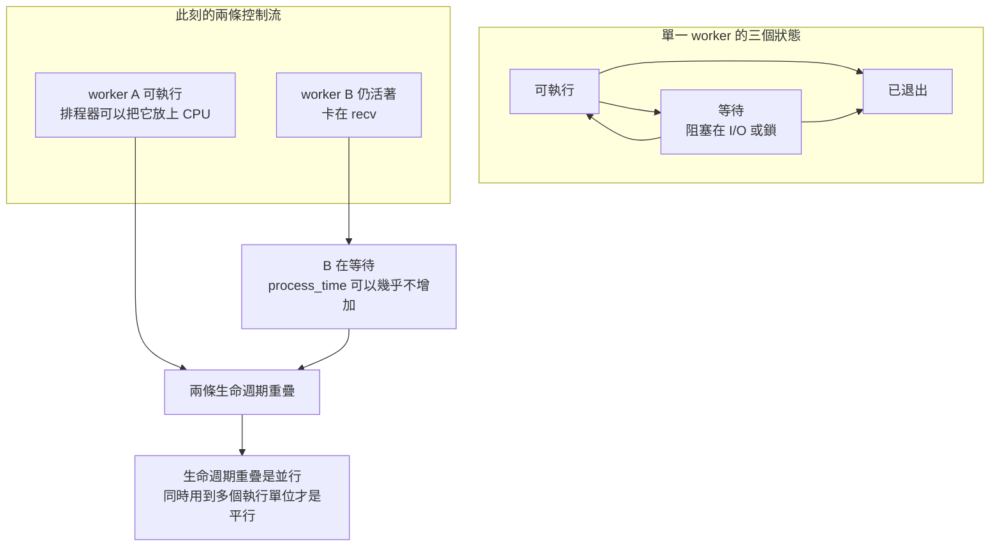

# 02｜程序還在，圖卻沒有進度

兩支 worker 的 PID 都還在。監控只寫「程序存在」。一支卡在 `recv`，等下一塊影像位元組。另一支停在加總迴圈的下一列。畫面上看起來，兩張合成 AOI 圖都在處理。

卡在 `recv` 的那一支可以一直活著。它在等對端或等核心把資料交進來。排程器沒有義務在它阻塞時，繼續把 CPU 分給它的影像迴圈。

若把「程序還在」填進完成表，接收端會一直等一張沒有人在算的圖。上一頁已經能分出退出碼。這一頁要分的是：活著的程序，現在能不能跑。

## 先預測

兩個 worker 都還活著，其中一個卡在 `recv`。CPU 正在執行它的影像加總嗎？

## 沿着這條路徑



## 原理

把一個 worker 分成三種狀態來看。

可執行：它的下一步可以在 CPU 上跑。排程器挑中它，它才真正占一個執行單位。

等待：它阻塞在 I/O 或鎖上。卡在 `recv` 屬於這一類。程序還在，PID 還查得到，下一步卻要等別的事發生。等待期間，`process_time` 可以幾乎不增加。

已退出：它不再參與排程。父程序要取走的是退出狀態，見 [程序與退出](01-process.md)。已退出的 worker 不會因為 PID 曾經存在而回到可執行。

排程器從可執行的控制流裡面挑。等待中的要等 I/O 完成，或等鎖被放開，才回到可執行。卡在 `recv` 的 worker 停在等待。它的下一行影像加總還沒有被排上去。

並行是多條控制流的生命週期重疊。兩支 worker 同時活著，生命週期就重疊了。平行是真正同時使用多個執行單位。B 卡在 `recv` 時，A 就算正在算圖，也只有 A 用到 CPU。兩支都活著，推不出兩張圖正在同時被計算。

一個程序裡可以有多條執行緒。每一條也落在可執行、等待或已退出。程序還在，可能是其中一條卡在 `recv`，另一條已經無事可做。監控若只亮「程序存在」，這兩條會合成一盞燈。

執行緒是共享同一個虛擬位址空間的 task。那個空間的歸屬在 [位址空間](03-address-space.md)。鎖造成的等待，留在 [共享狀態](12-shared-state.md)。這一頁先只看每條控制流落在哪一格。

鎖住之後誰在等，留到後面的共享狀態。現場若要沿連線看卡在哪一層，另見《五台機台也用得上的 Linux 現場招式》。那裡的排查仍要先把「連線停住」放進等待，再決定要不要看 CPU。記憶體排序與更後面的並行模型，見《Binary Hacks》的記憶體與並行篇。

兩支都可執行，而且機器真的同時把兩個執行單位分給它們，那一次才同時滿足並行和平行。只有生命週期重疊、其中一條在等 `recv`，滿足的是並行。平行那一格是空的。

本頁不寫 CPU 秒數。等待時牆上時間會過去、`process_time` 可以幾乎不動，那組對照詳見 [同步與非同步](11-sync-async.md) 與 `examples/l06_sync.py`。

可執行還要再被排程器選中，才會在這一刻使用 CPU。沒有被選中的可執行 worker，下一行加總仍然停著。等待中的 worker 連被選中的資格都還沒有回到佇列。已退出的 worker 不在這兩個格子裡。

並行只要求這些控制流的生命週期疊在一起。平行還要求這一刻真的有多個執行單位在跑。題目裡一個 worker 卡在 `recv`，生命週期仍和另一個活著的 worker 重疊。重疊的是並行。算圖的執行單位沒有因此變成兩個。

## 反例

每隔一秒用 `os.kill(pid, 0)` 看 PID 還在不在，還在就把這張圖記成「計算中」。等待中的程序也找得到 PID。`recv` 停住時，這個檢查仍然成功。它看出的是程序還活著，看不出 CPU 正在跑影像迴圈。

## 動手看

對應程式仍是 `examples/l01_process.py`。進入該目錄執行：

```bash
python3 l01_process.py
```

通過時標準輸出是 `L01 PASS`。本次 macOS 與 Linux 容器都是這個結果。和本頁直接有關的是 `hang`。

`hang` 在握手之後呼叫長時間的 `sleep`，沒有做影像加總。通過時這條路徑檢查三件事：完成旗標為假、錯誤是 `child-timeout`、回收之後 `os.kill(pid, 0)` 找不到該 pid。它證明等待被時限截斷，而且 child 被收回。它沒有印出 `process_time`。

在被回收之前，這支 child 的狀態是等待，程序仍活著。回收之後變成已退出，PID 找不到。兩格都看過，仍然沒有 CPU 時間的數字。不要把 `L01 PASS` 讀成「卡住的 worker 仍在消耗 CPU」。那個區分的量測不在這支程式裡。

`recv` 沒有出現在 L01。題目裡的 `recv` 用的是同一組狀態：程序可以停在等待，PID 仍在，影像迴圈沒有在跑。真的去量等待時的 `process_time`，用前面指向的 L06。L01 的 `sleep` 秒數只描述它睡了多久，不能填進 CPU 用量。程式裡 `hang` 的等待上限是 0.4 秒，用來截斷這次等待。

牆上時鐘在等待期間仍會前進。人看著這 0.4 秒過去，會覺得 worker 有在做事。狀態格仍是等待。截斷之後它變成已退出。兩段時間都沒有提供「影像迴圈跑了多久」的樣本。

所以「程序還在」只排除已退出。它留下可執行與等待兩格。卡在 `recv` 的那格是等待。CPU 有沒有在算這張圖，要看它有沒有處於可執行，並且真的占到執行單位。

## 題目

**Q02.** 兩個 worker 都還活著，其中一個卡在 recv。為什麼「程序還在」不能推出 CPU 正在算這張圖？

[返回地圖](00-map.md) · [實驗入口](labs.md) · [題目提示](hints.md) · [題目解答](answers.md)
