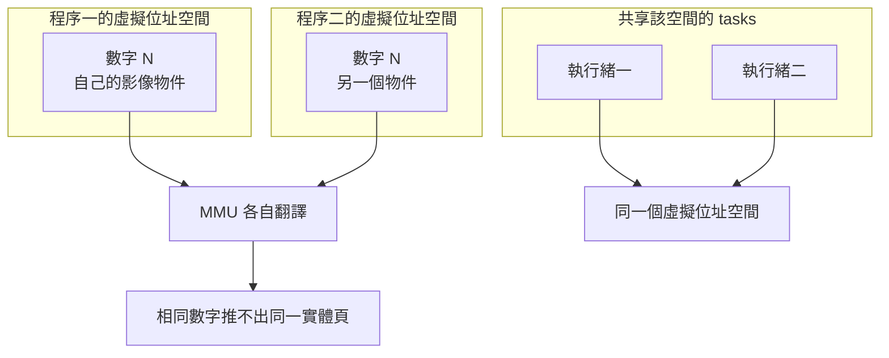

# 03｜位址數字一樣，不一定是同一份圖

兩支 worker 各印了一行除錯。PID 不同，其中一個 `id` 數字卻和另一個一樣。有人把這個數字當成「同一塊影像 buffer」，讓後一支直接改前一支的像素。

改完之後，前一支仍算出自己的值。接收端拿到的兩筆結果對不上那次「原地修改」。log 裡的數字相同，兩張合成 AOI 圖的內容卻各走各的。

同一支程序裡，函式返回之後區域變數已經結束，下一個物件又印出同樣的 `id`。第二次的數字對上了，第一次的物件已經不在。

## 先預測

兩個還活著的程序印出相同的 `id`。可以由此認定它們正在改同一份影像 buffer 嗎？

## 沿着這條路徑



## 原理

程式使用虛擬位址。MMU 把虛擬位址譯成實體位址。相同的數字落在不同位址空間時，不能推出同一實體頁。

一個虛擬位址空間，由共享該空間的 tasks 參考。那些 tasks 就是這個程序裡的執行緒。執行緒甲寫進這個空間的 buffer，執行緒乙看同一個虛擬位址，指的是這一份空間裡的位置。另一個程序有另一份空間。它印出的數字要先經過它自己的 MMU。

Python 的 `id` 表示物件在壽命期間的身分。CPython 的實作細節才把這個身分做成物件位址。壽命不重疊的物件可以共用同一個 `id`。所以同一個程序裡，前後兩個已經死去、再生的物件也可以印出相同數字。那個數字對上，只表示身分欄位再次出現。

兩個程序同時活著、又印出相同 `id`，仍然是兩份身分。每一份身分只在自己的程序裡有效。實驗會把 `id` 印出來，只供觀察。通過條件不使用這個數字。

同一個程序裡也會重用數字。函式裡做出暫存的影像 bytes，函式返回後那份物件的壽命結束。下一張圖再做出 bytes 時，新物件可以印出先前那個 `id`。兩次列印中間，第一份已經不在。CPython 把 `id` 做成位址，只解釋這個實作裡的身分欄位。它沒有讓兩個 PID 共用實體頁。

堆疊上的區域物件跟著那次呼叫。堆積上的 buffer 跟著擁有它的物件。這些都住在該程序的虛擬位址空間裡。執行緒因為共享這個空間，才可能寫到同一份 buffer。兩個程序沒有共享這份空間。把 buffer 交給另一個 PID，要另外複製，或另外做系統允許的共享。複製與借用的成本在 [資料怎麼搬](04-data-movement.md)。

L02 的 child 各自建立字典，把 `n` 設成命令列給的 10 或 20，再印出自己的 PID、`n` 與 `id`。父程序等兩個 child 都退出。通過時兩個 `n` 都還在，表示各自的寫入留在自己的程序裡。沒有第三個步驟把兩邊的字典接成同一塊記憶體。

若兩條執行緒在沒有同步的情況下同時改同一份 C++ 物件，C++ 標準把 data race 定義為未定義行為。這是延伸。本頁的 Python 實驗只檢查兩個程序各自留下 10 與 20。C++ 的記憶體模型要看 C++ 的規則與它自己的測試。深入的記憶體與並行閱讀見《Binary Hacks》的記憶體與並行篇。

數字 N 在程序一是虛擬位址。程序二印出同一個 N，仍是程序二的虛擬位址。MMU 分別翻譯之後，實體頁可以不同，也可以在別的機制下被對應到同一頁。單靠印出的數字，兩種結果都推不出來。實驗沒有讀頁表，也沒有列印實體位址。

- Python `id`：https://docs.python.org/3.13/library/functions.html#id
- Linux 虛擬記憶體：https://www.kernel.org/doc/html/latest/admin-guide/mm/concepts.html
- Linux 位址空間與 tasks：https://www.kernel.org/doc/html/latest/mm/process_addrs.html
- C++ data race：https://eel.is/c++draft/intro.races

因此除錯列印要帶 PID，再帶這個程序裡的 `id`。只貼 `id`，兩份 log 會在數字碰巧相同時被當成一次寫入。實驗把 PID 放進通過條件，就是要保住「哪一個程序」這個維度。

堆疊上的區域名稱跟著那次呼叫結束。堆積上的 buffer 跟著釋放它的擁有者結束。兩個時間都到了，下一個物件可以再使用同一個 `id` 數字。

那是同一個程序、壽命不重疊的重用。兩個同時活著的程序就算印出同一個數字，仍然各有自己的虛擬位址空間。MMU 分開翻譯。實體頁不能從這個數字讀出來。

## 反例

把兩行程式印出的 `id` 相等寫進斷言，斷言通過就讓其中一個程序去改「那塊」buffer。`id` 相等只是兩個數字相同。測試若靠它判斷共享，會在數字碰巧一樣時放行，在數字不一樣時又把兩份獨立結果判成失敗。L02 故意不把 `id` 放進通過條件。

## 動手看

進入 `examples/` 後執行：

```bash
python3 l02_address.py
```

通過時標準輸出以 `L02 PASS` 開頭，後面附上兩列 JSON。程式檢查的是：一列的 `n` 為 10、另一列為 20，而且兩個 `pid` 不同。子程序的退出碼要是 0。

`id` 欄位會被印出來。它只是這次程序裡那個字典物件的身分觀察。不要把某一次印出的數字當成下次也必須相同，也不要把它當成實體頁編號。

一份 macOS 原生紀錄與一份 Linux 容器紀錄都印出 `L02 PASS`。兩次的 `n` 都是 10 與 20，PID 都彼此不同。兩次印出的 `id` 數字不一樣。就算哪一次兩個 child 的 `id` 印成同一個數字，通過條件仍然只看 `n` 與 PID。那個相同數字仍推不出同一份影像 buffer。

C++ 的複製計時是另一支程式，在 [資料怎麼搬](04-data-movement.md)。這一頁不用那組微秒。

兩個 child 由父程序分別啟動，命令列一個傳 10、一個傳 20。它們不共用 Python 物件。父程序只讀取它們印出的一行 JSON，再 `wait`。讀到的 `n` 若仍是各自的目標，寫入就留在那個 child 的位址空間裡。

同一份影像 buffer 要同時滿足兩件事：位元組住在同一個虛擬位址空間，而且擁有者允許這次修改。兩個程序的 `id` 數字相同，兩件事都還沒有成立。

## 題目

**Q03.** 兩個程序印出相同的 id 數字。可以說它們改到同一份影像 buffer 嗎？

[返回地圖](00-map.md) · [實驗入口](labs.md) · [題目提示](hints.md) · [題目解答](answers.md)
