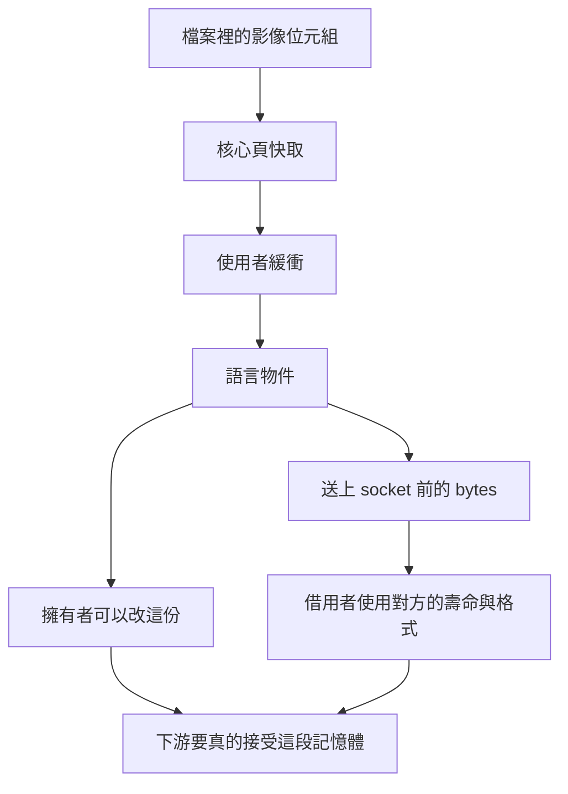

# 04｜載入之後，同一張圖有幾份

合成 AOI 圖從檔案讀進來之後，log 只寫「已載入 1 張」。接著送給接收端的函式收到的是另一個物件。有人改了語言物件裡的一個像素，socket 上送出的內容沒有跟著變。另一個晚上，改動又出現在對端。兩次呼叫的函式名字相同。

計時也幫不上忙。借用路徑比複製路徑少了幾百微秒，就被記成「已經 zero-copy」。接收端仍要求自己的訊息格式。下游沒有答應使用上游那段記憶體的壽命。

同一張圖在這段路上可以同時有好幾份。先把份數畫出來，再談哪一份可以改。

## 先預測

複製和借用都會把每個 byte 加總。借用比較快的那一次，能不能單獨證明送上 socket 時沒有再複製？

## 沿着這條路徑



## 原理

一張圖從檔案讀入之後，同一時刻可能同時存在四份資料。

核心頁快取留著檔案讀過的頁。使用者緩衝是這次讀進呼叫端的那段空間。語言物件是程式接著持有的結構，例如一個 `vector` 或一段 bytes。送上 socket 之前，還可能再有一份已經排好格式的 bytes。

所有權要分開寫。擁有者可以改自己那份，也負責它的壽命。借用者只使用別人的那份。原物件先死，借用就沒有可讀的對象。上一頁的虛擬位址說明了：另一個程序印出相同數字，仍然是另一份空間。見 [位址空間](03-address-space.md)。

四份裡誰能改，可以沿著合成圖走一次。頁快取由核心管理。應用程式能改的是自己之後拿到的緩衝。使用者緩衝裡的位元組一旦複製進語言物件，再改語言物件，檔案裡的那一份還停在原處。語言物件若再複製成 socket 前的 bytes，改語言物件不會改到那份已經複製出去的 bytes。開頭的兩種夜晚就是這兩種所有權：一次送出的是早先複製的 bytes，一次送出時仍借用著還活著的物件。

借用要寫清楚三件事。誰可以改：擁有該 `vector` 的那一段程式。誰只讀：拿到 `const` 參考的加總函式。壽命收到哪裡：參考的使用必須停在原物件還活著的時候。格式要另外寫。加總函式接受的是 `uint8_t` 的連續緩衝。接收端若要長度前綴或影像標頭，這段緩衝的格式還對不上，即使壽命對了，也不能把它直接交給對端。

zero-copy 的前提是下游真的接受那段記憶體的壽命與格式。下游要的若是另一種長度前綴或另一段連續 bytes，上游仍得做出下游要的那一份。本次 C++ 實驗沒有使用 `sendfile` 或 `mmap`。它沒有把頁快取交到 socket。socket 上一次傳送對應幾次接收，見 [位元組串流](08-tcp-stream.md)。那一頁的切段不在這次計時裡。

實驗裡的兩條路徑都會把 2_000_000 個 byte 各加一次。`sum_by_copy` 的參數是傳值，進入函式前先有另一個 `vector`。`sum_by_borrow` 的參數是 `const` 參考，加總的是呼叫端那一份。兩者最後都呼叫會掃描每個 byte 的 `sum_bytes`。時鐘裡都含有這次全長掃描。複製路徑還多含做出第二份資料的時間。程式沒有把這兩段時間拆開印出。因此這次計時不能單獨證明 zero-copy 已經發生，也不能單獨證明 socket 上少了一次複製。

兩次 macOS 執行，編譯都是 `clang++ -std=c++17 -O2`。複製都比借用久，例如 356µs 對 168µs，另一次 722µs 對 638µs。差距會變，因為兩邊都掃過每個 byte。不要把單次微秒寫成定律。

計時用 `steady_clock` 量呼叫前後的時間差，再換成微秒。

區間蓋住整段 `sum_by_copy`，或整段 `sum_by_borrow`。程式沒有把區間拆成「做出第二份」和「掃描」兩行。

兩段都掃描 2_000_000 個 byte。複製那段還包含另一個 `vector` 的建立。

通過時兩個加總相等，而且等於 `2_000_000 × 3`。每個 byte 的初值是 3。原緩衝第一個 byte 仍是 3。

加總相等表示兩條路徑讀到的數值相同，也表示借用沒有把原緩衝改掉。

份數是另一件事。複製路徑在加總時持有第二個 `vector`。數值相同，推不出記憶體只剩一份。

若要把這段緩衝零複製送出去，下游得接受這個 `vector` 的壽命，以及連續 `uint8_t`、沒有長度前綴這個格式。

這支程式沒有 socket，沒有 `sendfile`，也沒有 `mmap`。較短的那一對微秒只描述這次程序、這個最佳化等級、這段迴圈。

圖再往下寫進正式檔案時，還有短讀和半檔。那是 [檔案與讀寫](05-files-io.md)。

頁快取、使用者緩衝、語言物件、socket 前的 bytes，可以在同一次讀檔之後同時還在。改其中一份，其他三份要各自看有沒有被寫到。計時沒有觀察這四份的位址，也沒有觀察 socket。

擁有者可以改自己那份 `vector`。`const` 參考只讀。參考的使用停在原物件還活著的時候。這三句是這次 C++ 程式裡的所有權。zero-copy 還要下游接受同一段記憶體的壽命與格式。程式沒有把緩衝交給下游。

## 反例

看到借用比複製少幾百微秒，就在交付紀錄寫上「影像已 zero-copy 送到接收端」。這次程式只在同一個程序裡加總一個 `vector`。兩條路徑都碰過每個 byte。較短的那一次仍包含掃描。接收端有沒有接受這段記憶體的壽命，程式根本沒有問。

## 動手看

進入 `examples/` 後，在 macOS 上編譯並執行：

```bash
clang++ -std=c++17 -O2 -o l02_copy l02_copy.cpp
./l02_copy
```

程式建立 2_000_000 個值為 3 的 byte。通過時程序退出碼是 0，並印出 `bytes 2000000`、兩段微秒，以及兩條路徑共同的加總。加總必須等於 `2_000_000 × 3`。原緩衝的長度與第一個 byte 也必須仍是當初寫入的值。

題目裡的 2MB 指的就是這 2_000_000 個 byte。讀者這次跑出來的微秒可以和 356／168、722／638 不同。通過條件看加總與原緩衝。某一對微秒不在通過條件裡。

Linux 容器這次沒有 `clang++`，C++ 這項記為 SKIP。不要用 SKIP 補一組微秒。

把微秒較短讀成 zero-copy，跳過了下游有沒有接受壽命與格式。這次迴圈的工作是加總，加總本身就要讀每個 byte。讀過每個 byte 的計時，留在「這次掃描花了多久」的範圍裡。

## 題目

**Q04.** 複製和借用都會把 2MB 每個 byte 加總。為什麼這次計時不能單獨證明 zero-copy 已經發生？

[返回地圖](00-map.md) · [實驗入口](labs.md) · [題目提示](hints.md) · [題目解答](answers.md)
