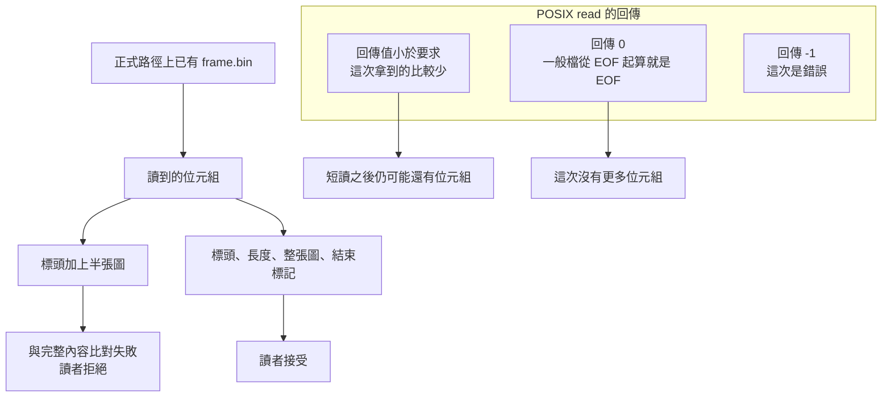

# 05｜檔名在，內容卻只有一半

正式路徑 `frame.bin` 已經出現。檔案總管看得到大小。打開之後，前面有標頭 `AOI1` 和一行長度，後面只跟著半張合成圖。沒有約定的結束標記。接收端若依「路徑存在」收進產線，這張圖會進入下一個模型。

writer 中途停住時，這個路徑也已經能被另一個程序打開。writer 被收回之後再讀一次，內容仍是那半張。路徑沒有消失，完整影像也沒有補上。

讀的回傳值會讓人把三種情況揉在一起：沒有更多位元組、這次少拿了一些、這次失敗。半檔是內容不完整。它要先和這三種回傳分開。

## 先預測

正式路徑上已經有一個檔案，內容是標頭加上半張圖。讀者應該把這張圖收下嗎？

## 沿着這條路徑



## 原理

讀者要的是一整張約定好的圖。實驗裡的完整內容是：魔術標頭、長度行、全部 payload、結束標記 `COMPLETE`。半檔路徑上有標頭、長度行，以及 payload 的前半。結束標記不在。位元組對不上，讀者拒絕。

檔名存在只表示目錄裡查得到這個名稱。檔案非空只表示裡面有一些位元組。半檔同時滿足這兩點。完整性看的是讀到的內容是否就是那張圖。

POSIX `read` 的回傳要分開記。對一般檔，從 EOF 的位置開始讀，回傳 0 表示 EOF。回傳值可以小於要求的位元組數；那是這次拿到的比較少，呼叫端要依已經拿到的數量繼續處理。回傳 -1 才是錯誤。短讀和錯誤是兩個結果。EOF 和「檔案裡只有半張圖」也是兩個結果：EOF 表示這次沒有更多位元組，半張圖表示已經讀到的那些位元組本身不完整。

用一般檔把這三個回傳放回這張圖上。迴圈還在檔案中段時，某次 `read` 可以少於要求，下一次仍可能讀到後面的像素。讀到檔案結尾再讀，回傳 0，表示沒有更多位元組。磁碟或描述符出錯時，回傳 -1，這次沒有新的像素可拼。半檔實驗走完之後也會遇到 EOF，因為檔案就只有那麼長。EOF 只結束讀取。它不補上被寫入程式截掉的那一半。

實驗的 payload 是位元組 `synthetic-image`。半檔路徑寫入標頭、長度行，以及這段 payload 的前半，然後 `flush`。結束標記 `COMPLETE` 沒有寫進正式路徑。接受函式把讀到的全部位元組和「標頭 + 長度 + 整段 payload + 結束標記」比較。前半對得上，整體仍對不上。

POSIX `write` 成功時回傳實際寫入的位元組數，這個數可以少於要求。那是短寫。呼叫端若把「呼叫返回了」當成「要求的長度都寫進去了」，短寫會被漏掉。剩下的位元組要靠回傳的數量再寫一次。L03 的半檔是程式自己只把前半寫進正式路徑，再 `flush`。它和「`write` 回報短寫」是兩種會讓路徑上少資料的情況。兩種都要讓讀者拒絕不完整的內容。

半檔寫入用的是正式名稱 `frame.bin`。讀者之後打開的就是這個名稱。暫存檔那條路徑使用 `.{name}.partial`，寫完才 `os.replace` 成正式名稱。替換之前，正式名稱上可以仍是舊的半檔，或這個名稱還沒有完整內容。接受函式不因為看見暫存檔的檔名而接受。它只打開正式路徑。發布步驟的時間線在 [完成與持久化](06-completion-durability.md)。

這支實驗的接受檢查用一次讀取比對整份位元組。通過只代表比對結果。它沒有另外印出某次 `read` 的短讀計數。不要為這次執行編一個短讀數字。

直接寫在正式路徑上的半檔，另一個程序打得開。writer 在發布前被回收，之後再讀，仍然拒絕。可見和「內容完整」要分開。發布、`fsync` 和斷電不在這一頁的判準裡，見 [完成與持久化](06-completion-durability.md)。

- POSIX `read`：https://pubs.opengroup.org/onlinepubs/9699919799/functions/read.html
- POSIX `write`：https://pubs.opengroup.org/onlinepubs/9699919799/functions/write.html

長度行寫著完整 payload 的長度時，檔案裡仍可能只有前半。長度行是程式自己寫下的宣告。讀者要比對的是宣告、實際位元組和結束標記三者。只相信長度行，半檔會被當成整張圖。

`read` 回傳 0 時，一般檔表示從 EOF 再讀，沒有新位元組。半檔讀完也會走到這個 0。這個 0 結束讀取。缺少的像素仍舊缺少。

回傳值小於要求時，這次只拿到一部分。後面可能還有位元組，要用已經拿到的數量繼續讀。把它當成錯誤再重來，會把已經讀到的標頭丟掉。

回傳 -1 才把這次讀取記成錯誤。半檔實驗的接受檢查沒有走這一條。它讀到了位元組，然後整份比對失敗。

## 反例

正式路徑存在，而且檔案大小大於 0，就把 `frame.bin` 送進接收端。半檔正好是這種檔：名稱在、標頭在、像素只有一半。大小檢查會放行。完整比對會拒絕。用「讀的時候沒有丟例外」也會放行，因為半檔仍然讀得到。

## 動手看

進入 `examples/` 後執行：

```bash
python3 l03_publish.py
```

通過時標準輸出以 `L03 PASS` 開頭。和本頁有關的檢查是接受或拒絕：

- 直接把半檔寫到正式路徑時，讀者拒絕。
- 寫入同目錄暫存檔，`flush`，對檔案 `os.fsync`，再 `os.replace` 到正式名稱之後，同一程序的讀者接受。
- writer 印出 `PAUSED`、停在發布前，被回收之後，測試另起一個 reader 程序讀正式路徑，結果是 `REJECT`。
- 發布完成後，再起一個新的 reader 程序，結果才是 `ACCEPT`。

本頁通過的是這些接受結果。目錄 `fsync` 那一欄的讀法在下一頁。那一欄印出成功，不使半檔變成完整影像。

讀者判斷時打開的是正式路徑的全部位元組。半檔實驗沒有把「短讀了幾個 byte」印出來。若自己用 POSIX `read` 重寫迴圈，要把回傳 0、較小的正數、以及 -1 分成三路。本頁的 `L03 PASS` 沒有代替那三路的計數。

正式路徑上的半張圖已經可以被別的程序讀到。讀得到是這次 `read` 的輸入。輸入少了結束標記與後半像素時，讀者的接受檢查維持拒絕。短讀、EOF、錯誤各自留在自己的回傳值，不改寫這個拒絕。

## 題目

**Q05.** 正式路徑上已經有一個檔案，內容是標頭加上半張圖。讀者應該接受嗎？

[返回地圖](00-map.md) · [實驗入口](labs.md) · [題目提示](hints.md) · [題目解答](answers.md)
