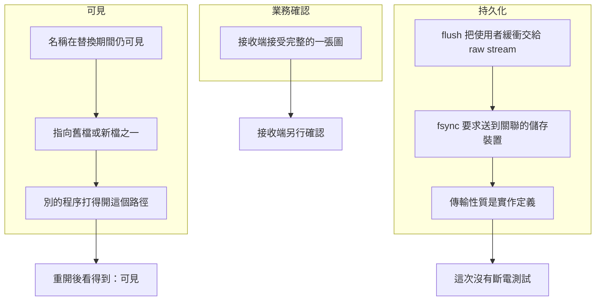

# 06｜寫入返回了，是哪一層完成

`frame.bin` 的 `flush` 已經返回。writer 也正常結束。交接單上被寫了「圖已落盤，斷電也還在」。隔天要對的是另一件事：接收端根本還沒回過「這張合成 AOI 圖我收下了」。

另一筆更早。writer 停在發布前被回收。新的程序重新打開正式路徑，檔案看得到，內容仍是標頭加半張圖。看得到，和完整、和斷電之後還在，是三條不同的時間線。

上一頁已經拒絕半檔。這一頁只處理：誰在什麼時候看得見、誰要求寫到儲存裝置、誰做了業務確認。

## 先預測

`flush` 成功，而且 writer 正常結束。這次實驗有沒有證明斷電之後檔案還在？

## 沿着這條路徑



## 原理

三條時間線分開記。

可見：名稱能被打開，讀到的是檔案系統上現在的內容。POSIX `rename` 在替換期間讓這個名稱仍可見，並指向舊檔或新檔之一。跨檔案系統的重新命名可能得到 `EXDEV`。實驗用同目錄的 `os.replace`，把暫存名換成正式名，就是為了留在同一個檔案系統。writer 被回收之後，另一個程序仍能打開正式路徑。那是可見。半檔在這條時間線上也可以被看見；內容完整與否見 [檔案與讀寫](05-files-io.md)。

持久化：`flush` 把使用者空間緩衝交給底層 raw stream。這一層完成的是「這支程序的緩衝交出去了」。POSIX `fsync` 要求把該檔案描述符的資料送到與檔案關聯的儲存裝置。傳輸性質是實作定義。理由書允許空實作，也寫斷電安全不一定成立。本實驗沒有斷電，呼叫成功只停留在這次呼叫的返回。

有的程式庫在正常結束時會再處理自己還沒交出的緩衝。本實驗不把那一步當成測試。檔案那一側是程式自己呼叫的 `flush` 與 `os.fsync`。兩層都返回，斷電測試仍然缺席。正常結束只說明這個程序走完了退出。Q06 問的就是這兩件事加起來仍然沒有斷電證據。

Linux 的 fsync(2) 是另一份說明，要和 POSIX 分開讀。它寫即使系統崩潰，也要讓該檔案的資料可以再讀，並說目錄項需要另外對目錄做 `fsync`。手冊說的是崩潰之後的可讀性。這次實驗沒有做斷電，也沒有在斷電後重開機器讀檔。程式會印出目錄 `fsync` 的結果。印出成功，只表示這次呼叫沒有丟例外。

檔案內容的 `fsync` 與目錄項的 `fsync` 在 Linux 這份說明裡是兩次呼叫。實驗對暫存檔的描述符做一次，再對目錄做一次，並把第二次的結果印出來。兩次都返回，仍只表示這兩次呼叫在這次執行裡沒有失敗。崩潰之後目錄項還指不指向新檔，手冊把它列為目錄 `fsync` 要處理的事。本頁沒有用斷電去核對那句話。

業務確認：接收端接受完整的一張圖，並留下自己的收件證據。程序重開後看得到檔案，落在可見。斷電保證要有斷電之後的讀回。接收端的確認要有接收端自己的證據。呼叫端這邊的「我以為寫完了」和對端的「我已經收下」，中間可以是未知。那個知識狀態在《資料庫與資料正確性》的「結果未知」。本頁不把資料庫交易重做一次。

發布順序是：寫進同目錄暫存檔、`flush`、對檔案 `os.fsync`、`os.replace`、再嘗試目錄 `fsync`。順序把「讀者會打開的名稱」留到替換那一步才換上。停在發布前的 writer 只做了半檔那條直接寫入，沒有走到 `os.replace`。它沒有把斷電放進測試。

替換期間，正式名稱仍可見，並指向舊檔或新檔之一。讀者在那一刻打開，可能讀到舊的半檔，也可能讀到新檔。實驗的接受檢查放在 `os.replace` 返回之後。返回後的那一次讀到完整內容，記錄的是這次呼叫結束後的可見結果。

跨檔案系統時，`rename` 可能失敗並給出 `EXDEV`。實驗把暫存檔放在正式檔的同一目錄，讓這次替換留在同一個檔案系統。頁面沒有另外做一次跨檔案系統的失敗樣本。

目錄 `fsync` 印出的文字另記。它回答「這次對目錄的呼叫有沒有丟例外」。它不回答斷電，也不回答接收端是否已把這張圖記成收到。

## 反例

`flush` 成功，程序也正常結束，就把交接單改成「斷電之後檔案還在」。`flush` 交出的是使用者緩衝。程序結束只表示這個程序走完了自己的退出。實驗沒有拔電，也沒有在斷電後重新讀檔。目錄 `fsync` 印出 `ok` 時，同樣只表示那次呼叫沒有丟例外。把它寫進斷電紀錄，會多報一層沒有做過的測試。

## 動手看

進入 `examples/` 後執行：

```bash
python3 l03_publish.py
```

通過時標準輸出以 `L03 PASS` 開頭，並帶有 `dir_fsync=`。一份 macOS 原生執行印出的是 `L03 PASS dir_fsync=ok`。這裡的 `ok` 只表示這次目錄 `fsync` 沒有丟例外。其他系統可以印出這次呼叫的失敗文字，程式仍以讀者是否接受來決定前半段檢查。

通過時和本頁有關的事實：

- 半檔直接落在正式路徑時，讀者拒絕。這是可見的不完整內容。
- 暫存檔經過 `flush` 與檔案 `os.fsync`，再在同目錄 `os.replace` 之後，讀者接受。
- writer 停在發布前被回收。測試另起的 reader 程序印出 `REJECT`。發布之後，另一個新的 reader 程序印出 `ACCEPT`。這仍不是斷電之後的讀回。
- 輸出裡的目錄 `fsync` 結果有印出來。沒有斷電測試，也沒有接收端的業務回執。

`L03 PASS` 證明這些檢查在這次程序裡成立。斷電之後檔案還在，不在這次證明的範圍。一份 Linux 容器紀錄同樣印出 `L03 PASS dir_fsync=ok`。那個 `ok` 的讀法與 macOS 這次相同：呼叫沒有丟例外。兩次紀錄都沒有斷電步驟。

可見、持久化、業務確認在輸出裡沒有合成一個旗標。`L03 PASS` 表示接受檢查與回收檢查通過，並且目錄呼叫的結果被印了出來。接收端的「我收下了」不在這支程式的標準輸出裡。

`flush` 成功停在使用者緩衝交給 raw stream。程序正常結束停在這支程序的退出。兩件事都發生時，斷電之後的讀回仍然沒有被執行。業務確認也還沒有從接收端回來。

## 題目

**Q06.** flush 成功，程序也正常結束。這次實驗證明了斷電之後檔案還在嗎？

[返回地圖](00-map.md) · [實驗入口](labs.md) · [題目提示](hints.md) · [題目解答](answers.md)
